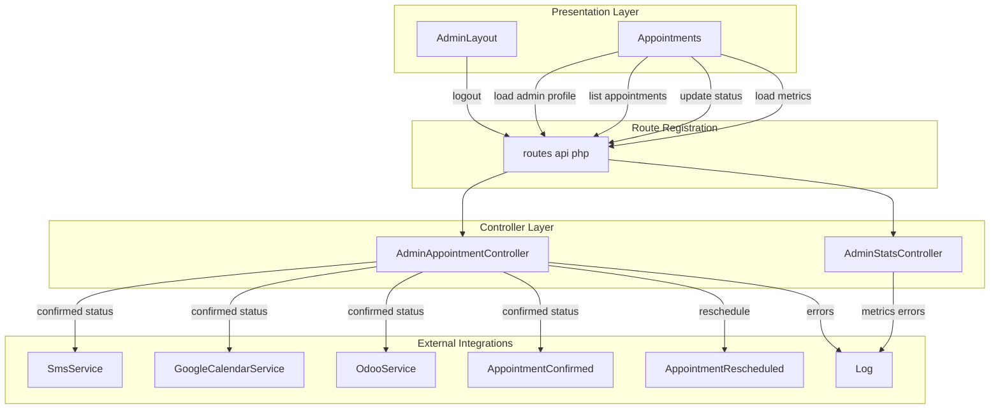
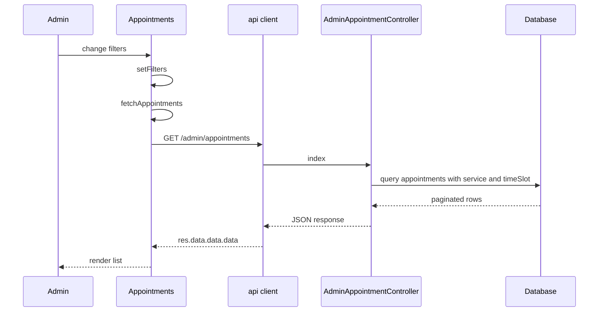
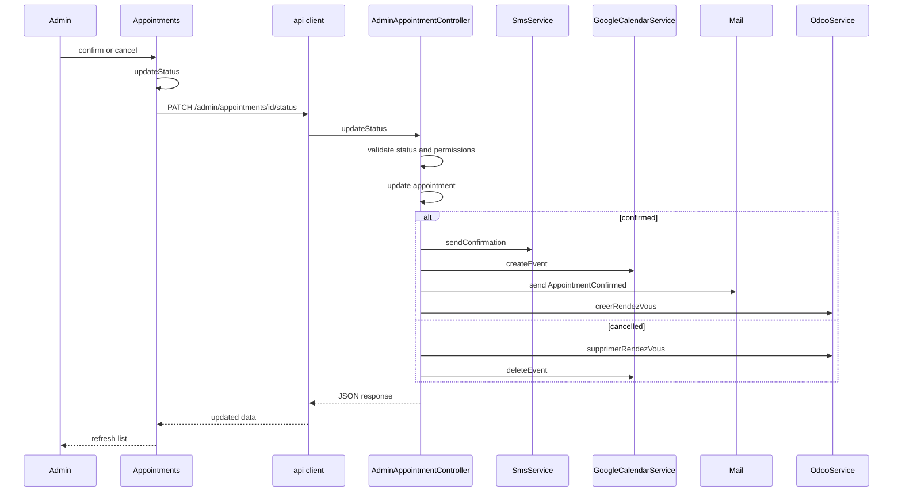
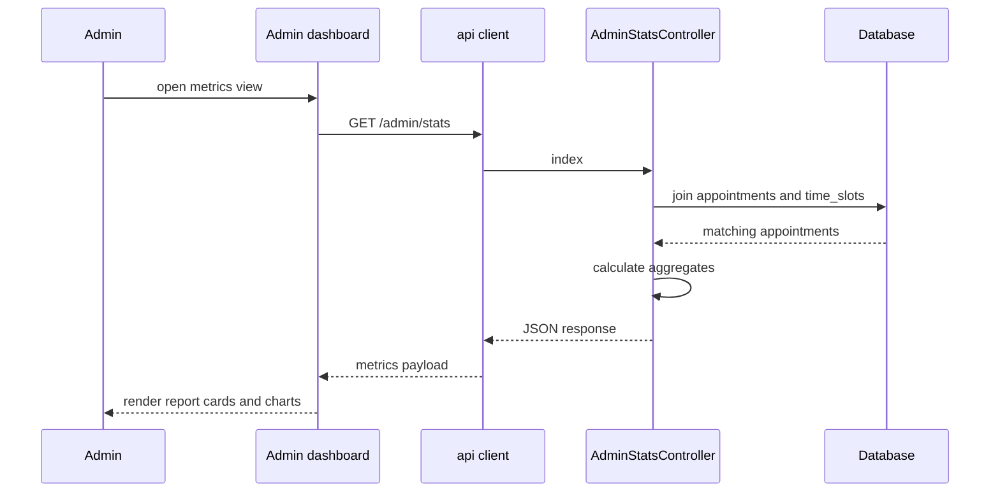

# Admin Appointment Operations - Appointment listing, filtering, status updates, and dashboard metrics

## Overview

This admin surface lets authenticated staff review booked appointments, narrow them by date, status, and service, and update appointment state directly from the back-office UI. The same flow also exposes a metrics endpoint that aggregates appointment volume and audience breakdowns for the selected reporting period.

The implementation is split between `cri-back/routes/api.php`, the admin controllers in `cri-back/app/Http/Controllers/Api/Admin/`, and the React admin shell in `cri-frontend/src/components/AdminLayout.jsx` plus the appointments page in `cri-frontend/src/pages/admin/Appointments.jsx`. The page pulls the current admin profile, renders role-aware filters, and sends appointment status updates back to the authenticated admin endpoints.

## Architecture Overview



## Route Registration

cri-back/routes/api.php registers the appointment and stats handlers inside Route::prefix('admin') and Route::middleware('admin.jwt'), while cri-frontend/src/pages/admin/Appointments.jsx calls the same resources through the api client at /admin/. The backend route strings and the client request paths are documented together below.

*`cri-back/routes/api.php`*

| Route registration | Controller action | Runtime role |
| --- | --- | --- |
| `Route::get('stats', [AdminStatsController::class, 'index']);` | `AdminStatsController::index` | Authenticated admin reporting |
| `Route::get('appointments', [AdminAppointmentController::class, 'index']);` | `AdminAppointmentController::index` | Authenticated admin listing |
| `Route::get('appointments/{id}', [AdminAppointmentController::class, 'show']);` | `AdminAppointmentController::show` | Authenticated admin detail view |
| `Route::patch('appointments/{id}/status', [AdminAppointmentController::class, 'updateStatus']);` | `AdminAppointmentController::updateStatus` | Authenticated admin status update |
| `Route::patch('appointments/{id}/reschedule', [AdminAppointmentController::class, 'reschedule']);` | `AdminAppointmentController::reschedule` | Authenticated admin reschedule |
| `Route::post('login', [AuthController::class, 'login']);` | `AuthController::login` | Admin authentication entrypoint |
| `Route::get('me', [AuthController::class, 'me']);` | `AuthController::me` | Current admin profile |
| `Route::get('services', [AdminServiceController::class, 'index']);` | `AdminServiceController::index` | Service selector data for the admin page |


All admin appointment handlers are registered under the `admin` prefix and the `admin.jwt` middleware group. The route file is the source of the protected admin path layout; the React page consumes those handlers through the `api` client.

## Presentation Layer

### Admin Layout

*`cri-frontend/src/components/AdminLayout.jsx`*

`AdminLayout` provides the shell around the admin area. It renders the sidebar, the top bar, the logout action, and an `Outlet` for the active admin page. The appointments entry is the navigation item that leads into the appointment operations screen.

| Value | Type | Responsibility |
| --- | --- | --- |
| `admin` | `object` | Local storage snapshot used by the module-level `navItems` definition |
| `navItems` | `array` | Sidebar entries, including `/admin/appointments` |
| `sidebarOpen` | `boolean` | Controls the compact and expanded sidebar widths |
| `navigate` | function | React Router navigation used after logout |
| `handleLogout` | function | Calls `/admin/logout`, clears local storage, redirects to `/admin/login` |


| Navigation item path | Label | Condition |
| --- | --- | --- |
| `/admin/dashboard` | `Tableau de bord` | Always present |
| `/admin/appointments` | `Rendez-vous` | Always present |
| `/admin/services` | `Services` | Always present |
| `/admin/time-slots` | `Creneaux` | Always present |
| `/admin/admins` | `Admins` | Added only when `admin.role === 'superadmin'` |


`handleLogout` attempts `api.post('/admin/logout')` inside a `try` block, ignores any thrown error, then removes `admin_token` and `admin_user` from `localStorage` before navigating to `/admin/login`.

### Appointments Page

*`cri-frontend/src/pages/admin/Appointments.jsx`*

`Appointments` is the working screen for appointment review and state changes. It fetches the current admin profile, loads the appointment list, applies local filters, and opens modals for confirmation, cancellation, motif viewing, and rescheduling.

| Value | Type | Responsibility |
| --- | --- | --- |
| `STATUS_LABELS` | `object` | Maps `pending`, `confirmed`, `present`, and `cancelled` to label and badge color |
| `appointments` | `array` | Current appointment rows rendered in the table |
| `loading` | `boolean` | Drives the list loading spinner |
| `filters` | `object` | Holds `start_date`, `end_date`, `status`, and `service_id` |
| `services` | `array` | Service options loaded for confirmation and service-aware filtering |
| `modal` | `null` or `object` | Controls motif, confirm, and cancel dialogs |
| `cancelReason` | `string` | Text entered for cancellation |
| `confirmServiceId` | `string` | Service selected before confirming an appointment |
| `actionLoading` | `boolean` | Disables action buttons during status updates |
| `rescheduleModal` | `null` or `object` | Controls the reschedule dialog |
| `newDate` | `string` | Selected reschedule date |
| `newStartTime` | `string` | Selected reschedule start time |
| `newEndTime` | `string` | Selected reschedule end time |
| `rescheduleReason` | `string` | Optional reschedule reason |
| `availableSlots` | `array` | Slot options shown in the reschedule modal |
| `slotsLoading` | `boolean` | Drives the slot loading indicator |
| `currentAdmin` | `null` or `object` | Profile returned by `/admin/me` |
| `isSuperadmin` | `boolean` | Enables service-level filtering in the list |
| `isAccueil` | `boolean` | Used for role-specific confirmation hints |
| `isRegularAdmin` | `boolean` | Used for role-specific confirmation hints |


| Method | Responsibility |
| --- | --- |
| `fetchServices` | Loads `/admin/services` for dropdown options |
| `fetchAppointments` | Loads `/admin/appointments` with the current filter set |
| `fetchAvailableSlots` | Loads `/slots` for a chosen date and keeps only entries with `available > 0` |
| `handleReschedule` | Validates the chosen slot, sends the reschedule request, refreshes the list, and clears the modal state |
| `updateStatus` | Sends status changes to `/admin/appointments/{id}/status` |
| `openConfirmModal` | Opens the confirmation modal and seeds the service selection |
| `formatDate` | Formats dates for the table |
| `formatTime` | Truncates times to `HH:MM` |


The page uses three role checks derived from `/admin/me`:

- `isSuperadmin` shows the service filter and allows `service_id` to be sent with the list request.
- `isAccueil` changes the helper text shown in the confirm modal.
- `isRegularAdmin` shows a reminder to choose a service before confirmation.

## Controller Layer

### Admin Appointment Controller

The component calls fetchAppointments() in the empty-dependency mount effect and again in the [filters] effect on the first render. That produces two list requests during initial page load.

*`cri-back/app/Http/Controllers/Api/Admin/AdminAppointmentController.php`*

| Method | Responsibility |
| --- | --- |
| `index` | Lists appointments with role-aware filters and pagination |
| `show` | Returns a single appointment after service-scoped access checks |
| `updateStatus` | Validates and applies status transitions, then triggers external side effects |
| `reschedule` | Moves an appointment to a different slot and synchronizes external systems |


#### `index`

`index` begins by reading the authenticated admin from `Auth::guard('admin')->user()`. If no admin is present, it returns `401 Unauthorized`. The query eager loads `service` and `timeSlot`, applies the admin service restriction when `isAdmin()` and `service_id` are present, filters by appointment date through `timeSlot.slot_date`, filters by `status`, and only applies the request `service_id` filter when `isSuperadmin()` is true.

The result is ordered by `created_at` descending and paginated with `paginate(20)`.

#### `show`

`show` loads the appointment by ID with `service` and `timeSlot`. If the authenticated admin is restricted to a service and the appointment belongs to another service, the method returns `403` with the French permission message. Otherwise it returns the appointment payload in `data`.

#### `updateStatus`

`updateStatus` validates three request fields:

- `status` with allowed values `confirmed`, `present`, `cancelled`
- `cancelled_reason` required only when `status` is `cancelled`
- `service_id` as an optional service reference

It enforces the workflow table below before writing the update.

| Current status | Allowed next statuses |
| --- | --- |
| `pending` | `confirmed`, `cancelled` |
| `confirmed` | `present`, `cancelled` |
| `present` | none |
| `cancelled` | none |


The update stores `status`, `admin_id`, `cancelled_reason`, and `service_id`. When the new status is `confirmed`, the method:

- sends SMS through `SmsService`
- creates a Google Calendar event through `GoogleCalendarService`
- sends `AppointmentConfirmed` when `email` exists
- creates an Odoo calendar event through `OdooService`

When the new status is `cancelled`, it deletes existing Odoo and Google Calendar events if their identifiers are present on the appointment.

The response returns `Appointment::fresh()` in `data`.

#### `reschedule`

`reschedule` validates `new_date`, `new_start_time`, `new_end_time`, and `reason`. It only allows `pending` and `confirmed` appointments to be rescheduled. It then verifies that a matching `TimeSlot` exists for the requested date and time, and checks for a conflicting confirmed appointment already attached to that slot.

The method wraps the update in `DB::beginTransaction()` and `DB::commit()`. Inside the transaction it updates:

- `time_slot_id`
- `reschedule_reason`
- `rescheduled_at`

If the appointment already has a Google Calendar event, it updates that event. If it already has an Odoo event, it removes the old event and creates a new one for the new slot. It also decrements the old slot `booked_count` and increments the new slot `booked_count` when the slot changes.

If `email` exists, it sends `AppointmentRescheduled` with the old and new date and time strings. On any exception, the method rolls the transaction back, logs the failure with `\Log::error`, and returns `500`.

### Admin Stats Controller

*`cri-back/app/Http/Controllers/Api/Admin/AdminStatsController.php`*

| Method | Responsibility |
| --- | --- |
| `index` | Returns aggregated dashboard metrics for the requested period |


#### `index`

`index` reads `start_date` and `end_date` from the request. When one or both are missing, the period defaults to the current month. It joins `appointments` to `time_slots` and filters by `time_slots.slot_date`, then applies a service filter when the authenticated admin has `role === 'admin'` and a `service_id`.

The method loads the matching appointments and computes these metrics:

| Metric | Description |
| --- | --- |
| `total_appointments` | Total number of matching appointments |
| `by_status` | Counts for `pending`, `confirmed`, `present`, and `cancelled` |
| `by_service` | Grouped counts with `service_id`, `service_name`, `count`, and `percentage` |
| `by_country` | Top 10 nationalities with counts and percentages |
| `by_genre` | Gender distribution with counts and percentages |
| `by_age` | Age buckets built from `date_naissance` |
| `visitor_type` | `first_time` and `returning` counts |
| `confirmation_rate` | Percentage of confirmed appointments over total |
| `popular_slots` | Top five slot start times by count |
| `period` | Final `start` and `end` date strings used for the report |


On any exception, the controller logs both the error message and the trace string, then returns `500` with `success: false`.

## API Integration

#### Get Admin Profile

```api
{
    "title": "Get Admin Profile",
    "description": "Returns the authenticated admin identity used by the appointments page to scope the UI",
    "method": "GET",
    "baseUrl": "/admin",
    "endpoint": "/me",
    "headers": [
        {
            "key": "Authorization",
            "value": "Bearer admin token",
            "required": true
        }
    ],
    "queryParams": [],
    "pathParams": [],
    "bodyType": "none",
    "requestBody": "",
    "formData": [],
    "rawBody": "",
    "responses": {
        "200": {
            "description": "Authenticated admin profile",
            "body": "{\n    \"success\": true,\n    \"data\": {\n        \"id\": 7,\n        \"name\": \"Admin User\",\n        \"email\": \"admin@example.com\",\n        \"role\": \"admin\"\n    }\n}"
        }
    }
}
```

#### Get Admin Metrics

```api
{
    "title": "Get Admin Metrics",
    "description": "Returns dashboard metrics for the authenticated admin reporting period",
    "method": "GET",
    "baseUrl": "/admin",
    "endpoint": "/stats",
    "headers": [
        {
            "key": "Authorization",
            "value": "Bearer admin token",
            "required": true
        }
    ],
    "queryParams": [
        {
            "key": "start_date",
            "value": "2026-05-01",
            "required": false
        },
        {
            "key": "end_date",
            "value": "2026-05-31",
            "required": false
        }
    ],
    "pathParams": [],
    "bodyType": "none",
    "requestBody": "",
    "formData": [],
    "rawBody": "",
    "responses": {
        "200": {
            "description": "Metric payload",
            "body": "{\n    \"success\": true,\n    \"data\": {\n        \"total_appointments\": 18,\n        \"by_status\": {\n            \"pending\": 4,\n            \"confirmed\": 9,\n            \"present\": 3,\n            \"cancelled\": 2\n        },\n        \"by_service\": [\n            {\n                \"service_id\": 1,\n                \"service_name\": \"Cr\\u00e9ation d'entreprise\",\n                \"count\": 7,\n                \"percentage\": 38.89\n            }\n        ],\n        \"by_country\": [\n            {\n                \"nationalite\": \"Marocaine\",\n                \"count\": 15,\n                \"percentage\": 83.33\n            }\n        ],\n        \"by_genre\": [\n            {\n                \"genre\": \"femme\",\n                \"count\": 10,\n                \"percentage\": 55.56\n            }\n        ],\n        \"by_age\": [\n            {\n                \"age_group\": \"26-35 ans\",\n                \"count\": 6,\n                \"percentage\": 33.33\n            }\n        ],\n        \"visitor_type\": {\n            \"first_time\": 11,\n            \"returning\": 7\n        },\n        \"confirmation_rate\": 50,\n        \"popular_slots\": [\n            {\n                \"start_time\": \"09:00:00\",\n                \"count\": 5\n            }\n        ],\n        \"period\": {\n            \"start\": \"2026-05-01\",\n            \"end\": \"2026-05-31\"\n        }\n    }\n}"
        }
    }
}
```

#### List Appointments

```api
{
    "title": "List Appointments",
    "description": "Returns a paginated appointment list with role-aware filtering and appointment date filtering through time slots",
    "method": "GET",
    "baseUrl": "/admin",
    "endpoint": "/appointments",
    "headers": [
        {
            "key": "Authorization",
            "value": "Bearer admin token",
            "required": true
        }
    ],
    "queryParams": [
        {
            "key": "start_date",
            "value": "2026-05-01",
            "required": false
        },
        {
            "key": "end_date",
            "value": "2026-05-31",
            "required": false
        },
        {
            "key": "status",
            "value": "confirmed",
            "required": false
        },
        {
            "key": "service_id",
            "value": "1",
            "required": false
        }
    ],
    "pathParams": [],
    "bodyType": "none",
    "requestBody": "",
    "formData": [],
    "rawBody": "",
    "responses": {
        "200": {
            "description": "Paginated appointments",
            "body": "{\n    \"success\": true,\n    \"data\": {\n        \"current_page\": 1,\n        \"data\": [\n            {\n                \"id\": 42,\n                \"reference_code\": \"CRI-1A2B-0513\",\n                \"service_id\": 1,\n                \"time_slot_id\": 18,\n                \"admin_id\": 7,\n                \"full_name\": \"Amina El Idrissi\",\n                \"cin\": \"AB123456\",\n                \"phone\": \"0612345678\",\n                \"email\": \"amina@example.com\",\n                \"status\": \"pending\",\n                \"cancelled_reason\": null,\n                \"motif\": \"Demande de licence\",\n                \"date_naissance\": \"1992-04-10\",\n                \"nationalite\": \"Marocaine\",\n                \"genre\": \"femme\",\n                \"premiere_visite\": true,\n                \"google_event_id\": null,\n                \"odoo_event_id\": null,\n                \"pdf_path\": \"appointments/CRI-1A2B-0513.pdf\",\n                \"sms_sent\": false,\n                \"sms_sent_at\": null,\n                \"service\": {\n                    \"id\": 1,\n                    \"name\": \"Cr\\u00e9ation d'entreprise\",\n                    \"description\": \"Accompagnement \\u00e0 la cr\\u00e9ation d'une nouvelle entreprise.\",\n                    \"duration_minutes\": 45,\n                    \"capacity\": 3,\n                    \"is_active\": true\n                },\n                \"timeSlot\": {\n                    \"id\": 18,\n                    \"slot_date\": \"2026-05-13\",\n                    \"start_time\": \"09:00:00\",\n                    \"end_time\": \"09:30:00\",\n                    \"capacity\": 3,\n                    \"booked_count\": 1,\n                    \"is_active\": true\n                }\n            }\n        ],\n        \"per_page\": 20,\n        \"total\": 1\n    }\n}"
        }
    }
}
```

#### Get Appointment

```api
{
    "title": "Get Appointment",
    "description": "Returns a single appointment and enforces service-scoped access for restricted admins",
    "method": "GET",
    "baseUrl": "/admin",
    "endpoint": "/appointments/{id}",
    "headers": [
        {
            "key": "Authorization",
            "value": "Bearer admin token",
            "required": true
        }
    ],
    "queryParams": [],
    "pathParams": [
        {
            "key": "id",
            "value": "42",
            "required": true
        }
    ],
    "bodyType": "none",
    "requestBody": "",
    "formData": [],
    "rawBody": "",
    "responses": {
        "200": {
            "description": "Appointment detail",
            "body": "{\n    \"success\": true,\n    \"data\": {\n        \"id\": 42,\n        \"reference_code\": \"CRI-1A2B-0513\",\n        \"service_id\": 1,\n        \"time_slot_id\": 18,\n        \"admin_id\": 7,\n        \"full_name\": \"Amina El Idrissi\",\n        \"cin\": \"AB123456\",\n        \"phone\": \"0612345678\",\n        \"email\": \"amina@example.com\",\n        \"status\": \"pending\",\n        \"cancelled_reason\": null,\n        \"motif\": \"Demande de licence\",\n        \"date_naissance\": \"1992-04-10\",\n        \"nationalite\": \"Marocaine\",\n        \"genre\": \"femme\",\n        \"premiere_visite\": true,\n        \"google_event_id\": null,\n        \"odoo_event_id\": null,\n        \"pdf_path\": \"appointments/CRI-1A2B-0513.pdf\",\n        \"sms_sent\": false,\n        \"sms_sent_at\": null,\n        \"service\": {\n            \"id\": 1,\n            \"name\": \"Cr\\u00e9ation d'entreprise\",\n            \"description\": \"Accompagnement \\u00e0 la cr\\u00e9ation d'une nouvelle entreprise.\",\n            \"duration_minutes\": 45,\n            \"capacity\": 3,\n            \"is_active\": true\n        },\n        \"timeSlot\": {\n            \"id\": 18,\n            \"slot_date\": \"2026-05-13\",\n            \"start_time\": \"09:00:00\",\n            \"end_time\": \"09:30:00\",\n            \"capacity\": 3,\n            \"booked_count\": 1,\n            \"is_active\": true\n        }\n    }\n}"
        }
    }
}
```

#### Update Appointment Status

```api
{
    "title": "Update Appointment Status",
    "description": "Validates the requested transition, updates the appointment, and triggers confirmation or cancellation side effects",
    "method": "PATCH",
    "baseUrl": "/admin",
    "endpoint": "/appointments/{id}/status",
    "headers": [
        {
            "key": "Authorization",
            "value": "Bearer admin token",
            "required": true
        },
        {
            "key": "Content-Type",
            "value": "application/json",
            "required": true
        }
    ],
    "queryParams": [],
    "pathParams": [
        {
            "key": "id",
            "value": "42",
            "required": true
        }
    ],
    "bodyType": "json",
    "requestBody": "{\n    \"status\": \"confirmed\",\n    \"cancelled_reason\": null,\n    \"service_id\": 1\n}",
    "formData": [],
    "rawBody": "",
    "responses": {
        "200": {
            "description": "Updated appointment",
            "body": "{\n    \"success\": true,\n    \"message\": \"Appointment marked as confirmed.\",\n    \"data\": {\n        \"id\": 42,\n        \"reference_code\": \"CRI-1A2B-0513\",\n        \"service_id\": 1,\n        \"time_slot_id\": 18,\n        \"admin_id\": 7,\n        \"full_name\": \"Amina El Idrissi\",\n        \"cin\": \"AB123456\",\n        \"phone\": \"0612345678\",\n        \"email\": \"amina@example.com\",\n        \"status\": \"confirmed\",\n        \"cancelled_reason\": null,\n        \"motif\": \"Demande de licence\",\n        \"date_naissance\": \"1992-04-10\",\n        \"nationalite\": \"Marocaine\",\n        \"genre\": \"femme\",\n        \"premiere_visite\": true,\n        \"google_event_id\": \"gcal_123\",\n        \"odoo_event_id\": \"odoo_456\",\n        \"pdf_path\": \"appointments/CRI-1A2B-0513.pdf\",\n        \"sms_sent\": true,\n        \"sms_sent_at\": \"2026-05-13T09:10:00Z\"\n    }\n}"
        }
    }
}
```

#### Reschedule Appointment

```api
{
    "title": "Reschedule Appointment",
    "description": "Moves an appointment to a new verified slot, updates external calendars, and sends the reschedule email when an address exists",
    "method": "PATCH",
    "baseUrl": "/admin",
    "endpoint": "/appointments/{id}/reschedule",
    "headers": [
        {
            "key": "Authorization",
            "value": "Bearer admin token",
            "required": true
        },
        {
            "key": "Content-Type",
            "value": "application/json",
            "required": true
        }
    ],
    "queryParams": [],
    "pathParams": [
        {
            "key": "id",
            "value": "42",
            "required": true
        }
    ],
    "bodyType": "json",
    "requestBody": "{\n    \"new_date\": \"2026-05-20\",\n    \"new_start_time\": \"09:00\",\n    \"new_end_time\": \"09:30\",\n    \"reason\": \"Client requested a later slot\"\n}",
    "formData": [],
    "rawBody": "",
    "responses": {
        "200": {
            "description": "Rescheduled appointment",
            "body": "{\n    \"success\": true,\n    \"message\": \"Rendez-vous report\\u00e9 avec succ\\u00e8s.\",\n    \"data\": {\n        \"id\": 42,\n        \"reference_code\": \"CRI-1A2B-0513\",\n        \"service_id\": 1,\n        \"time_slot_id\": 23,\n        \"admin_id\": 7,\n        \"full_name\": \"Amina El Idrissi\",\n        \"cin\": \"AB123456\",\n        \"phone\": \"0612345678\",\n        \"email\": \"amina@example.com\",\n        \"status\": \"confirmed\",\n        \"cancelled_reason\": null,\n        \"motif\": \"Demande de licence\",\n        \"date_naissance\": \"1992-04-10\",\n        \"nationalite\": \"Marocaine\",\n        \"genre\": \"femme\",\n        \"premiere_visite\": true,\n        \"google_event_id\": \"gcal_123\",\n        \"odoo_event_id\": \"odoo_789\",\n        \"pdf_path\": \"appointments/CRI-1A2B-0513.pdf\",\n        \"sms_sent\": true,\n        \"sms_sent_at\": \"2026-05-13T09:10:00Z\",\n        \"service\": {\n            \"id\": 1,\n            \"name\": \"Cr\\u00e9ation d'entreprise\",\n            \"description\": \"Accompagnement \\u00e0 la cr\\u00e9ation d'une nouvelle entreprise.\",\n            \"duration_minutes\": 45,\n            \"capacity\": 3,\n            \"is_active\": true\n        },\n        \"timeSlot\": {\n            \"id\": 23,\n            \"slot_date\": \"2026-05-20\",\n            \"start_time\": \"09:00:00\",\n            \"end_time\": \"09:30:00\",\n            \"capacity\": 3,\n            \"booked_count\": 1,\n            \"is_active\": true\n        }\n    }\n}"
        }
    }
}
```

## Feature Flows

### Appointment List Refresh and Filtering



`index` is the core listing action. The page sends `start_date`, `end_date`, `status`, and `service_id` when the current user is a superadmin, and the backend further applies service restrictions for non-superadmin admins with a `service_id`.

### Status Update Flow



The backend workflow accepts only the transition set declared in `updateStatus`. The UI requires a service selection before it lets the user confirm an appointment.

### Dashboard Metrics Load



`AdminStatsController::index` uses the current month when no date range is supplied, so the dashboard can render immediately after login.

## State Management

### Appointments Page State

The appointments page uses local React state only. Two `useEffect` flows drive the data lifecycle:

1. The mount effect fetches the current admin profile, services, and appointments.
2. The filter effect refetches appointments when `filters` changes.
3. The reschedule effect refreshes available slots when `newDate` changes while the reschedule modal is open.

| State group | Trigger | Effect |
| --- | --- | --- |
| `loading` | Before and after `fetchAppointments` | Toggles the list spinner |
| `filters` | Month, status, service, and reset controls | Reissues the appointment list request |
| `modal` | View motif, confirm, cancel actions | Opens the corresponding dialog |
| `rescheduleModal` | Reschedule action | Opens the slot picker dialog |
| `availableSlots` | Date selection in reschedule flow | Renders selectable slots |
| `currentAdmin` | `/admin/me` response | Enables role-aware UI behavior |


### Admin Layout State

| State group | Trigger | Effect |
| --- | --- | --- |
| `sidebarOpen` | Sidebar toggle button | Switches between wide and compact sidebar widths |
| `admin_user` | `localStorage` | Supplies the header badge and sidebar identity |
| `admin_token` | Logout | Removed before redirection to the login screen |


## External Integrations

### Sms Service

*`cri-back/app/Services/SmsService.php`*

| Method | Responsibility |
| --- | --- |
| `sendConfirmation` | Formats the phone number, posts the confirmation SMS to Infobip, logs the response status, and marks the appointment as SMS-sent on success |


`sendConfirmation` is called from `AdminAppointmentController::updateStatus` when the status changes to `confirmed`. It normalizes Moroccan phone numbers, constructs the confirmation message with the appointment date, time, and reference, and posts to `https://{INFOBIP_BASE_URL}/sms/3/messages` with the `Authorization`, `Content-Type`, and `Accept` headers.

### Google Calendar Service

*`cri-back/app/Services/GoogleCalendarService.php`*

| Property | Type | Responsibility |
| --- | --- | --- |
| `calendar` | untyped | Google Calendar client wrapper |
| `calendarId` | `string` | Target calendar identifier from `services.google.calendar_id` |


| Method | Responsibility |
| --- | --- |
| `__construct` | Builds the Google client from the JSON credentials file and loads the calendar ID from config |
| `createEvent` | Creates a calendar event for a confirmed appointment and returns the event ID |
| `deleteEvent` | Deletes a calendar event by event ID |
| `updateEvent` | Rewrites the event when an appointment is rescheduled |


`createEvent`, `deleteEvent`, and `updateEvent` all log success and failure through `Illuminate\Support\Facades\Log`. The appointment controller uses `createEvent` after confirmation, `deleteEvent` after cancellation, and `updateEvent` during rescheduling.

### Odoo Service

*`cri-back/app/Services/OdooService.php`*

| Property | Type | Responsibility |
| --- | --- | --- |
| `url` | `string` | Odoo base URL from `services.odoo.url` |
| `db` | `string` | Odoo database name |
| `email` | `string` | Login email used for authentication |
| `password` | `string` | Login password used for authentication |
| `uid` | `?int` | Authenticated Odoo user ID |


| Method | Responsibility |
| --- | --- |
| `__construct` | Loads credentials and performs authentication |
| `getClient` | Builds an XML-RPC client for the requested endpoint |
| `authenticate` | Calls Odoo authentication and stores the returned UID |
| `creerRendezVous` | Creates an Odoo `calendar.event` record |
| `supprimerRendezVous` | Deletes an Odoo `calendar.event` record |


`AdminAppointmentController::updateStatus` uses `creerRendezVous` for confirmation. `AdminAppointmentController::reschedule` uses `supprimerRendezVous` to remove the old record before creating the replacement event. Both service methods log success and error outcomes.

### Email Delivery

*`cri-back/app/Mail/AppointmentConfirmed.php`*

*`cri-back/app/Mail/AppointmentRescheduled.php`*

| Mail class | Constructor data |
| --- | --- |
| `AppointmentConfirmed` | `Appointment $appointment` |
| `AppointmentRescheduled` | `Appointment $appointment`, `string $oldDate`, `string $oldTime`, `string $newDate`, `string $newTime`, `string $reason` |


`AppointmentConfirmed` is sent when an appointment transitions to `confirmed`. `AppointmentRescheduled` is sent after a successful reschedule when the appointment has an email address.

### Logging and Telemetry

*`cri-back/app/Http/Controllers/Api/Admin/AdminStatsController.php`*

*`cri-back/app/Http/Controllers/Api/Admin/AdminAppointmentController.php`*

*`cri-back/app/Services/GoogleCalendarService.php`*

*`cri-back/app/Services/OdooService.php`*

*`cri-back/app/Services/SmsService.php`*

| Location | Logged data |
| --- | --- |
| `AdminStatsController::index` | `Stats Error` and trace string on exceptions |
| `AdminAppointmentController::reschedule` | `Reschedule failed` and the exception message |
| `GoogleCalendarService` | Success and failure messages for create, delete, and update operations |
| `OdooService` | Authentication, event creation, and event deletion success or failure |
| `SmsService` | Infobip response status and SMS sending failures |


The controller-level logs are the only explicit telemetry in this feature slice. The external services return `false` or `null` on failure, which keeps their error handling local to the integration layer.

## Error Handling

| Condition | Where it occurs | Response |
| --- | --- | --- |
| Missing admin session | `AdminAppointmentController::index`, `AdminStatsController::index` | `401 Unauthorized` |
| Service mismatch on a restricted admin | `show`, `updateStatus`, `reschedule` | `403 Forbidden` |
| Invalid status transition | `updateStatus` | `422` with a transition error message |
| Invalid or unavailable reschedule slot | `reschedule` | `422` with a slot availability message |
| Conflict on the target slot | `reschedule` | `422` with a reservation conflict message |
| Unexpected reschedule exception | `reschedule` | `500` after `DB::rollBack()` and `\Log::error` |
| Stats exception | `AdminStatsController::index` | `500` with `success: false` and the exception message |


The UI mirrors these failures with `alert` calls in `Appointments.jsx`, so validation and business rule errors are surfaced immediately to the admin operator.

## Integration Points

- `AuthController::me` supplies the role and service scope used by `Appointments.jsx`.
- `AdminLayout` routes into the appointments screen through `/admin/appointments`.
- `AdminAppointmentController::updateStatus` synchronizes SMS, Google Calendar, Odoo, and email when an appointment is confirmed.
- `AdminAppointmentController::reschedule` reuses the same external integrations to keep the appointment record aligned after a slot change.
- `AdminStatsController::index` powers the reporting cards and dashboard analytics view.

## Testing Considerations

| Scenario | Expected outcome |
| --- | --- |
| Admin without `service_id` opens the list | Sees appointments without the service restriction branch |
| Restricted admin opens another service appointment | Receives `403` from `show`, `updateStatus`, or `reschedule` |
| Superadmin applies a `service_id` filter | List is narrowed by the selected service |
| Invalid status transition is submitted | Request is rejected with `422` |
| Confirm action is submitted without a service choice in the UI | Button flow blocks the request before the API call |
| Reschedule date has no matching slot | UI alerts the admin and the API returns `422` |
| Reschedule hits a confirmed appointment conflict | API returns `422` |
| Stats period is omitted | The current month is used |
| Stats request fails | API returns `500` and logs the stack trace |


## Key Classes Reference

| Class | Responsibility |
| --- | --- |
| `AdminAppointmentController.php` | Appointment listing, per-role access checks, status updates, and rescheduling |
| `AdminStatsController.php` | Aggregated dashboard metrics for the authenticated admin period |
| `Appointments.jsx` | Admin appointment screen with filters, modals, and action triggers |
| `AdminLayout.jsx` | Admin shell, sidebar navigation, and logout handling |
| `routes/api.php` | Registers the authenticated admin appointment and stats endpoints |
| `SmsService.php` | Confirmation SMS delivery |
| `GoogleCalendarService.php` | Calendar event creation, deletion, and updates |
| `OdooService.php` | Odoo calendar event creation and deletion |
| `AppointmentConfirmed.php` | Confirmation email payload |
| `AppointmentRescheduled.php` | Reschedule email payload |
