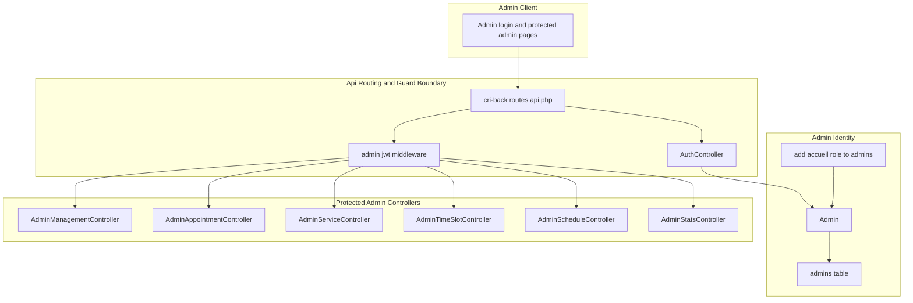
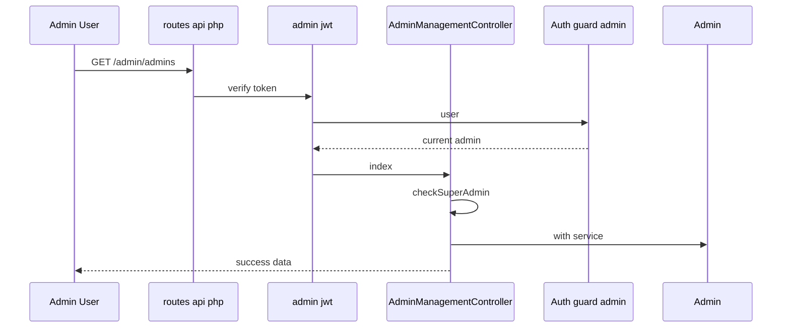
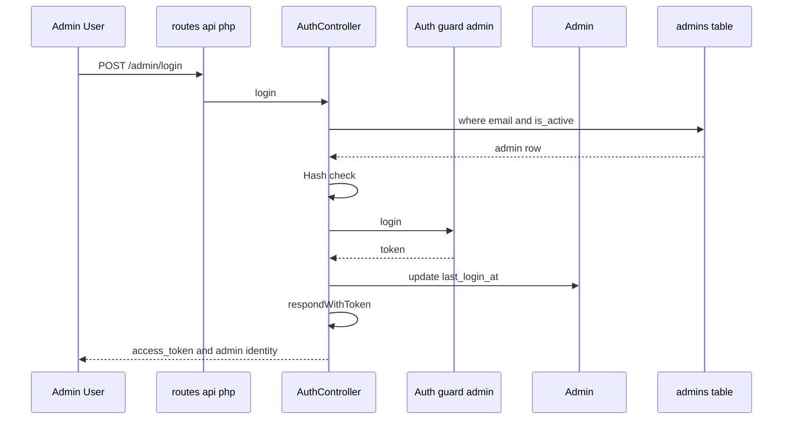

# Admin Authentication and Access Control

*`cri-back/app/Http/Controllers/Api/AuthController.php`*

*`cri-back/config/auth.php`*

*`cri-back/app/Models/Admin.php`*

*`cri-back/routes/api.php`*

*`cri-back/database/migrations/2026_04_11_001504_create_admins_table.php`*

*`cri-back/database/migrations/2026_04_11_005159_create_personal_access_tokens_table.php`*

*`cri-back/database/seeders/AdminSeeder.php`*

*`cri-back/config/database.php`*

## Overview

This section defines how admin users authenticate, how the backend distinguishes the `admin` guard from the default `web` guard, and how admin identity is represented after login. The flow is built around `AuthController`, which validates credentials, checks the `Admin` record, issues a JWT-backed token through `Auth::guard('admin')`, and returns a trimmed admin identity payload.

Access control is enforced at two layers. First, `routes/api.php` separates `Route::prefix('admin')` from public booking routes and places the protected admin routes under `Route::middleware('admin.jwt')`. Second, the admin model and admin controllers apply role-aware checks using `role`, `service_id`, and helper methods such as `isSuperadmin()`, `isAdmin()`, `isAccueil()`, `canManageAllAppointments()`, and `canManageService($serviceId)`.

## Architecture Overview



## Admin Authentication API

`AuthController` exposes the admin login, logout, token refresh, and identity lookup paths. The controller always reads and writes identity through `Auth::guard('admin')`, which keeps admin authentication separate from the default `web` guard defined in `config/auth.php`.

### `AuthController` methods

| Method | Description |
| --- | --- |
| `login` | Validates `email` and `password`, finds an active `Admin` by email, checks `password_hash` with `Hash::check`, logs the admin in with `Auth::guard('admin')->login`, updates `last_login_at`, and returns the token payload through `respondWithToken` |
| `logout` | Calls `Auth::guard('admin')->logout()` and returns a success message |
| `refresh` | Calls `Auth::guard('admin')->refresh()` and returns a fresh token payload |
| `me` | Reads the current admin from `Auth::guard('admin')->user()` and returns `id`, `name`, `email`, and `role` |
| `respondWithToken` | Builds the token response with `success`, `access_token`, `token_type`, `expires_in`, and optionally the admin identity block |


#### Admin Login

```api
{
    "title": "Admin Login",
    "description": "Validates admin credentials, authenticates an active admin account with the admin guard, updates last_login_at, and returns a JWT token with the admin identity.",
    "method": "POST",
    "baseUrl": "",
    "endpoint": "/admin/login",
    "headers": [
        {
            "key": "Content-Type",
            "value": "application/json",
            "required": true
        },
        {
            "key": "Accept",
            "value": "application/json",
            "required": true
        }
    ],
    "queryParams": [],
    "pathParams": [],
    "bodyType": "json",
    "requestBody": "{\n    \"email\": \"admin@cri.ma\",\n    \"password\": \"Admin@1234\"\n}",
    "formData": [],
    "rawBody": "",
    "responses": {
        "200": {
            "description": "Token issued successfully.",
            "body": "{\n    \"success\": true,\n    \"access_token\": \"eyJhbGciOiJIUzI1NiJ9.admin.token\",\n    \"token_type\": \"bearer\",\n    \"expires_in\": 3600,\n    \"admin\": {\n        \"id\": 1,\n        \"name\": \"Super Admin\",\n        \"email\": \"admin@cri.ma\",\n        \"role\": \"superadmin\"\n    }\n}"
        },
        "401": {
            "description": "Invalid credentials.",
            "body": "{\n    \"success\": false,\n    \"message\": \"Invalid credentials.\"\n}"
        }
    }
}
```

#### Admin Logout

```api
{
    "title": "Admin Logout",
    "description": "Invalidates the current admin token through the admin guard.",
    "method": "POST",
    "baseUrl": "",
    "endpoint": "/admin/logout",
    "headers": [
        {
            "key": "Authorization",
            "value": "Bearer eyJhbGciOiJIUzI1NiJ9.admin.token",
            "required": true
        },
        {
            "key": "Accept",
            "value": "application/json",
            "required": true
        }
    ],
    "queryParams": [],
    "pathParams": [],
    "bodyType": "json",
    "requestBody": "[]",
    "formData": [],
    "rawBody": "",
    "responses": {
        "200": {
            "description": "Logout completed.",
            "body": "{\n    \"success\": true,\n    \"message\": \"Successfully logged out.\"\n}"
        }
    }
}
```

#### Admin Token Refresh

```api
{
    "title": "Admin Token Refresh",
    "description": "Refreshes the current admin token through the admin guard and returns a new access token payload.",
    "method": "POST",
    "baseUrl": "",
    "endpoint": "/admin/refresh",
    "headers": [
        {
            "key": "Authorization",
            "value": "Bearer eyJhbGciOiJIUzI1NiJ9.admin.token",
            "required": true
        },
        {
            "key": "Accept",
            "value": "application/json",
            "required": true
        }
    ],
    "queryParams": [],
    "pathParams": [],
    "bodyType": "json",
    "requestBody": "[]",
    "formData": [],
    "rawBody": "",
    "responses": {
        "200": {
            "description": "Token refreshed successfully.",
            "body": "{\n    \"success\": true,\n    \"access_token\": \"eyJhbGciOiJIUzI1NiJ9.refreshed.admin.token\",\n    \"token_type\": \"bearer\",\n    \"expires_in\": 3600\n}"
        }
    }
}
```

#### Current Admin Identity

```api
{
    "title": "Current Admin Identity",
    "description": "Returns the authenticated admin identity from the admin guard.",
    "method": "GET",
    "baseUrl": "",
    "endpoint": "/admin/me",
    "headers": [
        {
            "key": "Authorization",
            "value": "Bearer eyJhbGciOiJIUzI1NiJ9.admin.token",
            "required": true
        },
        {
            "key": "Accept",
            "value": "application/json",
            "required": true
        }
    ],
    "queryParams": [],
    "pathParams": [],
    "bodyType": "none",
    "requestBody": "",
    "formData": [],
    "rawBody": "",
    "responses": {
        "200": {
            "description": "Authenticated admin returned.",
            "body": "{\n    \"success\": true,\n    \"data\": {\n        \"id\": 1,\n        \"name\": \"Super Admin\",\n        \"email\": \"admin@cri.ma\",\n        \"role\": \"superadmin\"\n    }\n}"
        }
    }
}
```

## Admin Protected Route Group

`routes/api.php` defines the admin boundary with `Route::prefix('admin')`. Only `POST /admin/login` sits outside `Route::middleware('admin.jwt')`; every other route in the group requires a valid admin JWT before the controller runs.

| Route group entry | Controller | Access rule visible in source |
| --- | --- | --- |
| `POST /admin/login` | `AuthController` | Public within the `admin` prefix, used to start admin authentication |
| `POST /admin/logout` | `AuthController` | Protected by `admin.jwt` |
| `POST /admin/refresh` | `AuthController` | Protected by `admin.jwt` |
| `GET /admin/me` | `AuthController` | Protected by `admin.jwt` |
| `GET /admin/stats` | `AdminStatsController` | Protected by `admin.jwt` |
| `GET /admin/appointments` | `AdminAppointmentController` | Protected by `admin.jwt` |
| `GET /admin/appointments/{id}` | `AdminAppointmentController` | Protected by `admin.jwt` |
| `PATCH /admin/appointments/{id}/status` | `AdminAppointmentController` | Protected by `admin.jwt` |
| `PATCH /admin/appointments/{id}/reschedule` | `AdminAppointmentController` | Protected by `admin.jwt` |
| `GET /admin/services` | `AdminServiceController` | Protected by `admin.jwt` |
| `POST /admin/services` | `AdminServiceController` | Protected by `admin.jwt` |
| `PUT /admin/services/{id}` | `AdminServiceController` | Protected by `admin.jwt` |
| `DELETE /admin/services/{id}` | `AdminServiceController` | Protected by `admin.jwt` |
| `GET /admin/time-slots` | `AdminTimeSlotController` | Protected by `admin.jwt` |
| `POST /admin/time-slots` | `AdminTimeSlotController` | Protected by `admin.jwt` |
| `DELETE /admin/time-slots/{id}` | `AdminTimeSlotController` | Protected by `admin.jwt` |
| `PATCH /admin/time-slots/{id}/toggle` | `AdminTimeSlotController` | Protected by `admin.jwt` |
| `GET /admin/admins` | `AdminManagementController` | Protected by `admin.jwt` |
| `POST /admin/admins` | `AdminManagementController` | Protected by `admin.jwt` |
| `PUT /admin/admins/{id}/password` | `AdminManagementController` | Protected by `admin.jwt` |
| `PATCH /admin/admins/{id}/toggle` | `AdminManagementController` | Protected by `admin.jwt` |
| `DELETE /admin/admins/{id}` | `AdminManagementController` | Protected by `admin.jwt` |
| `GET /admin/schedules` | `AdminScheduleController` | Protected by `admin.jwt` |
| `POST /admin/schedules` | `AdminScheduleController` | Protected by `admin.jwt` |
| `DELETE /admin/schedules/{id}` | `AdminScheduleController` | Protected by `admin.jwt` |
| `POST /admin/schedules/generate` | `AdminScheduleController` | Protected by `admin.jwt` |
| `GET /admin/blocked-dates` | `AdminScheduleController` | Protected by `admin.jwt` |
| `POST /admin/blocked-dates` | `AdminScheduleController` | Protected by `admin.jwt` |
| `DELETE /admin/blocked-dates/{id}` | `AdminScheduleController` | Protected by `admin.jwt` |


### Protected Admin List

```api
{
    "title": "List Admins",
    "description": "Returns the admin list for superadmin users. The controller calls checkSuperAdmin before querying Admin with the service relation.",
    "method": "GET",
    "baseUrl": "",
    "endpoint": "/admin/admins",
    "headers": [
        {
            "key": "Authorization",
            "value": "Bearer eyJhbGciOiJIUzI1NiJ9.admin.token",
            "required": true
        },
        {
            "key": "Accept",
            "value": "application/json",
            "required": true
        }
    ],
    "queryParams": [],
    "pathParams": [],
    "bodyType": "none",
    "requestBody": "",
    "formData": [],
    "rawBody": "",
    "responses": {
        "200": {
            "description": "Admin list returned.",
            "body": "{\n    \"success\": true,\n    \"data\": [\n        {\n            \"id\": 1,\n            \"name\": \"Super Admin\",\n            \"email\": \"admin@cri.ma\",\n            \"role\": \"superadmin\",\n            \"service_id\": null,\n            \"is_active\": true,\n            \"last_login_at\": \"2026-04-11T09:00:00Z\",\n            \"created_at\": \"2026-04-11T00:00:00Z\",\n            \"service\": {\n                \"id\": 1,\n                \"name\": \"Information g\\u00e9n\\u00e9rale\"\n            }\n        }\n    ]\n}"
        }
    }
}
```

### Create Admin

```api
{
    "title": "Create Admin",
    "description": "Creates a new admin account after checkSuperAdmin validates the caller.",
    "method": "POST",
    "baseUrl": "",
    "endpoint": "/admin/admins",
    "headers": [
        {
            "key": "Authorization",
            "value": "Bearer eyJhbGciOiJIUzI1NiJ9.admin.token",
            "required": true
        },
        {
            "key": "Content-Type",
            "value": "application/json",
            "required": true
        },
        {
            "key": "Accept",
            "value": "application/json",
            "required": true
        }
    ],
    "queryParams": [],
    "pathParams": [],
    "bodyType": "json",
    "requestBody": "{\n    \"name\": \"Service Admin\",\n    \"email\": \"service.admin@cri.ma\",\n    \"password\": \"StrongPass123\",\n    \"role\": \"admin\",\n    \"service_id\": 2\n}",
    "formData": [],
    "rawBody": "",
    "responses": {
        "201": {
            "description": "Admin created.",
            "body": "{\n    \"success\": true,\n    \"data\": {\n        \"id\": 5,\n        \"name\": \"Service Admin\",\n        \"email\": \"service.admin@cri.ma\",\n        \"role\": \"admin\",\n        \"service_id\": 2,\n        \"is_active\": true,\n        \"created_at\": \"2026-04-11T10:00:00Z\",\n        \"updated_at\": \"2026-04-11T10:00:00Z\"\n    }\n}"
        }
    }
}
```

### Update Admin Password

```api
{
    "title": "Update Admin Password",
    "description": "Replaces an admin password_hash after checkSuperAdmin validates the caller.",
    "method": "PUT",
    "baseUrl": "",
    "endpoint": "/admin/admins/{id}/password",
    "headers": [
        {
            "key": "Authorization",
            "value": "Bearer eyJhbGciOiJIUzI1NiJ9.admin.token",
            "required": true
        },
        {
            "key": "Content-Type",
            "value": "application/json",
            "required": true
        },
        {
            "key": "Accept",
            "value": "application/json",
            "required": true
        }
    ],
    "queryParams": [],
    "pathParams": [
        {
            "key": "id",
            "value": "5",
            "required": true
        }
    ],
    "bodyType": "json",
    "requestBody": "{\n    \"password\": \"NewStrongPass123\"\n}",
    "formData": [],
    "rawBody": "",
    "responses": {
        "200": {
            "description": "Password updated.",
            "body": "{\n    \"success\": true,\n    \"message\": \"Mot de passe mis a jour.\"\n}"
        }
    }
}
```

### Toggle Admin Active State

```api
{
    "title": "Toggle Admin Active State",
    "description": "Flips is_active for the selected admin after checkSuperAdmin validates the caller. The controller blocks self deactivation.",
    "method": "PATCH",
    "baseUrl": "",
    "endpoint": "/admin/admins/{id}/toggle",
    "headers": [
        {
            "key": "Authorization",
            "value": "Bearer eyJhbGciOiJIUzI1NiJ9.admin.token",
            "required": true
        },
        {
            "key": "Content-Type",
            "value": "application/json",
            "required": true
        },
        {
            "key": "Accept",
            "value": "application/json",
            "required": true
        }
    ],
    "queryParams": [],
    "pathParams": [
        {
            "key": "id",
            "value": "5",
            "required": true
        }
    ],
    "bodyType": "json",
    "requestBody": "[]",
    "formData": [],
    "rawBody": "",
    "responses": {
        "200": {
            "description": "Admin toggled.",
            "body": "{\n    \"success\": true,\n    \"data\": {\n        \"id\": 5,\n        \"name\": \"Service Admin\",\n        \"email\": \"service.admin@cri.ma\",\n        \"role\": \"admin\",\n        \"service_id\": 2,\n        \"is_active\": false,\n        \"last_login_at\": \"2026-04-11T10:00:00Z\",\n        \"created_at\": \"2026-04-11T10:00:00Z\",\n        \"updated_at\": \"2026-04-11T10:05:00Z\"\n    }\n}"
        },
        "422": {
            "description": "Self deactivation blocked.",
            "body": "{\n    \"success\": false,\n    \"message\": \"Vous ne pouvez pas desactiver votre propre compte.\"\n}"
        }
    }
}
```

### Delete Admin

```api
{
    "title": "Delete Admin",
    "description": "Deletes an admin after checkSuperAdmin validates the caller. The controller blocks self deletion.",
    "method": "DELETE",
    "baseUrl": "",
    "endpoint": "/admin/admins/{id}",
    "headers": [
        {
            "key": "Authorization",
            "value": "Bearer eyJhbGciOiJIUzI1NiJ9.admin.token",
            "required": true
        },
        {
            "key": "Accept",
            "value": "application/json",
            "required": true
        }
    ],
    "queryParams": [],
    "pathParams": [
        {
            "key": "id",
            "value": "5",
            "required": true
        }
    ],
    "bodyType": "none",
    "requestBody": "",
    "formData": [],
    "rawBody": "",
    "responses": {
        "200": {
            "description": "Admin deleted.",
            "body": "{\n    \"success\": true,\n    \"message\": \"Compte supprime.\"\n}"
        },
        "422": {
            "description": "Self deletion blocked.",
            "body": "{\n    \"success\": false,\n    \"message\": \"Vous ne pouvez pas supprimer votre propre compte.\"\n}"
        }
    }
}
```

## Protected Admin Request Flow

`admin.jwt` sits between the route declaration and every protected admin controller. Once the token is accepted, each controller reads the current identity from `Auth::guard('admin')->user()` and then applies role checks or service scoping in the handler.



## Admin Identity Model

*`cri-back/app/Models/Admin.php`*

`Admin` is the identity model behind the `admin` guard. It extends `Illuminate\Foundation\Auth\User as Authenticatable` and implements `PHPOpenSourceSaver\JWTAuth\Contracts\JWTSubject`, which lets the guard issue and validate JWT-based admin sessions against the `admins` table.

### Properties

| Property | Type | Description |
| --- | --- | --- |
| `$fillable` | array | `name`, `email`, `password_hash`, `role`, `service_id`, `is_active`, `last_login_at` |
| `$hidden` | array | `password_hash` |
| `$casts` | array | `is_active` to `boolean`, `last_login_at` to `datetime` |


### Methods

| Method | Description |
| --- | --- |
| `isSuperadmin` | Returns `true` when `role` is `superadmin` |
| `isAdmin` | Returns `true` when `role` is `admin` |
| `isAccueil` | Returns `true` when `role` is `accueil` |
| `canManageAllAppointments` | Returns `true` for `superadmin` and `accueil` |
| `canManageService` | Returns `true` for `superadmin` and `accueil`; otherwise compares `service_id` to the requested service |
| `getJWTIdentifier` | Returns the model key used as the JWT identifier |
| `getJWTCustomClaims` | Returns an empty array of custom claims |
| `getAuthPassword` | Returns `password_hash` instead of Laravel's default `password` field |
| `appointments` | Defines the `hasMany` relation to `Appointment` |
| `service` | Defines the `belongsTo` relation to `Service` |


### Role Helpers and Access Boundaries

The model exposes three role checks and two permission helpers:

- `isSuperadmin()`
- `isAdmin()`
- `isAccueil()`
- `canManageAllAppointments()`
- `canManageService($serviceId)`

`canManageAllAppointments()` returns `true` for `superadmin` and `accueil`. `canManageService($serviceId)` returns `true` for `superadmin` and `accueil`, and otherwise limits access to the admin’s assigned `service_id`.

## Admin Role Rules in Controllers

`AdminManagementController`, `AdminServiceController`, `AdminTimeSlotController`, and `AdminAppointmentController` apply role restrictions directly in their handler code.

| Controller | Rule |
| --- | --- |
| `AdminManagementController` | `checkSuperAdmin()` aborts with 403 unless `Auth::guard('admin')->user()->role` is `superadmin` |
| `AdminServiceController` | `checkNotRestrictedAdmin()` aborts with 403 when the caller is not `superadmin` and has a `service_id` |
| `AdminTimeSlotController` | `checkNotRestrictedAdmin()` uses the same restriction pattern as `AdminServiceController` |
| `AdminAppointmentController` | `index`, `show`, `updateStatus`, and `reschedule` limit service-bound admins to their own `service_id` |
| `AdminStatsController` | Filters appointments by `service_id` when `role` is `admin` and `service_id` is present |


## Admin Table Structure

*`cri-back/database/migrations/2026_04_11_001504_create_admins_table.php`*

The admins table defines the persisted identity record used by `AuthController` and `Admin`. The migration shows the exact fields that back login, token issuance, active-state gating, and login auditing.

| Column | Type | Constraints |
| --- | --- | --- |
| `id` | bigint id | Primary key |
| `name` | string(100) | Required |
| `email` | string(150) | Unique |
| `password_hash` | string(255) | Required |
| `role` | enum | `superadmin`, `admin`, default `admin` |
| `is_active` | boolean | Default `true` |
| `last_login_at` | timestamp | Nullable |
| `created_at` | timestamp | Added by `timestamps()` |
| `updated_at` | timestamp | Added by `timestamps()` |


### Role Extension Evidence

*`cri-back/database/migrations/2026_04_27_214636_add_accueil_role_to_admins.php`*

This migration expands the role enum to include `accueil` and changes `service_id` to nullable. That matches the `Admin` helper methods and the controller checks that treat `accueil` as privileged.

## Personal Access Tokens Table

*`cri-back/database/migrations/2026_04_11_005159_create_personal_access_tokens_table.php`*

The repository also defines a `personal_access_tokens` table with a polymorphic `tokenable` relation and token metadata columns.

| Column | Type | Constraints |
| --- | --- | --- |
| `id` | bigint id | Primary key |
| `tokenable` | morphs | Polymorphic owner columns |
| `name` | text | Required |
| `token` | string(64) | Unique |
| `abilities` | text | Nullable |
| `last_used_at` | timestamp | Nullable |
| `expires_at` | timestamp | Nullable, indexed |
| `created_at` | timestamp | Added by `timestamps()` |
| `updated_at` | timestamp | Added by `timestamps()` |


## Admin Seeding

*`cri-back/database/seeders/AdminSeeder.php`*

*`cri-back/database/seeders/DatabaseSeeder.php`*

`AdminSeeder::run()` inserts the initial admin row directly into `admins`. `DatabaseSeeder` calls `AdminSeeder::class`, so the admin account is part of the standard database seed path.

| Seeder | Behavior |
| --- | --- |
| `AdminSeeder::run` | Inserts `Super Admin` with `admin@cri.ma`, a hashed `Admin@1234` password, `role` set to `superadmin`, `is_active` set to `true`, and timestamps |
| `DatabaseSeeder::run` | Calls `ServiceSeeder::class` and `AdminSeeder::class` |


## Database Support Files

*`cri-back/config/auth.php`*

*`cri-back/config/database.php`*

| File | Source-backed role in admin auth and access control |
| --- | --- |
| `cri-back/config/auth.php` | Defines `web` and `admin` guards, with `admin` using the `jwt` driver and the `admins` provider |
| `cri-back/config/database.php` | Defines the default database connection, SQL drivers, Redis connections, and the `migrations` table configuration |


### Auth Configuration

| Config path | Value |
| --- | --- |
| `defaults.guard` | `web` |
| `defaults.passwords` | `users` |
| `guards.web.driver` | `session` |
| `guards.web.provider` | `users` |
| `guards.admin.driver` | `jwt` |
| `guards.admin.provider` | `admins` |
| `providers.users.driver` | `eloquent` |
| `providers.users.model` | `App\Models\User::class` |
| `providers.admins.driver` | `eloquent` |
| `providers.admins.model` | `App\Models\Admin::class` |
| `passwords.users.table` | `password_reset_tokens` |
| `passwords.users.expire` | `60` |
| `passwords.users.throttle` | `60` |
| `password_timeout` | `10800` |


### Database Configuration

| Config path | Value |
| --- | --- |
| `default` | `sqlite` when `DB_CONNECTION` is not set |
| `connections.sqlite.driver` | `sqlite` |
| `connections.mysql.driver` | `mysql` |
| `connections.mariadb.driver` | `mariadb` |
| `connections.pgsql.driver` | `pgsql` |
| `connections.sqlsrv.driver` | `sqlsrv` |
| `redis.options.prefix` | `Str::slug((string) env('APP_NAME', 'laravel')).'-database-'` |
| `redis.default.database` | `0` by default |
| `redis.cache.database` | `1` by default |


## Authentication and Access Flow



## Error Handling

The visible service and appointment schemas do not fully match the fields used by the admin controllers. AdminServiceController writes capacity, but cri-back/database/migrations/2026_04_11_001439_create_services_table.php does not define that column. AdminAppointmentController updates odoo_event_id, but cri-back/database/migrations/2026_04_11_001536_create_appointments_table.php does not define that column either. The auth and access-control flow still shows those writes in the controller layer.

The admin auth layer uses explicit status-based failures and controller-level aborts.

| Condition | Where it appears | Result |
| --- | --- | --- |
| Invalid credentials | `AuthController::login` | `401` with `success: false` and `message: "Invalid credentials."` |
| Inactive admin or missing admin row | `AuthController::login` | Treated as invalid credentials and blocked from login |
| Non-superadmin admin management access | `AdminManagementController::checkSuperAdmin` | `403` abort with `Acces reserve au superadmin.` |
| Restricted service or slot management | `AdminServiceController::checkNotRestrictedAdmin`, `AdminTimeSlotController::checkNotRestrictedAdmin` | `403` abort when the caller is not `superadmin` and has a `service_id` |
| Cross-service appointment access | `AdminAppointmentController` | `403` on `show`, `updateStatus`, and `reschedule` when an `admin` tries to operate outside its assigned `service_id` |
| Invalid status workflow | `AdminAppointmentController::updateStatus` | `422` with a transition message |
| Missing or unavailable reschedule slot | `AdminAppointmentController::reschedule` | `422` with a slot availability message |
| Transaction failure during reschedule | `AdminAppointmentController::reschedule` | `DB::rollBack()` and `500` response |


## Dependencies

### Core auth and identity dependencies

- `Illuminate\Support\Facades\Auth`
- `Illuminate\Support\Facades\Hash`
- `Illuminate\Foundation\Auth\User as Authenticatable`
- `PHPOpenSourceSaver\JWTAuth\Contracts\JWTSubject`

### Persistence and schema dependencies

- `Illuminate\Support\Facades\Schema`
- `Illuminate\Database\Schema\Blueprint`
- `Illuminate\Database\Migrations\Migration`
- `Illuminate\Support\Facades\DB`

### Admin access-control consumers

- `AdminManagementController`
- `AdminAppointmentController`
- `AdminServiceController`
- `AdminTimeSlotController`
- `AdminScheduleController`
- `AdminStatsController`

## Testing Considerations

- Successful login with an active admin row and a valid `password_hash`
- Login rejection for inactive admins
- Login rejection for wrong password
- `last_login_at` update after successful login
- `logout` invalidating the current admin token
- `refresh` returning a new token payload
- `me` returning only `id`, `name`, `email`, and `role`
- `checkSuperAdmin()` blocking non-superadmin admin management calls
- `AdminServiceController` and `AdminTimeSlotController` enforcing service-bound restrictions
- `AdminAppointmentController` rejecting cross-service operations for regular admins
- Seeder insertion of the initial `superadmin` account

## Key Classes Reference

| Class | Responsibility |
| --- | --- |
| `AuthController.php` | Admin login, logout, token refresh, and current identity response |
| `Admin.php` | Admin identity model, JWT subject, role helpers, and relations |
| `AdminSeeder.php` | Seeds the initial superadmin account |
| `AdminManagementController.php` | Superadmin-only admin account management |
| `AdminAppointmentController.php` | Protected appointment operations with role and service scoping |
| `AdminServiceController.php` | Protected service management with restriction checks |
| `AdminTimeSlotController.php` | Protected time-slot management with restriction checks |
| `AdminScheduleController.php` | Protected scheduling and blocked-date management |
| `AdminStatsController.php` | Protected statistics endpoint with admin scoping |
| `routes/api.php` | Admin route prefix and `admin.jwt` protected group |
| `create_admins_table.php` | Admin identity table schema |
| `create_personal_access_tokens_table.php` | Token table schema |
| `config/auth.php` | Guard and provider configuration for `admin` |
| `config/database.php` | Database and Redis configuration used by the backend |
