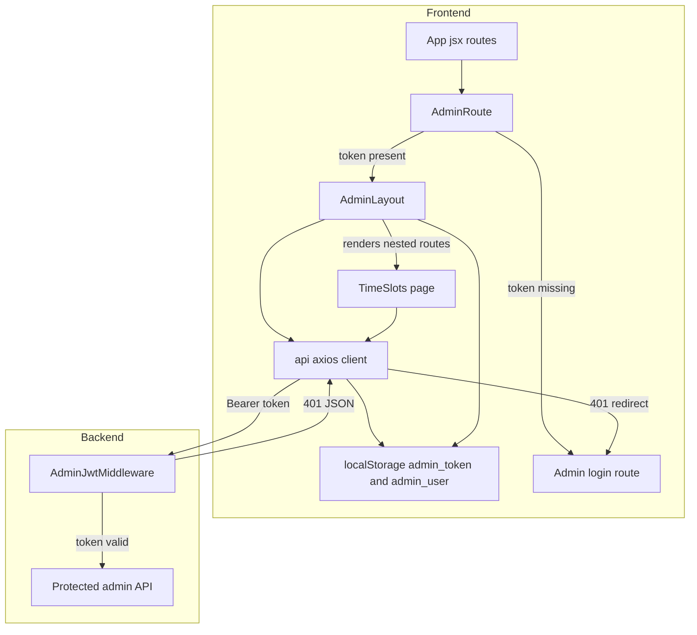
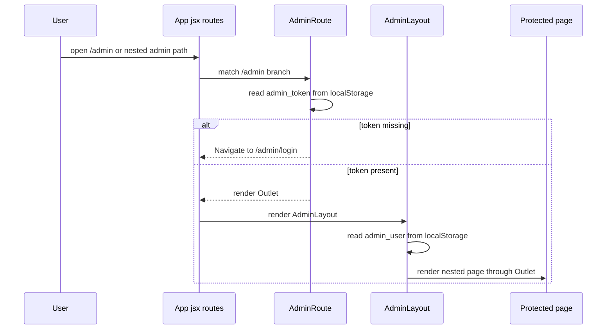
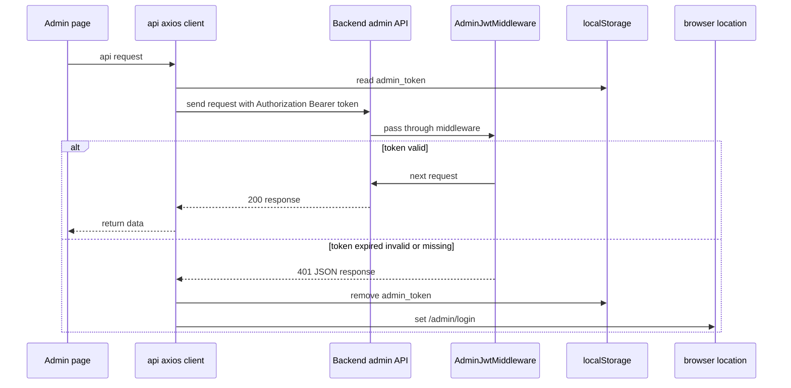
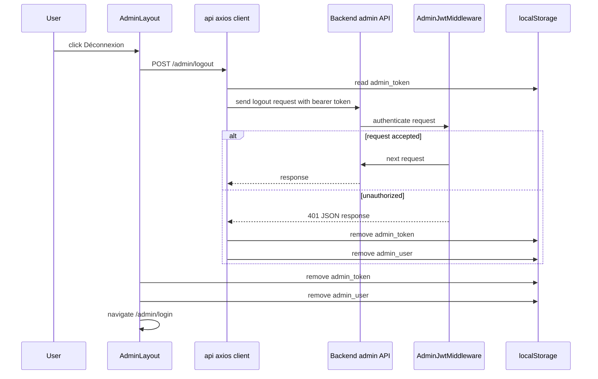

# Admin Authentication and Access Control

## Overview

This section covers the admin access path from the browser to the backend: route-level gating in `cri-frontend/src/App.jsx` and `cri-frontend/src/components/AdminRoute.jsx`, admin shell rendering in `cri-frontend/src/components/AdminLayout.jsx`, bearer-token injection and 401 handling in `cri-frontend/src/api/axios.js`, and JWT validation in `cri-back/app/Http/Middleware/AdminJwtMiddleware.php`.

The flow is split across client-side navigation and server-side enforcement. The client only opens the admin shell when `admin_token` exists in `localStorage`, while the backend middleware validates the JWT on protected admin requests and returns a JSON 401 response when the token is expired, invalid, missing, or no admin user is found.

## Architecture Overview



## Component Structure

### `cri-frontend/src/App.jsx`

cri-frontend/src/App.jsx contains two index routes under the same /admin branch: one redirects to /admin/dashboard, and another redirects to /admin/appointments. The first index route is the effective default for /admin, so the second index redirect is unreachable in the current route tree.

`App` defines the public pages and the protected admin route tree. The admin section is mounted under `/admin`, guarded by `AdminRoute`, and rendered inside `AdminLayout`.

#### Route structure

| Path | Element | Behavior |
| --- | --- | --- |
| `/` | `Home` | Public home page |
| `/booking` | `Booking` | Public booking page |
| `/confirmation/:reference` | `Confirmation` | Public confirmation page |
| `/search` | `Search` | Public search page |
| `/admin/login` | `Login` | Public admin login page |
| `/admin` | `AdminRoute` | Guard for protected admin navigation |
| `/admin/dashboard` | `Dashboard` | Protected admin dashboard |
| `/admin/appointments` | `Appointments` | Protected appointments management |
| `/admin/services` | `Services` | Protected services management |
| `/admin/time-slots` | `TimeSlots` | Protected slot management |
| `/admin/admins` | `Admins` | Protected admin management |


#### Protected route composition

| Nested layer | Purpose |
| --- | --- |
| `AdminRoute` | Blocks access unless `admin_token` exists in `localStorage` |
| `AdminLayout` | Provides the admin shell, sidebar, logout action, and `<Outlet />` rendering |
| Nested admin pages | Render inside the layout through `Outlet` |


#### Direct route behavior

- `/admin/login` is outside the protected branch.
- `/admin` is the protected parent route.
- `/admin/dashboard`, `/admin/appointments`, `/admin/services`, `/admin/time-slots`, and `/admin/admins` are nested under the protected branch.
- `Navigate` is used to redirect `/admin` to a default child route.

### `cri-frontend/src/components/AdminRoute.jsx`

`AdminRoute` is the client-side gate for protected admin navigation. It checks whether `admin_token` exists in `localStorage` and renders the nested route tree only when the token is present.

#### Declared values and state

| Value | Type | Responsibility |
| --- | --- | --- |
| `token` | `string \ | null` | Reads `localStorage.getItem('admin_token')` |
| `AdminRoute` | function | Returns `<Outlet />` when authenticated, otherwise `<Navigate to="/admin/login" />` |


#### Guard behavior

| Condition | Result |
| --- | --- |
| `admin_token` exists | Render nested admin route content through `Outlet` |
| `admin_token` is missing | Redirect to `/admin/login` |


This guard is presence-based. It does not validate token freshness or signature; those checks happen when protected API calls reach `AdminJwtMiddleware`.

### `cri-frontend/src/components/AdminLayout.jsx`

`AdminLayout` renders the persistent admin shell around protected pages. It reads `admin_user` from `localStorage`, builds the sidebar menu, shows the current admin identity, and provides logout through `api.post('/admin/logout')`.

#### Declared values and state

| Value | Type | Responsibility |
| --- | --- | --- |
| `admin` | object | Parsed from `localStorage.getItem('admin_user')` and used for display plus role checks |
| `navItems` | array | Sidebar menu entries |
| `navigate` | function | Redirects after logout |
| `sidebarOpen` | boolean | Controls sidebar width and compact mode |
| `AdminLayout` | function | Wraps admin pages and renders `<Outlet />` |


#### Sidebar navigation items

| Path | Label | Visibility |
| --- | --- | --- |
| `/admin/dashboard` | `Tableau de bord` | Always visible |
| `/admin/appointments` | `Rendez-vous` | Always visible |
| `/admin/services` | `Services` | Always visible |
| `/admin/time-slots` | `Creneaux` | Always visible |
| `/admin/admins` | `Admins` | Visible only when `admin.role === 'superadmin'` |


#### Logout flow

| Step | Behavior |
| --- | --- |
| 1 | `handleLogout` calls `await api.post('/admin/logout')` |
| 2 | Errors from the request are ignored in the local `catch {}` block |
| 3 | `localStorage.removeItem('admin_token')` runs |
| 4 | `localStorage.removeItem('admin_user')` runs |
| 5 | `navigate('/admin/login')` sends the user back to the login page |


`AdminLayout` also shows the logged-in admin name and role from `admin_user`, and uses `<Outlet />` to place the current protected page inside the shared shell.

### `cri-frontend/src/api/axios.js`

`api` is the shared Axios client used by admin pages and the logout action. It is configured with a local API base URL, JSON headers, a request interceptor that injects the bearer token from `localStorage`, and a response interceptor that forces a logout redirect on 401.

#### Client configuration

| Value | Type | Responsibility |
| --- | --- | --- |
| `api` | Axios instance | Shared HTTP client |
| `token` | `string \ | null` | Read from `localStorage.getItem('admin_token')` in the request interceptor |


#### Static client settings

| Setting | Value |
| --- | --- |
| `baseURL` | `http://localhost:8000/api` |
| `Content-Type` | `application/json` |
| `Accept` | `application/json` |


#### Request interceptor behavior

| Condition | Result |
| --- | --- |
| `admin_token` exists | Adds `Authorization: Bearer <token>` to `config.headers` |
| `admin_token` is missing | Sends the request without `Authorization` |


#### Response interceptor behavior

| Condition | Result |
| --- | --- |
| Response succeeds | Returns the response unchanged |
| Response status is 401 | Removes `admin_token` from `localStorage` and sets `window.location.href = '/admin/login'` |
| Other errors | Rejects the promise with `Promise.reject(error)` |


This client is the propagation point for bearer-token transport across all admin API calls in the current frontend.

### `cri-back/app/Http/Middleware/AdminJwtMiddleware.php`

`AdminJwtMiddleware` is the backend authentication gate for admin requests. It forces JSON responses, resolves the current admin from the `admin` guard, and converts JWT failures into consistent 401 JSON responses.

#### Declared properties

No instance properties are declared in `AdminJwtMiddleware`.

#### Public methods

| Method | Description |
| --- | --- |
| `handle` | Sets the request `Accept` header to `application/json`, validates the admin JWT through `Auth::guard('admin')->userOrFail()`, and returns either the next middleware response or a 401 JSON response |


#### Middleware behavior

| Condition | Response |
| --- | --- |
| `Auth::guard('admin')->userOrFail()` succeeds | Passes the request to `$next($request)` |
| No admin user is returned | `401` with `{"success": false, "message": "Admin not found."}` |
| `TokenExpiredException` | `401` with `{"success": false, "message": "Token expired."}` |
| `TokenInvalidException` | `401` with `{"success": false, "message": "Token invalid."}` |
| `JWTException` | `401` with `{"success": false, "message": "Token not provided."}` |


The middleware always sets `Accept` to `application/json` before the auth check, so protected admin API failures are returned as JSON rather than HTML.

### `cri-frontend/src/pages/admin/TimeSlots.jsx`

`TimeSlots` is a protected admin page that uses the shared Axios client, consumes the persisted `admin_user`, and applies an extra client-side restriction for non-superadmin users. It also demonstrates how the bearer-token flow reaches real admin operations.

#### Declared values and state

| Value | Type | Responsibility |
| --- | --- | --- |
| `slots` | array | Loaded time slots |
| `services` | array | Loaded admin services |
| `blockedDates` | array | Loaded blocked-date records |
| `loading` | boolean | Controls the slot list loading state |
| `generating` | boolean | Controls the schedule-generation button state |
| `generateMsg` | string | Displays generation feedback |
| `blockModal` | boolean | Controls the blocked-date modal |
| `blockForm` | object | Holds `blocked_date` and `reason` |
| `filters` | object | Holds `service_id` and `date` |
| `deleteConfirm` | object or null | Holds the slot selected for deletion |
| `currentAdmin` | object | Parsed from `localStorage.getItem('admin_user')` |
| `isRestricted` | boolean | Marks non-superadmin admins with a `service_id` as read-only |
| `fetchServices` | function | Loads services through the shared client |
| `TimeSlots` | function | Renders the protected slot management page |


#### Client-side access control in this page

| Rule | Effect |
| --- | --- |
| `currentAdmin.role !== 'superadmin' && currentAdmin.service_id` | Sets `isRestricted` |
| `!isRestricted` | Shows schedule generation and blocked-date actions |
| `isRestricted` | Hides management controls and shows `Lecture seule` for destructive actions |


#### Data-loading behavior

| Function | API call | Purpose |
| --- | --- | --- |
| `fetchServices` | `api.get('/admin/services')` | Loads the service list for the filter control |
| `fetchSlots` | `api.get('/admin/time-slots', { params })` | Loads filtered slot data |
| `fetchBlockedDates` | `api.get('/admin/blocked-dates')` | Loads blocked dates |
| `handleGenerate` | `api.post('/admin/schedules/generate', { days: 30 })` | Generates future slots |
| `handleToggleSlot` | PATCH request using `slot.id` in the route | Toggles a slot and refreshes the list |
| `handleDeleteSlot` | `api.delete(`/admin/time-slots/${id}`)` | Deletes a slot |
| `handleBlockDate` | `api.post('/admin/blocked-dates', blockForm)` | Creates a blocked-date entry |
| `handleUnblockDate` | `api.delete(`/admin/blocked-dates/${id}`)` | Removes a blocked-date entry |


#### UI states

| State | Trigger | Visible result |
| --- | --- | --- |
| Loading | `loading === true` | Spinner in the table area |
| Empty | `slots.length === 0` | Empty-state message |
| Defined | Data loaded | Slot table with service, date, time, reservations, availability, status, and actions |
| Error | Request failure in generation or mutation handlers | Inline generation error message or `alert` feedback |


## API Integration

### `POST /admin/logout`

#### Logout Admin Session

```api
{
    "title": "Logout Admin Session",
    "description": "Ends the admin session from the admin shell and clears persisted admin credentials on the client",
    "method": "POST",
    "baseUrl": "http://localhost:8000/api",
    "endpoint": "/admin/logout",
    "headers": [
        {
            "key": "Accept",
            "value": "application/json",
            "required": true
        },
        {
            "key": "Content-Type",
            "value": "application/json",
            "required": true
        },
        {
            "key": "Authorization",
            "value": "Bearer admin-token",
            "required": true
        }
    ],
    "queryParams": [],
    "pathParams": [],
    "bodyType": "none",
    "requestBody": "",
    "formData": [],
    "rawBody": "",
    "responses": {
        "200": {
            "description": "Logout request accepted",
            "body": "[]"
        },
        "401": {
            "description": "Authentication failure handled by the shared Axios interceptor",
            "body": "{\n    \"success\": false,\n    \"message\": \"Token invalid.\"\n}"
        }
    }
}
```

### `GET /admin/services`

#### Load Admin Services

```api
{
    "title": "Load Admin Services",
    "description": "Fetches the list of services used by the time-slot filter and admin slot management UI",
    "method": "GET",
    "baseUrl": "http://localhost:8000/api",
    "endpoint": "/admin/services",
    "headers": [
        {
            "key": "Accept",
            "value": "application/json",
            "required": true
        },
        {
            "key": "Authorization",
            "value": "Bearer admin-token",
            "required": true
        }
    ],
    "queryParams": [],
    "pathParams": [],
    "bodyType": "none",
    "requestBody": "",
    "formData": [],
    "rawBody": "",
    "responses": {
        "200": {
            "description": "Service collection returned to the frontend",
            "body": "{\n    \"data\": [\n        {\n            \"id\": 1,\n            \"name\": \"Consultation\"\n        }\n    ]\n}"
        }
    }
}
```

### `GET /admin/time-slots`

#### Load Admin Time Slots

```api
{
    "title": "Load Admin Time Slots",
    "description": "Fetches admin time slots with optional service and date filters",
    "method": "GET",
    "baseUrl": "http://localhost:8000/api",
    "endpoint": "/admin/time-slots",
    "headers": [
        {
            "key": "Accept",
            "value": "application/json",
            "required": true
        },
        {
            "key": "Authorization",
            "value": "Bearer admin-token",
            "required": true
        }
    ],
    "queryParams": [
        {
            "key": "service_id",
            "value": "1",
            "required": false
        },
        {
            "key": "date",
            "value": "2026-07-01",
            "required": false
        }
    ],
    "pathParams": [],
    "bodyType": "none",
    "requestBody": "",
    "formData": [],
    "rawBody": "",
    "responses": {
        "200": {
            "description": "Filtered slot collection returned to the frontend",
            "body": "{\n    \"data\": [\n        {\n            \"id\": 10,\n            \"service\": {\n                \"name\": \"Consultation\"\n            },\n            \"slot_date\": \"2026-07-01\",\n            \"start_time\": \"09:00:00\",\n            \"end_time\": \"09:30:00\",\n            \"booked_count\": 0,\n            \"capacity\": 3,\n            \"is_active\": true\n        }\n    ]\n}"
        }
    }
}
```

### `GET /admin/blocked-dates`

#### Load Blocked Dates

```api
{
    "title": "Load Blocked Dates",
    "description": "Fetches blocked dates for the admin slot management page",
    "method": "GET",
    "baseUrl": "http://localhost:8000/api",
    "endpoint": "/admin/blocked-dates",
    "headers": [
        {
            "key": "Accept",
            "value": "application/json",
            "required": true
        },
        {
            "key": "Authorization",
            "value": "Bearer admin-token",
            "required": true
        }
    ],
    "queryParams": [],
    "pathParams": [],
    "bodyType": "none",
    "requestBody": "",
    "formData": [],
    "rawBody": "",
    "responses": {
        "200": {
            "description": "Blocked-date collection returned to the frontend",
            "body": "{\n    \"data\": [\n        {\n            \"id\": 4,\n            \"blocked_date\": \"2026-07-04\",\n            \"reason\": \"Holiday\"\n        }\n    ]\n}"
        }
    }
}
```

### `POST /admin/schedules/generate`

#### Generate Admin Schedules

```api
{
    "title": "Generate Admin Schedules",
    "description": "Requests slot generation for the next 30 days from the admin time-slot page",
    "method": "POST",
    "baseUrl": "http://localhost:8000/api",
    "endpoint": "/admin/schedules/generate",
    "headers": [
        {
            "key": "Accept",
            "value": "application/json",
            "required": true
        },
        {
            "key": "Content-Type",
            "value": "application/json",
            "required": true
        },
        {
            "key": "Authorization",
            "value": "Bearer admin-token",
            "required": true
        }
    ],
    "queryParams": [],
    "pathParams": [],
    "bodyType": "json",
    "requestBody": "{\n    \"days\": 30\n}",
    "formData": [],
    "rawBody": "",
    "responses": {
        "200": {
            "description": "Generation completed",
            "body": "{\n    \"message\": \"Schedules generated\"\n}"
        }
    }
}
```

### `PATCH /admin/time-slots/id/toggle`

#### Toggle Admin Time Slot

```api
{
    "title": "Toggle Admin Time Slot",
    "description": "Toggles a specific slot from the admin time-slot page and refreshes the list after the request",
    "method": "PATCH",
    "baseUrl": "http://localhost:8000/api",
    "endpoint": "/admin/time-slots/id/toggle",
    "headers": [
        {
            "key": "Accept",
            "value": "application/json",
            "required": true
        },
        {
            "key": "Content-Type",
            "value": "application/json",
            "required": true
        },
        {
            "key": "Authorization",
            "value": "Bearer admin-token",
            "required": true
        }
    ],
    "queryParams": [],
    "pathParams": [
        {
            "key": "id",
            "value": "10",
            "required": true
        }
    ],
    "bodyType": "none",
    "requestBody": "",
    "formData": [],
    "rawBody": "",
    "responses": {
        "200": {
            "description": "Slot toggle accepted",
            "body": "[]"
        }
    }
}
```

### `POST /admin/blocked-dates`

#### Create Blocked Date

```api
{
    "title": "Create Blocked Date",
    "description": "Creates a blocked-date entry from the admin time-slot modal",
    "method": "POST",
    "baseUrl": "http://localhost:8000/api",
    "endpoint": "/admin/blocked-dates",
    "headers": [
        {
            "key": "Accept",
            "value": "application/json",
            "required": true
        },
        {
            "key": "Content-Type",
            "value": "application/json",
            "required": true
        },
        {
            "key": "Authorization",
            "value": "Bearer admin-token",
            "required": true
        }
    ],
    "queryParams": [],
    "pathParams": [],
    "bodyType": "json",
    "requestBody": "{\n    \"blocked_date\": \"2026-07-04\",\n    \"reason\": \"Holiday\"\n}",
    "formData": [],
    "rawBody": "",
    "responses": {
        "200": {
            "description": "Blocked date created",
            "body": "[]"
        }
    }
}
```

### `DELETE /admin/time-slots/{id}`

#### Delete Admin Time Slot

```api
{
    "title": "Delete Admin Time Slot",
    "description": "Deletes a selected slot after confirmation in the time-slot table",
    "method": "DELETE",
    "baseUrl": "http://localhost:8000/api",
    "endpoint": "/admin/time-slots/{id}",
    "headers": [
        {
            "key": "Accept",
            "value": "application/json",
            "required": true
        },
        {
            "key": "Authorization",
            "value": "Bearer admin-token",
            "required": true
        }
    ],
    "queryParams": [],
    "pathParams": [
        {
            "key": "id",
            "value": "10",
            "required": true
        }
    ],
    "bodyType": "none",
    "requestBody": "",
    "formData": [],
    "rawBody": "",
    "responses": {
        "200": {
            "description": "Slot deletion accepted",
            "body": "[]"
        }
    }
}
```

### `DELETE /admin/blocked-dates/{id}`

#### Delete Blocked Date

```api
{
    "title": "Delete Blocked Date",
    "description": "Removes a blocked date from the admin time-slot page after confirmation",
    "method": "DELETE",
    "baseUrl": "http://localhost:8000/api",
    "endpoint": "/admin/blocked-dates/{id}",
    "headers": [
        {
            "key": "Accept",
            "value": "application/json",
            "required": true
        },
        {
            "key": "Authorization",
            "value": "Bearer admin-token",
            "required": true
        }
    ],
    "queryParams": [],
    "pathParams": [
        {
            "key": "id",
            "value": "4",
            "required": true
        }
    ],
    "bodyType": "none",
    "requestBody": "",
    "formData": [],
    "rawBody": "",
    "responses": {
        "200": {
            "description": "Blocked date deletion accepted",
            "body": "[]"
        }
    }
}
```

## Feature Flows

### Protected Admin Entry and Navigation



### Authenticated Admin API Request and 401 Redirect



### Logout Flow from Admin Shell



## State Management

| State or storage key | Location | Role |
| --- | --- | --- |
| `admin_token` | `localStorage` | Client-side gate in `AdminRoute`, bearer token source in `axios.js`, cleared on 401 and logout |
| `admin_user` | `localStorage` | Admin profile and role source in `AdminLayout` and `TimeSlots` |
| `sidebarOpen` | `AdminLayout` | Toggles sidebar width and label visibility |
| `loading` | `TimeSlots` | Controls slot table loading UI |
| `generating` | `TimeSlots` | Controls schedule-generation button disabled state and spinner |
| `blockModal` | `TimeSlots` | Shows or hides the blocked-date modal |
| `deleteConfirm` | `TimeSlots` | Holds the slot selected for deletion |
| `filters` | `TimeSlots` | Drives `service_id` and `date` request params |
| `generateMsg` | `TimeSlots` | Displays success or failure feedback after schedule generation |


## Error Handling

| Location | Error condition | Behavior |
| --- | --- | --- |
| `AdminJwtMiddleware::handle` | Token expired | Returns `401` with `success: false` and `message: Token expired.` |
| `AdminJwtMiddleware::handle` | Token invalid | Returns `401` with `success: false` and `message: Token invalid.` |
| `AdminJwtMiddleware::handle` | Token not provided | Returns `401` with `success: false` and `message: Token not provided.` |
| `AdminJwtMiddleware::handle` | No admin user | Returns `401` with `success: false` and `message: Admin not found.` |
| `axios.js` response interceptor | Any `401` | Removes `admin_token` and redirects to `/admin/login` |
| `AdminLayout::handleLogout` | Logout request fails | Swallows the error, clears `admin_token` and `admin_user`, and navigates to `/admin/login` |
| `TimeSlots::handleGenerate` | Generation request fails | Sets `generateMsg` to `Erreur lors de la génération.` |
| `TimeSlots::handleDeleteSlot` | Delete request fails | Shows `alert(err.response?.data?.message | 'Impossible de supprimer ce créneau.')` |
| `TimeSlots::handleBlockDate` | Block-date request fails | Shows `alert(err.response?.data?.message | 'Erreur.')` |


## Dependencies

| File | Dependency | Use |
| --- | --- | --- |
| `cri-back/app/Http/Middleware/AdminJwtMiddleware.php` | `Closure` | Continues the middleware chain |
| `cri-back/app/Http/Middleware/AdminJwtMiddleware.php` | `Illuminate\Http\Request` | Accesses and mutates request headers |
| `cri-back/app/Http/Middleware/AdminJwtMiddleware.php` | `PHPOpenSourceSaver\JWTAuth\Exceptions\TokenExpiredException` | Handles expired JWTs |
| `cri-back/app/Http/Middleware/AdminJwtMiddleware.php` | `PHPOpenSourceSaver\JWTAuth\Exceptions\TokenInvalidException` | Handles invalid JWTs |
| `cri-back/app/Http/Middleware/AdminJwtMiddleware.php` | `PHPOpenSourceSaver\JWTAuth\Exceptions\JWTException` | Handles missing token cases |
| `cri-back/app/Http/Middleware/AdminJwtMiddleware.php` | `Illuminate\Support\Facades\Auth` | Resolves the `admin` guard user |
| `cri-frontend/src/App.jsx` | `react-router-dom` | Public and protected route composition |
| `cri-frontend/src/components/AdminRoute.jsx` | `react-router-dom` | `Navigate` and `Outlet` control |
| `cri-frontend/src/components/AdminLayout.jsx` | `react-router-dom` | `NavLink`, `useNavigate`, `Outlet` |
| `cri-frontend/src/components/AdminLayout.jsx` | `../api/axios` | Logout request transport |
| `cri-frontend/src/api/axios.js` | `axios` | Shared HTTP client |
| `cri-frontend/src/pages/admin/TimeSlots.jsx` | `../../api/axios` | Admin time-slot data transport |
| `cri-frontend/src/components/AdminLayout.jsx` | `../assets/cri-logo.png` | Sidebar branding |


## Testing Considerations

| Scenario | Expected result |
| --- | --- |
| Open `/admin/dashboard` without `admin_token` | Client redirects to `/admin/login` |
| Open `/admin/dashboard` with `admin_token` present | `AdminRoute` renders `AdminLayout` and nested content |
| Call a protected admin API with an expired token | Backend returns 401 JSON and the Axios interceptor clears the token and redirects |
| Click logout in `AdminLayout` | Client calls `/admin/logout`, clears `admin_token` and `admin_user`, then navigates to `/admin/login` |
| Load `TimeSlots` as superadmin | Management buttons are visible |
| Load `TimeSlots` as restricted admin with `service_id` | The page shows read-only mode and hides destructive controls |
| Visit `/admin` | Redirect goes to `/admin/dashboard` because of the first index route |


## Key Classes Reference

cri-frontend/src/pages/admin/TimeSlots.jsx also issues a PATCH request that interpolates slot.id into the slot route before calling fetchSlots() again. The captured source shows the toggle action and refresh behavior, but the complete clean route string for that PATCH call is not fully visible in the provided snippet.

| Class | Responsibility |
| --- | --- |
| `AdminJwtMiddleware.php` | Validates admin JWTs and converts auth failures into JSON 401 responses |
| `App.jsx` | Declares public pages and the protected admin route tree |
| `AdminRoute.jsx` | Performs client-side token presence checks before rendering protected admin routes |
| `AdminLayout.jsx` | Renders the authenticated admin shell, sidebar, and logout action |
| `axios.js` | Propagates the bearer token and handles 401 redirects |
| `TimeSlots.jsx` | Loads and manages protected admin slot data with role-based UI restrictions |
