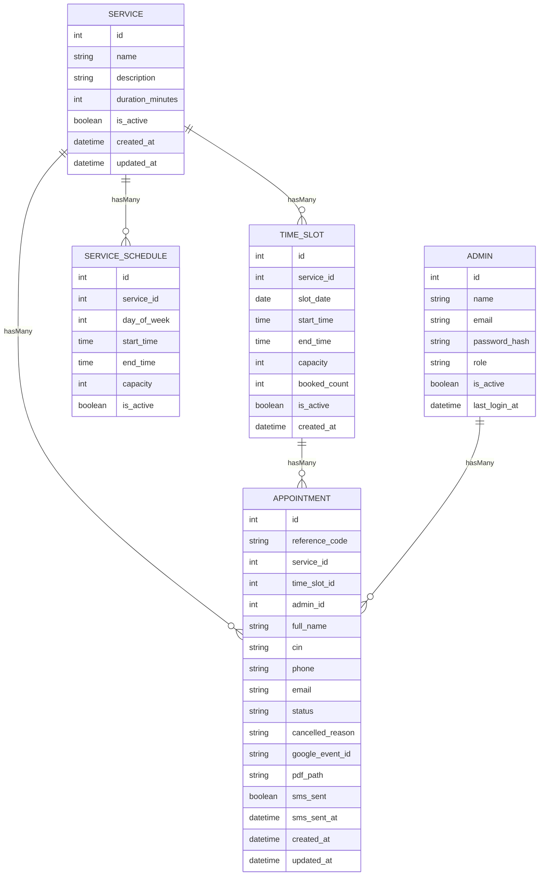
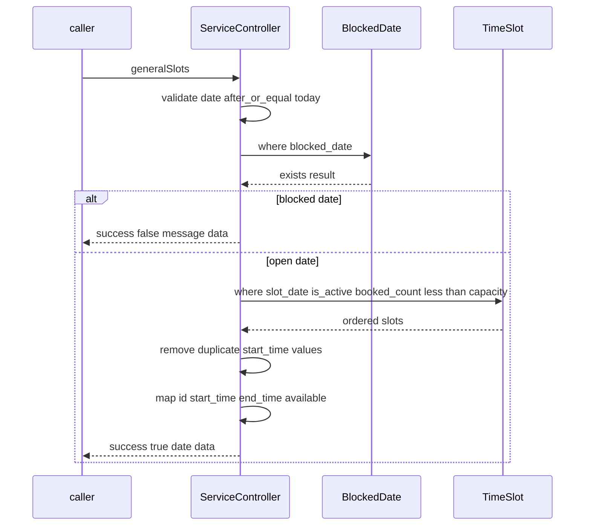

# Public Booking and Appointment APIs - Appointment entity, slot linkage, and booking persistence rules

## Overview

This section documents the booking data model that ties together `Service`, `TimeSlot`, and `Appointment` in `cri-back`. A booking is stored as an appointment record linked to exactly one service and one time slot, with an optional admin link for internal handling. The appointment also carries the public reference code and the downstream tracking fields used for PDF output, SMS delivery, and calendar integrations.

The persistence rules are enforced by the model relationships, the `generateReference()` helper, the slot availability check in `TimeSlot::isAvailable()`, and the schema constraints in the migrations. Those rules determine what can be created, what can be deleted, and which records remain stable after a booking is persisted.

## Architecture Overview

## Data Model and Persistence Rules

### Appointment Entity

*`cri-back/app/Models/Appointment.php`*

The `Appointment` model is the booking record that captures the customer identity, the selected service and slot, and the operational tracking fields for the rest of the lifecycle.

#### Class Properties

| Property | Type | Description |
| --- | --- | --- |
| `$fillable` | `array` | `reference_code`, `service_id`, `time_slot_id`, `admin_id`, `full_name`, `cin`, `phone`, `email`, `status`, `cancelled_reason`, `motif`, `date_naissance`, `nationalite`, `genre`, `premiere_visite`, `google_event_id`, `odoo_event_id`, `pdf_path`, `sms_sent`, `sms_sent_at` |

#### Relationships

| Method | Description |
| --- | --- |
| `service` | Links the appointment to `Service::class` through `service_id`. |
| `timeSlot` | Links the appointment to `TimeSlot::class` through `time_slot_id`. |
| `admin` | Links the appointment to `Admin::class` through `admin_id`. |

#### Methods

| Method | Description |
| --- | --- |
| `service` | Returns the related service for the appointment. |
| `timeSlot` | Returns the related time slot for the appointment. |
| `admin` | Returns the related admin for the appointment. |
| `generateReference` | Builds a unique `reference_code` using the `CRI-` prefix, the last four characters of `uniqid()`, and `date('md')`, then repeats until `reference_code` is unused. |

#### Schema-Backed Fields

| Field | Type | Constraints and behavior |
| --- | --- | --- |
| `id` | bigint unsigned | Primary key. |
| `reference_code` | string 12, later changed to string 20 | Unique. The later migration widens the column. |
| `service_id` | foreignId | Constrained to `services`, `onDelete('restrict')`. |
| `time_slot_id` | foreignId | Constrained to `time_slots`, `onDelete('restrict')`. |
| `admin_id` | foreignId nullable | Constrained to `admins`, `onDelete('set null')`. |
| `full_name` | string 150 | Required. |
| `cin` | string 10 | Required. |
| `phone` | string 20 | Required. |
| `email` | string 150 nullable | Optional. |
| `status` | enum | Values: `pending`, `confirmed`, `present`, `cancelled`; default `pending`. |
| `cancelled_reason` | string 255 nullable | Stored when the appointment is cancelled. |
| `google_event_id` | string 255 nullable | Calendar tracking value. |
| `pdf_path` | string 500 nullable | Stored PDF location. |
| `sms_sent` | boolean | Default `false`. |
| `sms_sent_at` | timestamp nullable | SMS delivery timestamp. |
| `created_at` | timestamp | Added by `timestamps()`. |
| `updated_at` | timestamp | Added by `timestamps()`. |

#### Booking Persistence Rules

> **Note:** `Appointment::$fillable` includes `motif`, `date_naissance`, `nationalite`, `genre`, `premiere_visite`, and `odoo_event_id`, but `create_appointments_table` does not define those columns. The shown table schema persists the fields that are present in the migration only.

- `reference_code` must be unique at the database level.
- `service_id` and `time_slot_id` are mandatory links and cannot be removed by deleting the referenced service or slot because both foreign keys use `restrict`.
- `admin_id` is optional and can be cleared automatically with `set null`.
- `status` starts at `pending` and can move through `confirmed`, `present`, and `cancelled`.
- `sms_sent` and `sms_sent_at` track confirmation delivery state.
- Integration identifiers and generated artifacts are stored on the appointment row as nullable fields when present.

---

### Service Entity

*`cri-back/app/Models/Service.php`*

The `Service` model is the catalog entry a visitor chooses before selecting a date and time. It defines the service name, the standard duration, and the active flag used by the public listing.

#### Class Properties

| Property | Type | Description |
| --- | --- | --- |
| `$fillable` | `array` | `name`, `description`, `duration_minutes`, `capacity`, `is_active` |
| `$casts` | `array` | `is_active` is cast to `boolean`. |

#### Relationships

| Method | Description |
| --- | --- |
| `timeSlots` | Returns all `TimeSlot::class` rows linked to the service. |
| `appointments` | Returns all `Appointment::class` rows linked to the service. |
| `schedules` | Returns all `ServiceSchedule::class` rows linked to the service. |

#### Methods

| Method | Description |
| --- | --- |
| `timeSlots` | Defines the service to slot relationship. |
| `appointments` | Defines the service to appointment relationship. |
| `schedules` | Defines the service to schedule relationship. |

#### Schema-Backed Fields

| Field | Type | Constraints and behavior |
| --- | --- | --- |
| `id` | bigint unsigned | Primary key. |
| `name` | string 150 | Required. |
| `description` | text nullable | Optional. |
| `duration_minutes` | smallInteger | Default `30`. |
| `is_active` | boolean | Default `true`. |
| `created_at` | timestamp | Added by `timestamps()`. |
| `updated_at` | timestamp | Added by `timestamps()`. |

> **Note:** `Service::$fillable` includes `capacity`, but `create_services_table` does not define a `capacity` column. The seeded service rows in `ServiceSeeder` also store only `name`, `description`, `duration_minutes`, `is_active`, and timestamps.

---

### Time Slot Entity

*`cri-back/app/Models/TimeSlot.php`*

The `TimeSlot` model represents a dated appointment window for one service. It stores the slot date, start and end times, the configured capacity, and the live booked counter that drives availability checks.

#### Class Properties

| Property | Type | Description |
| --- | --- | --- |
| `$timestamps` | `boolean` | Set to `false`; the model does not use automatic `updated_at` handling. |
| `$fillable` | `array` | `service_id`, `slot_date`, `start_time`, `end_time`, `capacity`, `booked_count`, `is_active` |
| `$casts` | `array` | `slot_date` is cast to `date`, `is_active` is cast to `boolean`. |

#### Relationships

| Method | Description |
| --- | --- |
| `service` | Returns the owning `Service::class` row. |
| `appointments` | Returns all `Appointment::class` rows linked to the slot. |

#### Methods

| Method | Description |
| --- | --- |
| `service` | Defines the slot to service relationship. |
| `appointments` | Defines the slot to appointment relationship. |
| `isAvailable` | Returns `true` only when the slot is active and `booked_count < capacity`. |

#### Schema-Backed Fields

| Field | Type | Constraints and behavior |
| --- | --- | --- |
| `id` | bigint unsigned | Primary key. |
| `service_id` | foreignId | Constrained to `services`, `onDelete('cascade')`. |
| `slot_date` | date | Cast to `date` in the model. |
| `start_time` | time | Required. |
| `end_time` | time | Required. |
| `capacity` | tinyInteger | Default `1`. |
| `booked_count` | tinyInteger | Default `0`. |
| `is_active` | boolean | Default `true`. |
| `created_at` | timestamp | Set with `useCurrent()`. |
| `uq_slot` | unique index | Unique on `service_id`, `slot_date`, `start_time`. |
| `idx_date` | index | Index on `slot_date`, `service_id`. |

`TimeSlot::isAvailable()` matches the same capacity rule used by the public slot listing path: active slots stay available while `booked_count` remains below `capacity`.

---

### Schema Migrations

*`cri-back/database/migrations/2026_04_11_001439_create_services_table.php`*

*`cri-back/database/migrations/2026_04_11_001520_create_time_slots_table.php`*

*`cri-back/database/migrations/2026_04_11_001536_create_appointments_table.php`*

*`cri-back/database/migrations/2026_04_11_171320_fix_ref_cpde_appointments_table.php`*

| File | `up` | `down` | Key effect |
| --- | --- | --- | --- |
| `2026_04_11_001439_create_services_table.php` | Creates `services` with `name`, `description`, `duration_minutes`, `is_active`, and timestamps. | Drops `services`. | Defines the service catalog schema used by public booking. |
| `2026_04_11_001520_create_time_slots_table.php` | Creates `time_slots` with `service_id`, `slot_date`, `start_time`, `end_time`, `capacity`, `booked_count`, `is_active`, `created_at`, plus `uq_slot` and `idx_date`. | Drops `time_slots`. | Defines dated slot capacity and uniqueness per service and start time. |
| `2026_04_11_001536_create_appointments_table.php` | Creates `appointments` with `reference_code`, service and slot foreign keys, optional `admin_id`, customer fields, status tracking, integration fields, SMS fields, and timestamps. | Drops `appointments`. | Stores the persisted booking record. |
| `2026_04_11_171320_fix_ref_cpde_appointments_table.php` | Changes `appointments.reference_code` from 12 to 20. | Changes `appointments.reference_code` back to 12. | Expands the code length used by `Appointment::generateReference()`. |

#### Schema Constraints That Shape Booking Behavior

- `services` rows are kept when related appointments exist because `appointments.service_id` uses `restrict`.
- `time_slots` rows are kept when related appointments exist because `appointments.time_slot_id` uses `restrict`.
- Removing an admin does not remove appointments because `appointments.admin_id` uses `set null`.
- Time slots are unique per service, date, and start time.
- Appointment rows are indexed by `status`, `time_slot_id`, and `created_at` for lookup and filtering.

## Public Read Support

### Service Controller

*`cri-back/app/Http/Controllers/Api/ServiceController.php`*

This controller provides the read-side data used before an appointment is created. It exposes the active service list and the date-filtered slot list that respects blocked dates and slot capacity.

#### Methods

| Method | Description |
| --- | --- |
| `index` | Returns active services using `id`, `name`, `description`, and `duration_minutes`. |
| `generalSlots` | Validates `date`, rejects blocked dates through `BlockedDate`, loads `TimeSlot` rows for the selected day, filters to active rows where `booked_count < capacity`, removes duplicate `start_time` values, and returns `id`, `start_time`, `end_time`, and `available`. |

#### Slot Availability Flow

The availability check is driven by the same `booked_count < capacity` rule that `TimeSlot::isAvailable()` uses in the model layer. When a blocked date is present, the controller stops before returning any slot data.

## Seeder Support

### Database Seeder

*`cri-back/database/seeders/DatabaseSeeder.php`*

| File | Responsibility |
| --- | --- |
| `cri-back/database/seeders/DatabaseSeeder.php` | Uses `WithoutModelEvents` and calls `ServiceSeeder::class` and `AdminSeeder::class` from `run()`. |
| `cri-back/database/seeders/ServiceSeeder.php` | Inserts the baseline service catalog into `services` with `is_active` set to `true` and `created_at` and `updated_at` set to `now()`. |

### Seeded Service Catalog

| Service name | `duration_minutes` |
| --- | --- |
| `Création d'entreprise` | `45` |
| `Investissement étranger` | `60` |
| `Autorisations et licences` | `30` |
| `Accompagnement de projets` | `60` |
| `Information générale` | `20` |

`ServiceSeeder` writes the seed rows directly with `DB::table('services')->insert([])`, so the bootstrap data always matches the service schema shown above.

## Key Classes Reference

| Class | Responsibility |
| --- | --- |
| `Appointment.php` | Stores the booking record, links the selected service and time slot, and generates a unique reference code. |
| `Service.php` | Represents the service catalog and exposes the service-to-slot and service-to-appointment relationships. |
| `TimeSlot.php` | Stores dated slot capacity, booked counts, and slot availability rules. |
| `ServiceController.php` | Serves the active service list and the date-based slot list used before a booking is created. |
| `DatabaseSeeder.php` | Boots the seed process by calling `ServiceSeeder` and `AdminSeeder`. |
| `ServiceSeeder.php` | Inserts the baseline service records used by the booking flow. |
