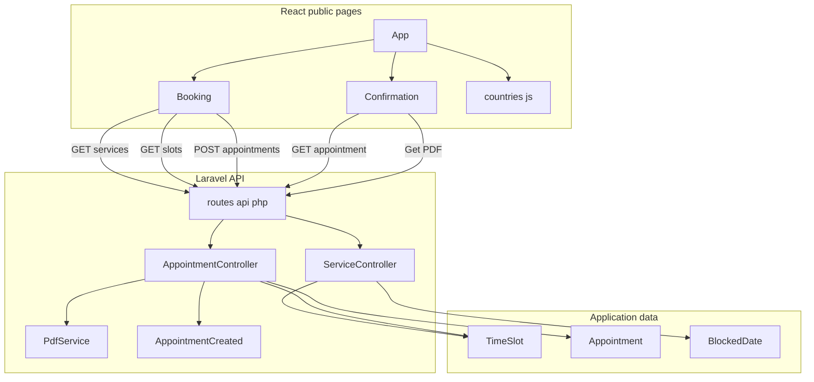
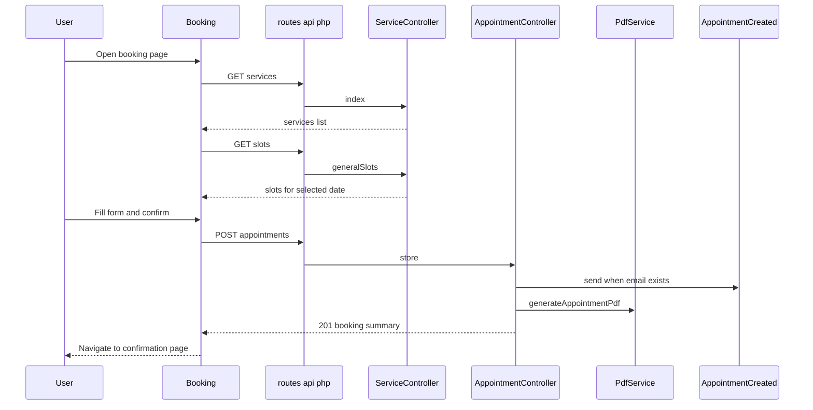
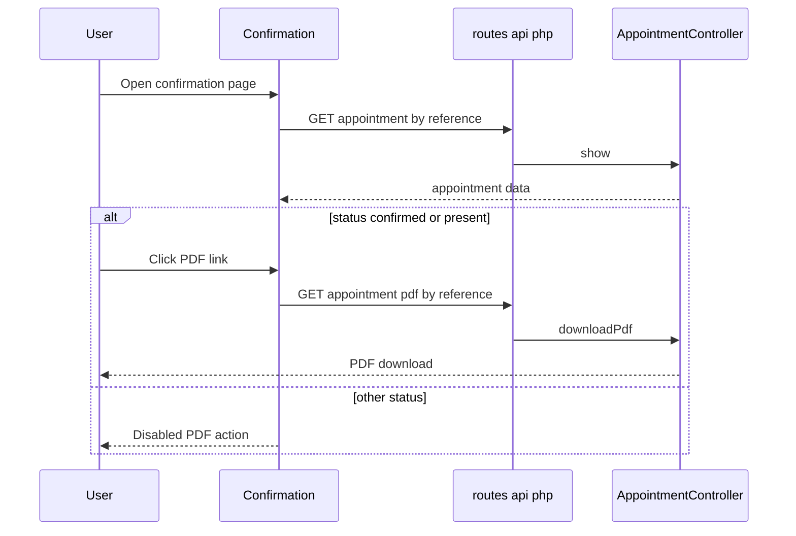

# Public Booking and Appointment APIs

## Overview

This section covers the public booking surface that starts in the React frontend and ends in the Laravel API controllers. The booking page loads active services, fetches available time slots for a chosen date, validates the visitor’s details, and submits a new appointment. The confirmation page then loads the booked appointment by reference and exposes the generated PDF download when the appointment status allows it.

The public API layer is split between `ServiceController` for service and slot discovery and `AppointmentController` for booking creation, appointment lookup, and PDF download. The frontend pages in `cri-frontend/src/pages/public/Booking.jsx` and `cri-frontend/src/pages/public/Confirmation.jsx` align directly with the route declarations in `cri-back/routes/api.php` and the page registrations in `cri-frontend/src/App.jsx`.

## Architecture Overview



## Route and Page Alignment

*`cri-back/routes/api.php`*

*`cri-frontend/src/App.jsx`*

| Route registration | Backend target | Frontend alignment |
| --- | --- | --- |
| `Route::get('services', [ServiceController::class, 'index']);` | `ServiceController@index` | `Booking.jsx` loads active services on mount with `api.get("/services")` |
| `Route::get('services/{id}/slots', [ServiceController::class, 'availableSlots']);` | Registered in `routes/api.php` | No visible call from the public booking pages in the provided frontend files |
| `Route::post('appointments', [AppointmentController::class, 'store']);` | `AppointmentController@store` | `Booking.jsx` submits the completed booking form with `api.post("/appointments")` |
| `Route::get('appointments/{reference}', [AppointmentController::class, 'show']);` | `AppointmentController@show` | `Confirmation.jsx` loads the booked appointment with `api.get(`/appointments/${reference}`)` |
| `Route::get('slots', [ServiceController::class, 'generalSlots']);` | `ServiceController@generalSlots` | `Booking.jsx` fetches date-based availability with `api.get("/slots", { params: { date } })` |
| `Route::get('appointments/{reference}/pdf', [AppointmentController::class, 'downloadPdf']);` | `AppointmentController@downloadPdf` | `Confirmation.jsx` links to the generated PDF download |


## Public API Contracts

### List Services

routes/api.php registers services/{id}/slots against ServiceController::class, 'availableSlots', while the provided ServiceController declaration only exposes index() and generalSlots(Request $request). The public booking page does not call that route; it uses GET /slots instead.

*`cri-back/app/Http/Controllers/Api/ServiceController.php`*

*`cri-back/routes/api.php`*

```api
{
    "title": "List Services",
    "description": "Returns active services with id, name, description, and duration_minutes.",
    "method": "GET",
    "baseUrl": "/api",
    "endpoint": "/services",
    "headers": [],
    "queryParams": [],
    "pathParams": [],
    "bodyType": "none",
    "requestBody": "",
    "formData": [],
    "rawBody": "",
    "responses": {
        "200": {
            "description": "Active services list",
            "body": "{\n    \"success\": true,\n    \"data\": [\n        {\n            \"id\": 1,\n            \"name\": \"Accompagnement Investissement\",\n            \"description\": \"Service public pour l'orientation et l'accompagnement\",\n            \"duration_minutes\": 30\n        }\n    ]\n}"
        }
    }
}
```

### Get Service Slots Route

*`cri-back/routes/api.php`*

```api
{
    "title": "Get Service Slots Route",
    "description": "Route registered for service-specific slot retrieval.",
    "method": "GET",
    "baseUrl": "/api",
    "endpoint": "/services/{id}/slots",
    "headers": [],
    "queryParams": [],
    "pathParams": [
        {
            "key": "id",
            "value": 12,
            "required": true
        }
    ],
    "bodyType": "none",
    "requestBody": "",
    "formData": [],
    "rawBody": "",
    "responses": {
        "200": {
            "description": "Registered route target in routes/api.php",
            "body": "[]"
        }
    }
}
```

### Create Appointment

*`cri-back/app/Http/Controllers/Api/AppointmentController.php`*

*`cri-back/routes/api.php`*

```api
{
    "title": "Create Appointment",
    "description": "Validates the booking payload, checks slot availability, creates the appointment, sends the booking email when an email address is provided, generates the PDF, and returns the booking summary.",
    "method": "POST",
    "baseUrl": "/api",
    "endpoint": "/appointments",
    "headers": [],
    "queryParams": [],
    "pathParams": [],
    "bodyType": "json",
    "requestBody": "{\n    \"time_slot_id\": 12,\n    \"service_id\": 3,\n    \"full_name\": \"Mohammed Alaoui\",\n    \"cin\": \"AB123456\",\n    \"phone\": \"0612345678\",\n    \"email\": \"mohammed@example.com\",\n    \"motif\": \"Demande de cr\\u00e9ation d'entreprise\",\n    \"date_naissance\": \"1992-04-15\",\n    \"nationalite\": \"Maroc\",\n    \"genre\": \"homme\",\n    \"premiere_visite\": 1\n}",
    "formData": [],
    "rawBody": "",
    "responses": {
        "201": {
            "description": "Appointment booked successfully.",
            "body": "{\n    \"success\": true,\n    \"message\": \"Appointment booked successfully.\",\n    \"data\": {\n        \"reference_code\": \"CRI-ABCD-0425\",\n        \"full_name\": \"Mohammed Alaoui\",\n        \"cin\": \"AB123456\",\n        \"service\": \"Accompagnement Investissement\",\n        \"date\": \"2026-04-25\",\n        \"start_time\": \"09:00:00\",\n        \"end_time\": \"09:30:00\",\n        \"status\": \"pending\",\n        \"pdf_url\": \"http://localhost:8000/storage/appointments/CRI-ABCD-0425.pdf\"\n    }\n}"
        },
        "422": {
            "description": "Returned when the slot is no longer available or the same CIN already has a pending or confirmed appointment for the same slot.",
            "body": "{\n    \"success\": false,\n    \"message\": \"This time slot is no longer available.\"\n}"
        },
        "500": {
            "description": "Returned when the transaction fails.",
            "body": "{\n    \"success\": false,\n    \"message\": \"Unexpected booking error\",\n    \"line\": 123\n}"
        }
    }
}
```

### Get Appointment By Reference

*`cri-back/app/Http/Controllers/Api/AppointmentController.php`*

*`cri-back/routes/api.php`*

```api
{
    "title": "Get Appointment By Reference",
    "description": "Loads a booked appointment with its service and time slot details.",
    "method": "GET",
    "baseUrl": "/api",
    "endpoint": "/appointments/{reference}",
    "headers": [],
    "queryParams": [],
    "pathParams": [
        {
            "key": "reference",
            "value": "CRI-ABCD-0425",
            "required": true
        }
    ],
    "bodyType": "none",
    "requestBody": "",
    "formData": [],
    "rawBody": "",
    "responses": {
        "200": {
            "description": "Appointment details",
            "body": "{\n    \"success\": true,\n    \"data\": {\n        \"reference_code\": \"CRI-ABCD-0425\",\n        \"full_name\": \"Mohammed Alaoui\",\n        \"cin\": \"AB123456\",\n        \"phone\": \"0612345678\",\n        \"email\": \"mohammed@example.com\",\n        \"status\": \"confirmed\",\n        \"service\": \"Accompagnement Investissement\",\n        \"date\": \"2026-04-25\",\n        \"start_time\": \"09:00:00\",\n        \"end_time\": \"09:30:00\"\n    }\n}"
        }
    }
}
```

### Get General Slots

*`cri-back/app/Http/Controllers/Api/ServiceController.php`*

*`cri-back/routes/api.php`*

```api
{
    "title": "Get General Slots",
    "description": "Returns available time slots for a requested date after blocking checks, active slot filtering, capacity filtering, and start-time deduplication.",
    "method": "GET",
    "baseUrl": "/api",
    "endpoint": "/slots",
    "headers": [],
    "queryParams": [
        {
            "key": "date",
            "value": "2026-04-25",
            "required": true
        }
    ],
    "pathParams": [],
    "bodyType": "none",
    "requestBody": "",
    "formData": [],
    "rawBody": "",
    "responses": {
        "200": {
            "description": "Available slots for the requested date",
            "body": "{\n    \"success\": true,\n    \"date\": \"2026-04-25\",\n    \"data\": [\n        {\n            \"id\": 12,\n            \"start_time\": \"09:00\",\n            \"end_time\": \"09:30\",\n            \"available\": 3\n        }\n    ]\n}"
        }
    }
}
```

### Download Appointment PDF

*`cri-back/app/Http/Controllers/Api/AppointmentController.php`*

*`cri-back/routes/api.php`*

```api
{
    "title": "Download Appointment PDF",
    "description": "Downloads the stored PDF for a booked appointment when the PDF path exists and the file is present on disk.",
    "method": "GET",
    "baseUrl": "/api",
    "endpoint": "/appointments/{reference}/pdf",
    "headers": [],
    "queryParams": [],
    "pathParams": [
        {
            "key": "reference",
            "value": "CRI-ABCD-0425",
            "required": true
        }
    ],
    "bodyType": "none",
    "requestBody": "",
    "formData": [],
    "rawBody": "",
    "responses": {
        "200": {
            "description": "PDF file download",
            "body": "[]"
        },
        "404": {
            "description": "Returned when the PDF has not been generated yet.",
            "body": "{\n    \"success\": false,\n    \"message\": \"PDF not generated yet.\"\n}"
        }
    }
}
```

### `ServiceController`

*`cri-back/app/Http/Controllers/Api/ServiceController.php`*

| Method | Description |
| --- | --- |
| `index` | Returns active services using `Service::where('is_active', true)->select('id', 'name', 'description', 'duration_minutes')->get()` |
| `generalSlots` | Validates the `date` query parameter, rejects blocked dates, filters active slots with remaining capacity, removes duplicate `start_time` values, and returns `id`, `start_time`, `end_time`, and `available` |


#### Public slot response behavior

`generalSlots` returns a `success: false` payload with `message: 'Cette date est bloquee.'` and `data: []` when the requested date exists in `BlockedDate`. For non-blocked dates, it returns `success: true`, echoes the requested `date`, and maps the filtered `TimeSlot` collection into a display-friendly list with `HH:MM` times.

### `AppointmentController`

*`cri-back/app/Http/Controllers/Api/AppointmentController.php`*

| Method | Description |
| --- | --- |
| `store` | Validates the booking payload, checks `TimeSlot::isAvailable()`, blocks duplicate pending or confirmed appointments for the same CIN and slot, creates the appointment, sends `AppointmentCreated` when `email` is present, increments `booked_count`, generates a PDF through `PdfService`, and commits the transaction |
| `show` | Loads an appointment by `reference_code` with `service` and `timeSlot` relations and returns the public confirmation payload |
| `downloadPdf` | Reads the stored `pdf_path`, checks the file on disk, and returns a download response named after `reference_code` |


#### Booking payload rules

`store` validates these fields before the transaction starts:

- `time_slot_id`: required, `exists:time_slots,id`
- `service_id`: nullable, `exists:services,id`
- `full_name`: required, string, max 150
- `cin`: required, string, regex `^[A-Za-z]{1,2}[0-9]{4,7}$`, max 10
- `phone`: required, string, max 20
- `email`: nullable, email, max 150
- `motif`: required, string, max 500
- `date_naissance`: required, date, before today
- `nationalite`: required, string, max 100
- `genre`: required, `homme` or `femme`
- `premiere_visite`: required, boolean

#### Transaction and response flow

- The controller opens `DB::beginTransaction()` after availability and duplicate checks.
- It creates the appointment with a generated `reference_code`.
- When `email` exists, it sends `AppointmentCreated` with `Mail::to($appointment->email)->send(new AppointmentCreated($appointment))`.
- It increments `TimeSlot.booked_count`.
- It generates and stores the PDF path with `PdfService::generateAppointmentPdf()`.
- It commits on success and rolls back on any exception.

### `PdfService`

store returns service with the fallback string Non assigne, while show uses the fallback string Non assigné. The two public responses are not identical when the service relation is missing.

*`cri-back/app/Services/PdfService.php`*

| Method | Description |
| --- | --- |
| `generateAppointmentPdf` | Loads the appointment with `service` and `timeSlot`, renders `pdf.appointment`, sets A4 portrait mode, writes the file to `storage/app/public/appointments`, and returns the stored filename |


`AppointmentController::store` uses this service immediately after creating the appointment and stores the returned path in `pdf_path`. The confirmation page later exposes that PDF through the `downloadPdf` endpoint.

### `AppointmentCreated`

*`cri-back/app/Mail/AppointmentCreated.php`*

| Property | Type | Description |
| --- | --- | --- |
| `appointment` | `Appointment` | Appointment instance passed into the mailable constructor |


| Method | Description |
| --- | --- |
| `__construct` | Stores the `Appointment` instance on the mailable |
| `build` | Sets the subject `Confirmation de votre demande de rendez-vous` and uses the `emails.email` view |


This mailable is sent only from `AppointmentController::store` when the booking payload includes an email address.

## Public Frontend Pages

### Booking Page

*`cri-frontend/src/pages/public/Booking.jsx`*

`Booking` is the main public booking surface. It loads services on mount, fetches slots whenever the selected date changes, validates the visible form locally, and sends the final appointment payload to `POST /appointments`.

#### State and local values

| Value | Type | Initial value | Responsibility |
| --- | --- | --- | --- |
| `STEPS` | `array` | `["Motif", "Date", "Creneau", "Informations"]` | Renders the four-step progress indicator |
| `step` | `number` | `1` | Controls the active booking screen |
| `services` | `array` | `[]` | Stores the service list returned by `GET /services` |
| `slots` | `array` | `[]` | Stores the available slot list returned by `GET /slots` |
| `loading` | `boolean` | `false` | Shows the slot-loading spinner |
| `submitting` | `boolean` | `false` | Shows the booking submission spinner |
| `selected` | `object` | `{ service: location.state?.service | null, date: "", slot: null }` | Tracks the chosen service, date, and slot |
| `form` | `object` | `{ full_name: "", cin: "", phone: "", email: "", motif: "", date_naissance: "", nationalite: "Maroc", genre: "homme", premiere_visite: "1" }` | Holds the user-entered booking details |
| `errors` | `object` | `{}` | Holds local validation errors |


#### Component methods and helpers

| Method | Description |
| --- | --- |
| `fetchSlots` | Clears the current slots, calls `api.get("/slots", { params: { date: selected.date } })`, and stores the returned list |
| `validateForm` | Checks required fields, CIN format, and email format, then populates `errors` |
| `handleSubmit` | Sends the booking payload to `api.post("/appointments", )` and navigates to the confirmation page with the returned reference code |
| `formatFrenchDate` | Converts an ISO date string into `DD/MM/YYYY` format |
| `parseFrenchDate` | Converts a `DD/MM/YYYY` string into ISO `YYYY-MM-DD` format |
| `handleDateChange` | Validates weekend dates and updates `selected.date`; the rendered date input currently uses an inline `onChange` handler instead |
| `formatDate` | Renders the selected date with `toLocaleDateString("fr-FR")` |


#### Client-side flow

- On mount, `api.get("/services")` populates `services`.
- If navigation state contains `service`, `step` starts at `2`.
- When `selected.date` changes, `fetchSlots` runs and refreshes slot options.
- The form blocks progress until the current step is filled.
- The CIN input uppercases text as it is typed.
- `premiere_visite` is converted from `"1"` or `"0"` into `1` or `0` before submission.
- Weekend dates trigger an alert that the CRI is open Monday through Friday only.
- The date of birth input caps the date at 18 years ago with `max={maxBirth}`.

### Confirmation Page

*`cri-frontend/src/pages/public/Confirmation.jsx`*

`Confirmation` resolves the route parameter `reference`, loads the appointment from the backend, and displays the summary screen after a successful booking. It also shows the PDF download action only when the appointment status is `confirmed` or `present`.

#### State and local values

| Value | Type | Initial value | Responsibility |
| --- | --- | --- | --- |
| `appointment` | `object \ | null` | `null` | Stores the loaded appointment payload |
| `loading` | `boolean` | `true` | Controls the loading spinner while the appointment is fetched |
| `STATUS` | `object` | status map | Maps `pending`, `confirmed`, `present`, and `cancelled` to labels and CSS classes |


#### Component methods and helpers

| Method | Description |
| --- | --- |
| `formatDate` | Formats the appointment date using `fr-FR` locale rules |
| `navigate` | Used for the return links back to `/` |


#### Page behavior

- `api.get(`/appointments/${reference}`)` runs on mount.
- While the request is pending, the page shows a loading spinner.
- When the appointment cannot be loaded, the page shows `Rendez-vous introuvable.`
- When the appointment is loaded, the page shows the reference code, status badge, service, date, time, name, CIN, and phone.
- The PDF action is rendered as an active link only for `confirmed` and `present` statuses.
- The PDF link points directly at the backend route registered in `routes/api.php`.

### App Router

The PDF anchor in the provided JSX is written as arget="_blank" instead of target="_blank". The visible markup does not activate the intended new-tab behavior.

*`cri-frontend/src/App.jsx`*

| Route | Element | Purpose |
| --- | --- | --- |
| `/` | `Home` | Public landing page |
| `/booking` | `Booking` | Starts the public booking flow |
| `/confirmation/:reference` | `Confirmation` | Shows the booking confirmation page |
| `/search` | `Search` | Public route registered in the app router |


`App` wires these routes with `BrowserRouter`, `Routes`, `Route`, and `Navigate`. The public booking flow uses `/booking` and `/confirmation/:reference` directly.

### Country Data

*`cri-frontend/src/data/countries.js`*

| Export | Shape | Use |
| --- | --- | --- |
| `COUNTRIES` | Array of objects with `code` and `name` | Populates the nationality select in `Booking.jsx` |
| `default` | `COUNTRIES` | Default export of the same array |


`Booking.jsx` imports the named `COUNTRIES` export and renders each entry as an option using `country.code` as the React key and `country.name` as the option value and label. The visible list is written in French and includes a final `Other` entry with the label `Autre`.

## Feature Flows

### Booking a New Appointment



The page-level state transitions are:

- `services` fills after the initial `GET /services`.
- `slots` refreshes after each date change.
- `submitting` turns on during the final `POST /appointments`.
- A successful response pushes the user to `/confirmation/{reference}` with the returned summary in navigation state.

### Loading Confirmation and Downloading the PDF



The confirmation screen is data-driven:

- `loading` remains `true` until the appointment request completes.
- A missing appointment produces the not-found message.
- The PDF action is enabled only after `AppointmentController@show` returns a status of `confirmed` or `present`.

## State Management

### Booking Page State

- `step` drives the multi-step form.
- `selected.service`, `selected.date`, and `selected.slot` represent the user’s chosen appointment context.
- `form` holds the visitor details submitted to the API.
- `errors` stores client-side validation feedback.
- `loading` and `submitting` control the slot fetch and final submit spinners.

### Confirmation Page State

- `loading` drives the initial spinner.
- `appointment` stores the fetched response and controls whether the summary or not-found message is rendered.
- `STATUS` maps API status values to display labels and badge styles.

## Error Handling

- `ServiceController::generalSlots` returns `success: false` and an empty `data` array when the chosen date is blocked.
- `Booking.jsx` catches slot-fetch errors and resets `slots` to an empty array.
- `Booking.jsx` submits only after `validateForm()` passes, then shows `alert` with the backend message or the generic reservation message when the request fails.
- `AppointmentController::store` rejects unavailable slots and duplicate CIN and slot combinations with `422` JSON responses.
- `AppointmentController::store` wraps persistence in a transaction and rolls back on exceptions.
- `AppointmentController::downloadPdf` returns `404` when the PDF path is missing or the file does not exist.
- `Confirmation.jsx` shows a loading spinner while the request is in flight and a not-found state when the appointment cannot be resolved.

## Dependencies

### Frontend

- `react` hooks: `useState`, `useEffect`
- `react-router-dom`: `BrowserRouter`, `Routes`, `Route`, `Navigate`, `useNavigate`, `useLocation`, `useParams`
- `../../api/axios`
- `../../assets/cri-logo.png`
- `../../data/countries`

### Backend

- `Illuminate\Http\Request`
- `Illuminate\Support\Facades\DB`
- `Illuminate\Support\Facades\Mail`
- `App\Models\Appointment`
- `App\Models\TimeSlot`
- `App\Models\BlockedDate`
- `App\Services\PdfService`
- `App\Mail\AppointmentCreated`
- `Barryvdh\DomPDF\Facade\Pdf`
- `Illuminate\Support\Facades\Storage`

## Key Classes Reference

| Class | Responsibility |
| --- | --- |
| `AppointmentController.php` | Handles public appointment creation, lookup by reference, and PDF download |
| `ServiceController.php` | Serves active services and public date-based slot availability |
| `Booking.jsx` | Collects booking input, fetches services and slots, and submits the appointment |
| `Confirmation.jsx` | Displays the booked appointment and exposes the PDF download action |
| `App.jsx` | Registers the public routes used by the booking flow |
| `countries.js` | Provides the nationality list used by the booking form |
| `PdfService.php` | Generates and stores the appointment PDF |
| `AppointmentCreated.php` | Sends the booking confirmation email when an email address is provided |
