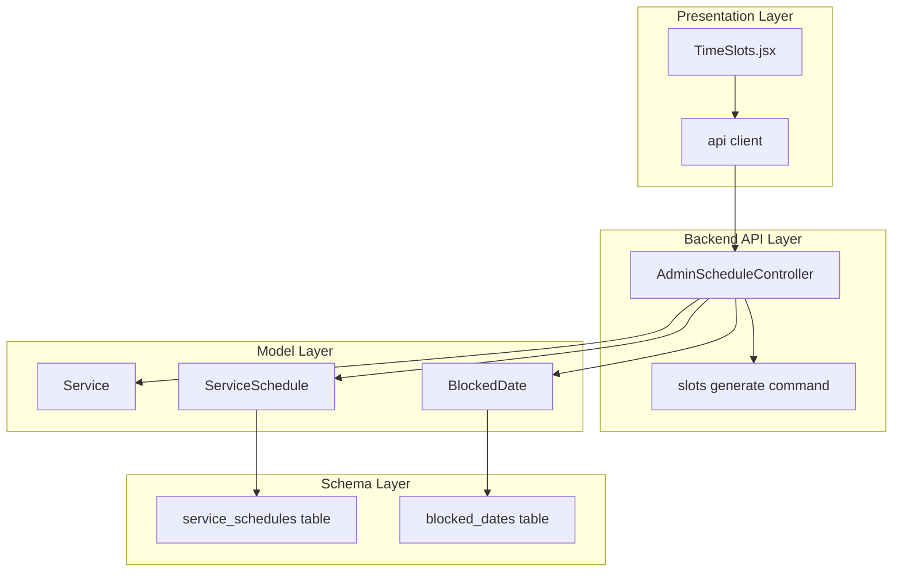
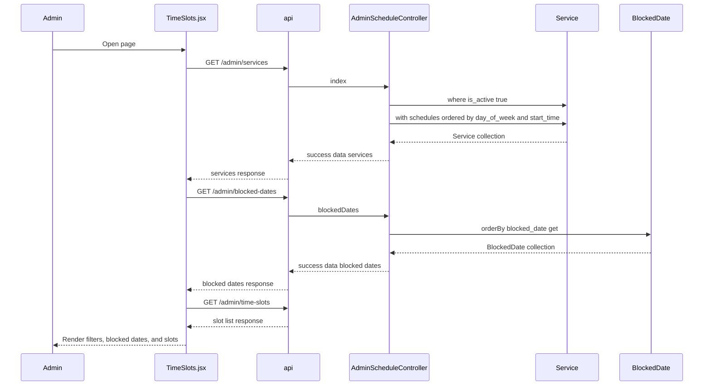
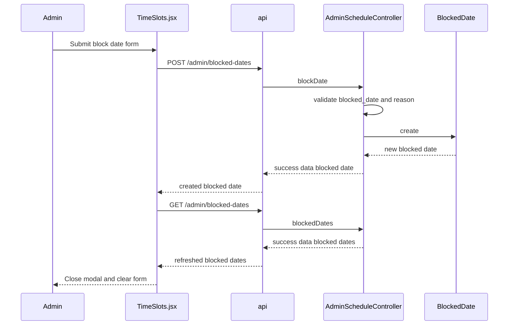
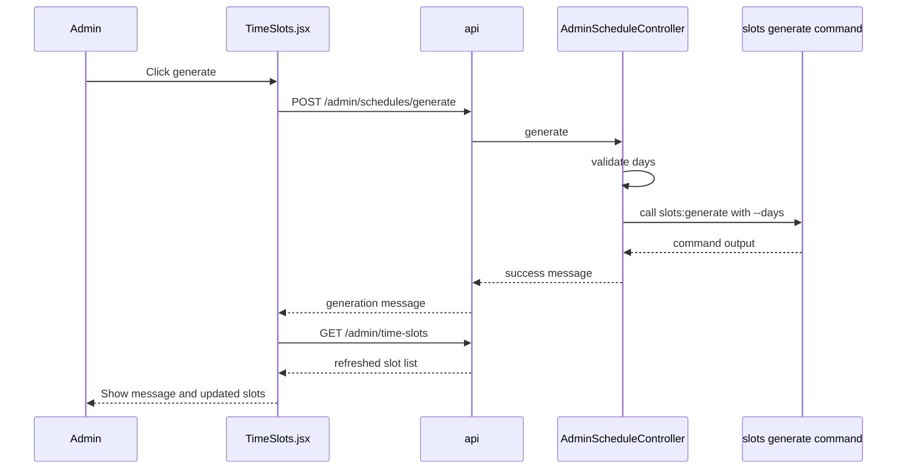
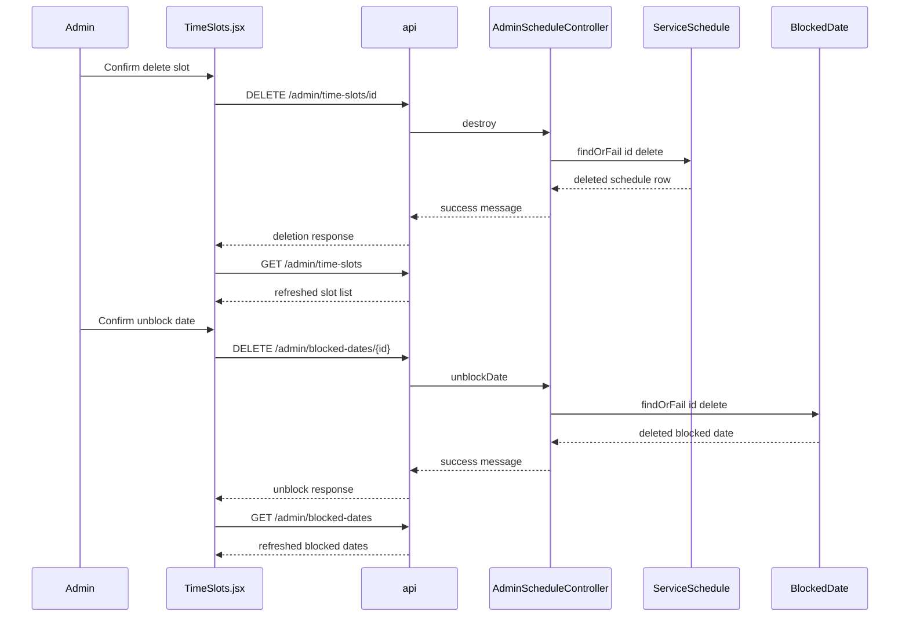

# Public Booking and Appointment APIs - Schedules and Blocked Dates as Booking Constraints

## Overview

This feature exposes the scheduling rules that shape appointment availability. Recurring service availability is stored as `ServiceSchedule` rows tied to `Service`, while specific dates are removed from availability through `BlockedDate` records. Together, they define the constraint set used by slot generation and by the booking experience that consumes generated slots.

The admin scheduling surface in `cri-frontend/src/pages/admin/TimeSlots.jsx` uses these records to display active services, existing schedules, blocked dates, and generated slots. From that page, an admin can generate slots for a future window, add or remove blocked dates, and remove schedule rows that feed slot generation.

## Architecture Overview



## Presentation Layer

### `TimeSlots.jsx`

*`cri-frontend/src/pages/admin/TimeSlots.jsx`*

The page is the admin-facing control point for schedule constraints. It loads services, time slots, and blocked dates on entry, then refreshes the slot list whenever filters change. The component also gates write actions with `isRestricted`, which is derived from the `admin_user` object stored in localStorage.

#### State and derived values

| Value | Type | Description |
| --- | --- | --- |
| `slots` | `array` | Slot rows rendered in the table. |
| `services` | `array` | Active services used in the service filter. |
| `blockedDates` | `array` | Explicit blocked-date records shown above the slot table. |
| `loading` | `boolean` | Controls the slot list loading state. |
| `generating` | `boolean` | Disables the generate button while `handleGenerate` runs. |
| `generateMsg` | `string` | Shows the backend message returned by slot generation. |
| `blockModal` | `boolean` | Controls the block-date modal visibility. |
| `blockForm` | `object` | Holds `blocked_date` and `reason` before submission. |
| `filters` | `object` | Holds `service_id` and `date` filter values. |
| `deleteConfirm` | `object` | Holds the selected slot pending deletion. |
| `currentAdmin` | `object` | Parsed from `localStorage.getItem('admin_user')`. |
| `isRestricted` | `boolean` | Hides write actions for non-`superadmin` admins with a `service_id`. |


#### Component methods

| Method | Description |
| --- | --- |
| `fetchServices` | Calls `/admin/services` and stores the returned services. |
| `fetchSlots` | Calls `/admin/time-slots` with the current `filters` and stores the returned slot list. |
| `fetchBlockedDates` | Calls `/admin/blocked-dates` and stores the returned blocked dates. |
| `handleGenerate` | Posts `{ days: 30 }` to `/admin/schedules/generate`, stores the returned message, then refreshes slots. |
| `handleToggleSlot` | Sends the slot toggle request for an individual slot and refreshes slots. |
| `handleDeleteSlot` | Deletes a slot through `/admin/time-slots/${id}` and refreshes slots. |
| `handleBlockDate` | Posts the `blockForm` payload to `/admin/blocked-dates`, refreshes blocked dates, and closes the modal. |
| `handleUnblockDate` | Deletes a blocked date through `/admin/blocked-dates/${id}` and refreshes blocked dates. |
| `formatDate` | Formats a stored date for the French admin display. |
| `formatTime` | Trims a time string to `HH:MM`. |
| `getAvailability` | Derives the display label and color from `capacity` and `booked_count`. |


#### UI behavior

- The page loads services and blocked dates on mount.
- The slot list is reloaded whenever `filters` changes.
- The block-date button and generate button are hidden when `isRestricted` is true.
- Slot deletion is also hidden when `isRestricted` is true.
- The blocked-date list shows both the blocked date and the optional `reason`.

## Backend API Surface

### `AdminScheduleController`

*`cri-back/app/Http/Controllers/Api/Admin/AdminScheduleController.php`*

This controller is the backend source for recurring schedule management and blocked-date management. It works with `Service`, `ServiceSchedule`, and `BlockedDate` to expose the active schedule set, create and delete schedule rows, create and delete blocked dates, and trigger slot generation.

#### Public methods

| Method | Description |
| --- | --- |
| `index` | Returns active services with their `schedules` relation loaded and ordered by `day_of_week` then `start_time`. |
| `store` | Validates `service_id`, `day_of_week`, `start_time`, `end_time`, and `capacity`, then creates a `ServiceSchedule`. |
| `destroy` | Deletes the `ServiceSchedule` found by id and returns a success message. |
| `generate` | Validates `days`, defaults to 30 when omitted, calls `slots:generate`, and returns the trimmed command output. |
| `blockedDates` | Returns blocked dates ordered by `blocked_date`. |
| `blockDate` | Validates a unique `blocked_date` and optional `reason`, then creates a `BlockedDate`. |
| `unblockDate` | Deletes the `BlockedDate` found by id and returns a success message. |


## Data Models

### `Service`

> **Note:** `AdminScheduleController::destroy` deletes `ServiceSchedule` rows and returns `Schedule deleted.`, while the admin page labels the corresponding action as deleting a time slot through `/admin/time-slots/${id}`. The backend source shown here treats that action as schedule deletion.

*`cri-back/app/Models/Service.php`*

`Service` is the parent entity for recurring schedule rows. Its `schedules()` relation is the link used by `AdminScheduleController::index` to return service availability together with the schedule rows that constrain slot generation.

#### Properties

| Property | Type | Description |
| --- | --- | --- |
| `$fillable` | `array` | `name`, `description`, `duration_minutes`, `capacity`, `is_active` |
| `$casts` | `array` | Casts `is_active` to `boolean`. |


#### Methods

| Method | Description |
| --- | --- |
| `timeSlots` | Defines a `hasMany(TimeSlot::class)` relation. |
| `appointments` | Defines a `hasMany(Appointment::class)` relation. |
| `schedules` | Defines a `hasMany(ServiceSchedule::class)` relation. |


### `ServiceSchedule`

> **Note:** `Service::$fillable` includes `capacity`, but the `services` table migration shown in this section does not create a `capacity` column. The controller still loads services through this model and uses the `schedules()` relation.

*`cri-back/app/Models/ServiceSchedule.php`*

`ServiceSchedule` stores recurring availability for a service. It belongs to `Service`, is active by default through the schema, and exposes a French day-name accessor for display.

#### Properties

| Property | Type | Description |
| --- | --- | --- |
| `$fillable` | `array` | `service_id`, `day_of_week`, `start_time`, `end_time`, `capacity`, `is_active` |
| `$casts` | `array` | Casts `is_active` to `boolean`. |


#### Methods

| Method | Description |
| --- | --- |
| `service` | Defines a `belongsTo(Service::class)` relation. |
| `getDayNameAttribute` | Returns the French label for the numeric `day_of_week`. |


#### Day-of-week representation

`day_of_week` is stored as a numeric value from `0` to `6`. The controller validates the same range, and the `index` method orders schedules by `day_of_week` and then `start_time`.

| Value | Label |
| --- | --- |
| `0` | `Dimanche` |
| `1` | `Lundi` |
| `2` | `Mardi` |
| `3` | `Mercredi` |
| `4` | `Jeudi` |
| `5` | `Vendredi` |
| `6` | `Samedi` |


### `BlockedDate`

*`cri-back/app/Models/BlockedDate.php`*

`BlockedDate` stores explicit calendar dates that must be excluded from booking and slot generation.

#### Properties

| Property | Type | Description |
| --- | --- | --- |
| `$fillable` | `array` | `blocked_date`, `reason` |
| `$casts` | `array` | Casts `blocked_date` to `date`. |


## Schema Surfaces

### Migration files

| File | Table | Key columns and constraints |
| --- | --- | --- |
| `cri-back/database/migrations/2026_04_13_214909_create_service_schedules_table.php` | `service_schedules` | `service_id` foreign key to `services` with cascade delete, `day_of_week`, `start_time`, `end_time`, `capacity`, `is_active`, timestamps. |
| `cri-back/database/migrations/2026_04_13_215005_create_blocked_dates_table.php` | `blocked_dates` | Unique `blocked_date`, nullable `reason`, timestamps. |


## API Integration

The admin page uses the following HTTP calls to manage schedule constraints and refresh the displayed data.

#### List Active Services and Their Schedules

```api
{
    "title": "List Active Services and Their Schedules",
    "description": "Returns active services with their schedules ordered by day_of_week and start_time",
    "method": "GET",
    "baseUrl": "",
    "endpoint": "/admin/services",
    "headers": [],
    "queryParams": [],
    "pathParams": [],
    "bodyType": "none",
    "requestBody": "",
    "formData": [],
    "rawBody": "",
    "responses": {
        "200": {
            "description": "Success",
            "body": "{\n    \"success\": true,\n    \"data\": [\n        {\n            \"id\": 1,\n            \"name\": \"General Consultation\",\n            \"description\": \"Initial visit\",\n            \"duration_minutes\": 30,\n            \"capacity\": 10,\n            \"is_active\": true,\n            \"created_at\": \"2026-04-11T09:00:00Z\",\n            \"updated_at\": \"2026-04-11T09:00:00Z\",\n            \"schedules\": [\n                {\n                    \"id\": 12,\n                    \"service_id\": 1,\n                    \"day_of_week\": 1,\n                    \"start_time\": \"09:00:00\",\n                    \"end_time\": \"12:00:00\",\n                    \"capacity\": 4,\n                    \"is_active\": true,\n                    \"created_at\": \"2026-04-13T21:49:09Z\",\n                    \"updated_at\": \"2026-04-13T21:49:09Z\"\n                }\n            ]\n        }\n    ]\n}"
        }
    }
}
```

#### List Time Slots

```api
{
    "title": "List Time Slots",
    "description": "Returns the slot rows shown by the admin page, filtered by service_id and date when provided",
    "method": "GET",
    "baseUrl": "",
    "endpoint": "/admin/time-slots",
    "headers": [],
    "queryParams": [
        {
            "key": "service_id",
            "value": "1",
            "required": false
        },
        {
            "key": "date",
            "value": "2026-05-01",
            "required": false
        }
    ],
    "pathParams": [],
    "bodyType": "none",
    "requestBody": "",
    "formData": [],
    "rawBody": "",
    "responses": {
        "200": {
            "description": "Success",
            "body": "{\n    \"success\": true,\n    \"data\": [\n        {\n            \"id\": 101,\n            \"service_id\": 1,\n            \"service\": {\n                \"id\": 1,\n                \"name\": \"General Consultation\"\n            },\n            \"slot_date\": \"2026-05-01\",\n            \"start_time\": \"09:00:00\",\n            \"end_time\": \"09:30:00\",\n            \"capacity\": 4,\n            \"booked_count\": 1,\n            \"is_active\": true\n        }\n    ]\n}"
        }
    }
}
```

#### List Blocked Dates

```api
{
    "title": "List Blocked Dates",
    "description": "Returns all blocked dates ordered by blocked_date",
    "method": "GET",
    "baseUrl": "",
    "endpoint": "/admin/blocked-dates",
    "headers": [],
    "queryParams": [],
    "pathParams": [],
    "bodyType": "none",
    "requestBody": "",
    "formData": [],
    "rawBody": "",
    "responses": {
        "200": {
            "description": "Success",
            "body": "{\n    \"success\": true,\n    \"data\": [\n        {\n            \"id\": 7,\n            \"blocked_date\": \"2026-05-01\",\n            \"reason\": \"Jour f\\u00e9ri\\u00e9\",\n            \"created_at\": \"2026-04-13T21:50:00Z\",\n            \"updated_at\": \"2026-04-13T21:50:00Z\"\n        }\n    ]\n}"
        }
    }
}
```

#### Generate Slots

```api
{
    "title": "Generate Slots",
    "description": "Validates days, defaults to 30 when omitted, calls slots:generate, and returns the trimmed command output",
    "method": "POST",
    "baseUrl": "",
    "endpoint": "/admin/schedules/generate",
    "headers": [],
    "queryParams": [],
    "pathParams": [],
    "bodyType": "json",
    "requestBody": "{\n    \"days\": 30\n}",
    "formData": [],
    "rawBody": "",
    "responses": {
        "200": {
            "description": "Success",
            "body": "{\n    \"success\": true,\n    \"message\": \"\"\n}"
        }
    }
}
```

#### Create Blocked Date

```api
{
    "title": "Create Blocked Date",
    "description": "Validates a unique blocked_date and optional reason, then stores a BlockedDate record",
    "method": "POST",
    "baseUrl": "",
    "endpoint": "/admin/blocked-dates",
    "headers": [],
    "queryParams": [],
    "pathParams": [],
    "bodyType": "json",
    "requestBody": "{\n    \"blocked_date\": \"2026-05-01\",\n    \"reason\": \"Jour f\\u00e9ri\\u00e9\"\n}",
    "formData": [],
    "rawBody": "",
    "responses": {
        "201": {
            "description": "Created",
            "body": "{\n    \"success\": true,\n    \"data\": {\n        \"id\": 7,\n        \"blocked_date\": \"2026-05-01\",\n        \"reason\": \"Jour f\\u00e9ri\\u00e9\",\n        \"created_at\": \"2026-04-13T21:50:00Z\",\n        \"updated_at\": \"2026-04-13T21:50:00Z\"\n    }\n}"
        }
    }
}
```

#### Delete Time Slot

```api
{
    "title": "Delete Time Slot",
    "description": "Deletes the ServiceSchedule row found by id and returns a schedule deletion message",
    "method": "DELETE",
    "baseUrl": "",
    "endpoint": "/admin/time-slots/{id}",
    "headers": [],
    "queryParams": [],
    "pathParams": [
        {
            "key": "id",
            "value": "12",
            "required": true
        }
    ],
    "bodyType": "none",
    "requestBody": "",
    "formData": [],
    "rawBody": "",
    "responses": {
        "200": {
            "description": "Success",
            "body": "{\n    \"success\": true,\n    \"message\": \"Schedule deleted.\"\n}"
        }
    }
}
```

#### Delete Blocked Date

```api
{
    "title": "Delete Blocked Date",
    "description": "Deletes the BlockedDate row found by id and returns a date unblocked message",
    "method": "DELETE",
    "baseUrl": "",
    "endpoint": "/admin/blocked-dates/{id}",
    "headers": [],
    "queryParams": [],
    "pathParams": [
        {
            "key": "id",
            "value": "7",
            "required": true
        }
    ],
    "bodyType": "none",
    "requestBody": "",
    "formData": [],
    "rawBody": "",
    "responses": {
        "200": {
            "description": "Success",
            "body": "{\n    \"success\": true,\n    \"message\": \"Date unblocked.\"\n}"
        }
    }
}
```

## Feature Flows

### Load services, slots, and blocked dates



### Create a blocked date and refresh the list



### Generate future slots from recurring schedules



### Delete a schedule row and remove a blocked date



## State Management

### React state in `TimeSlots.jsx`

> **Note:** `TimeSlots.jsx` also sends a `PATCH` request for slot toggling, but the backend handler for that route is not part of the provided source set, so it is not expanded here as an API contract.

- `filters` drives the slot query and triggers `fetchSlots` whenever `service_id` or `date` changes.
- `loading` wraps the slot table with a spinner while `fetchSlots` runs.
- `generating` disables the slot generation button while `handleGenerate` is active.
- `blockModal` and `deleteConfirm` control the two confirmation overlays.
- `generateMsg` displays the backend output from slot generation.
- `blockForm` is reset after a successful blocked-date creation.

### Backend validation and persistence

- `store` rejects invalid `service_id`, out-of-range `day_of_week`, invalid time formats, and invalid `capacity`.
- `blockDate` rejects repeated `blocked_date` values through a unique constraint check.
- `generate` clamps the request to a 1 to 90 day range and defaults to 30 days when the request omits `days`.
- `destroy` and `unblockDate` use `findOrFail`, so deletion is always keyed by the row id.

## Error Handling

- `handleGenerate` catches request failures and replaces the success message with `Erreur lors de la génération.`
- `handleDeleteSlot` catches API failures and shows the server message when available, otherwise `Impossible de supprimer ce créneau.`
- `handleBlockDate` catches API failures and shows the server message when available, otherwise `Erreur.`
- `generate` returns the trimmed Artisan output in the JSON `message` field, so the UI uses the command output directly.
- `destroy` and `unblockDate` return success messages that the UI can display after refresh.

## Dependencies

### Backend

- `App\Models\Service`
- `App\Models\ServiceSchedule`
- `App\Models\BlockedDate`
- `Illuminate\Http\Request`
- `\Artisan`
- `Illuminate\Database\Eloquent\Model`
- `Illuminate\Database\Migrations\Migration`
- `Illuminate\Database\Schema\Blueprint`
- `Illuminate\Support\Facades\Schema`

### Frontend

- `useState`
- `useEffect`
- `api from '../../api/axios'`
- `localStorage.getItem('admin_user')`

## Key Classes Reference

| Class | Responsibility |
| --- | --- |
| `TimeSlots.jsx` | Admin page that loads services, slots, and blocked dates, then submits schedule and date-blocking actions. |
| `AdminScheduleController.php` | Backend controller for active service listing, schedule CRUD, blocked-date CRUD, and slot generation triggers. |
| `Service.php` | Parent service model with the `schedules()` relation used to expose recurring availability. |
| `ServiceSchedule.php` | Recurring service availability model with `day_of_week` and a French day-name accessor. |
| `BlockedDate.php` | Explicit blocked-date model used to exclude calendar dates from booking. |
| `2026_04_13_214909_create_service_schedules_table.php` | Creates the recurring schedule table and its foreign key to `services`. |
| `2026_04_13_215005_create_blocked_dates_table.php` | Creates the blocked-date table and enforces unique blocked dates. |
