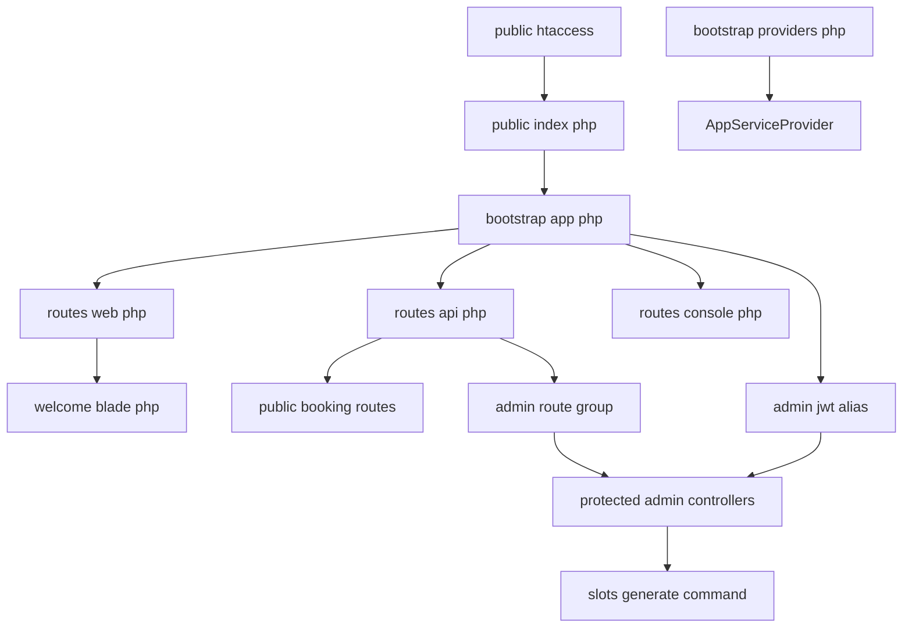
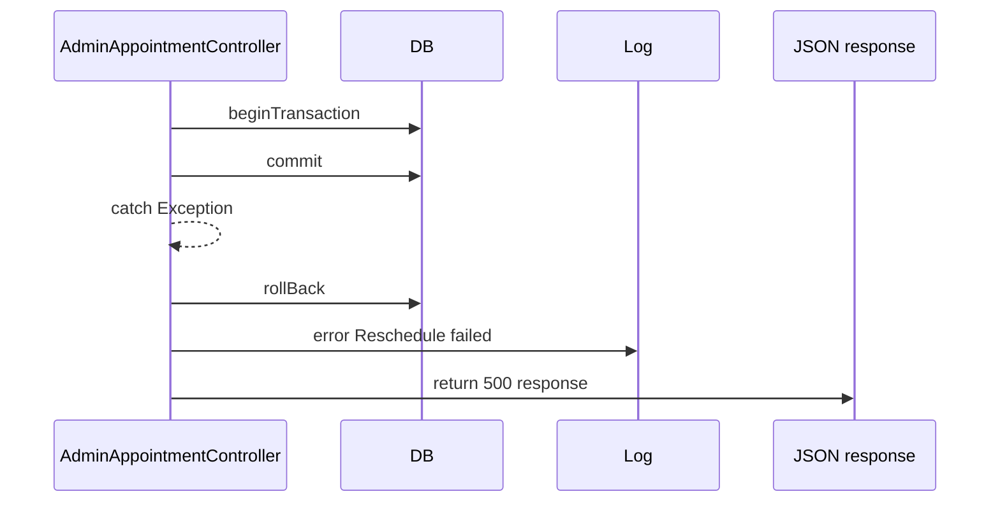
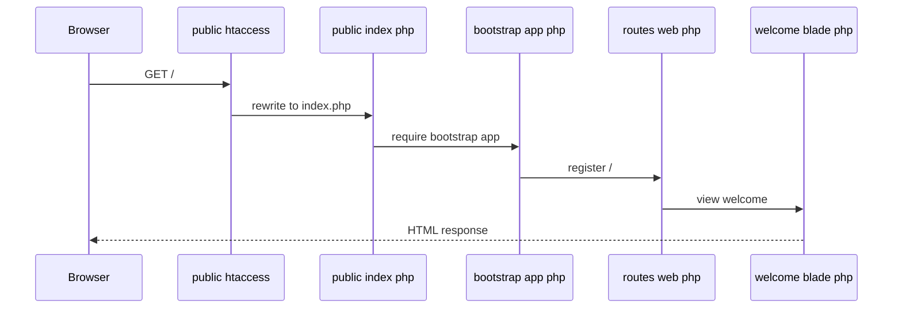
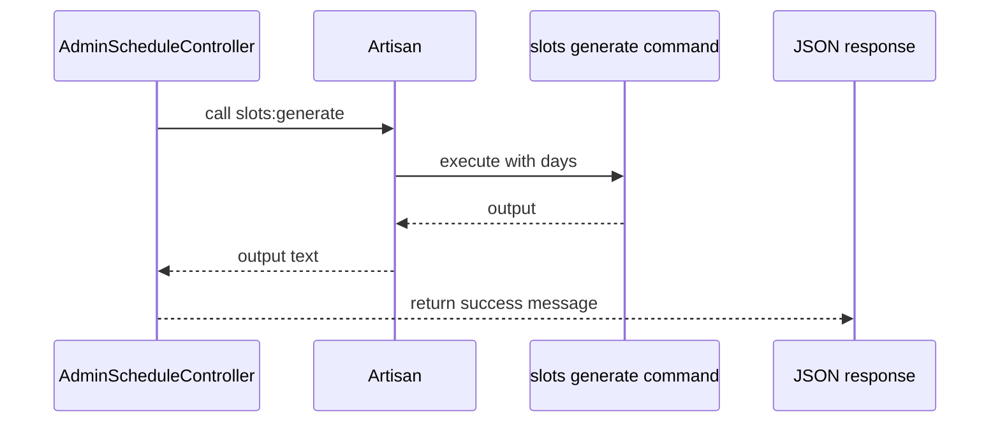

# System Architecture and Runtime Entry Points

## Overview

This section defines how the Laravel backend starts, where HTTP requests enter, and how the application wires its public and admin route surfaces. The runtime path begins in `cri-back/public/index.php`, is shaped by `cri-back/bootstrap/app.php`, and then fans out into `cri-back/routes/web.php` for the default browser entry and `cri-back/routes/api.php` for the booking and admin API surface.

The visible runtime surface is intentionally small at bootstrap time: one service provider is registered through `cri-back/bootstrap/providers.php`, one middleware alias is declared for `admin.jwt`, and the default web route renders `cri-back/resources/views/welcome.blade.php`. The API file then exposes the public booking endpoints, the admin authentication and protected management endpoints, and the schedule generation paths that bridge HTTP flows into the console command surface.

## Architecture Overview



## Runtime Surface Summary

| Surface | File | Responsibility |
| --- | --- | --- |
| Front controller | `cri-back/public/index.php` | Captures the request, loads Composer autoloading, and hands the request to the Laravel application. |
| Bootstrap configuration | `cri-back/bootstrap/app.php` | Configures routing, middleware aliases, exception handling, and the application instance. |
| Provider registration | `cri-back/bootstrap/providers.php` | Registers `AppServiceProvider` as the only visible provider in this bootstrap list. |
| Middleware alias | `cri-back/bootstrap/app.php` | Declares `admin.jwt` and maps it to `\App\Http\Middleware\AdminJwtMiddleware::class`. |
| Web routing | `cri-back/routes/web.php` | Registers `/` and returns the welcome view. |
| API routing | `cri-back/routes/api.php` | Mounts public booking routes and the admin route subtree. |
| Web root rewrite | `cri-back/public/.htaccess` | Rewrites non-file requests to `index.php` and preserves auth headers. |
| Crawler policy | `cri-back/public/robots.txt` | Declares permissive crawler access. |
| Default landing view | `cri-back/resources/views/welcome.blade.php` | Renders the default browser entry and conditionally loads Vite assets. |
| Base controller | `cri-back/app/Http/Controllers/Controller.php` | Shared abstract base for application controllers. |
| Application provider | `cri-back/app/Providers/AppServiceProvider.php` | Lifecycle hooks for register and boot. |
| Admin appointment logic | `cri-back/app/Http/Controllers/Api/Admin/AdminAppointmentController.php` | Admin appointment listing, inspection, status transitions, and rescheduling. |
| Admin management logic | `cri-back/app/Http/Controllers/Api/Admin/AdminManagementController.php` | Admin account listing and maintenance operations. |
| Admin schedule logic | `cri-back/app/Http/Controllers/Api/Admin/AdminScheduleController.php` | Service schedules, slot generation, and blocked date management. |
| Admin service logic | `cri-back/app/Http/Controllers/Api/Admin/AdminServiceController.php` | Service listing and maintenance. |
| Admin statistics logic | `cri-back/app/Http/Controllers/Api/Admin/AdminStatsController.php` | Appointment statistics aggregation. |


## HTTP Entry Points and Bootstrap

### Front Controller

*`cri-back/public/index.php`*

`public/index.php` is the only visible PHP entrypoint for HTTP traffic. It defines `LARAVEL_START`, checks for the maintenance file at `storage/framework/maintenance.php`, loads `vendor/autoload.php`, then boots the Laravel application from `bootstrap/app.php` and calls `$app->handleRequest(Request::capture())`.

| Step | Code path | Effect |
| --- | --- | --- |
| 1 | `define('LARAVEL_START', microtime(true));` | Captures bootstrap timing. |
| 2 | `file_exists($maintenance = __DIR__.'/../storage/framework/maintenance.php')` | Serves maintenance mode if present. |
| 3 | `require __DIR__.'/../vendor/autoload.php';` | Loads Composer autoloading. |
| 4 | `require_once __DIR__.'/../bootstrap/app.php';` | Builds the Laravel application instance. |
| 5 | `$app->handleRequest(Request::capture());` | Dispatches the captured request into the framework. |


### Application Bootstrap

*`cri-back/bootstrap/app.php`*

`bootstrap/app.php` configures the application with `Application::configure(basePath: dirname(__DIR__))` and registers the routing surfaces through `withRouting`. The visible configuration wires four paths: `web`, `api`, `commands`, and `health`, and it also declares the `admin.jwt` middleware alias.

| Configuration | Value | Runtime effect |
| --- | --- | --- |
| `web` | `__DIR__.'/../routes/web.php'` | Loads the web route surface. |
| `api` | `__DIR__.'/../routes/api.php'` | Loads the API route surface. |
| `commands` | `__DIR__.'/../routes/console.php'` | Loads the console command route file. |
| `health` | `/up` | Exposes the health check path. |
| Middleware alias | `admin.jwt` | Maps to `\App\Http\Middleware\AdminJwtMiddleware::class`. |


The same file registers an empty `withExceptions` callback, so the visible bootstrap does not add custom exception handling.

### Provider Registration

*`cri-back/bootstrap/providers.php`*

`bootstrap/providers.php` returns a single-provider array containing `AppServiceProvider::class`. That means the visible provider surface is deliberately minimal in the shown bootstrap state.

### Web Root Rewrite

*`cri-back/public/.htaccess`*

The web root rewrite file pushes all non-file, non-directory requests into `index.php`. It also preserves the incoming `Authorization` header and `X-XSRF-Token` header by copying them into environment variables before the rewrite happens.

| Rule | Effect |
| --- | --- |
| `RewriteCond %{HTTP:Authorization} .` and `RewriteRule .* - [E=HTTP_AUTHORIZATION:%{HTTP:Authorization}]` | Preserves authorization credentials for Laravel. |
| `RewriteCond %{HTTP:x-xsrf-token} .` and `RewriteRule .* - [E=HTTP_X_XSRF_TOKEN:%{HTTP:X-XSRF-Token}]` | Preserves the XSRF token header. |
| Trailing slash rule | Redirects directory-style URLs without a folder target. |
| Front controller rule | Routes non-file, non-directory requests to `index.php`. |


### Robots Policy

*`cri-back/public/robots.txt`*

The crawler policy is permissive:

| Key | Value |
| --- | --- |
| `User-agent` | `*` |
| `Disallow` | empty |


## Web Root and Default Landing Behavior

### Default Web Route

*`cri-back/routes/web.php`*

The web route file contains one visible route:

- `Route::get('/', function () { return view('welcome'); });`

This makes `/` the default browser entry and hands rendering to `cri-back/resources/views/welcome.blade.php`.

### Default View

*`cri-back/resources/views/welcome.blade.php`*

The welcome view is the default response for the root web route. It conditionally loads the frontend assets with `@vite(['resources/css/app.css', 'resources/js/app.js'])` when `public/build/manifest.json` or `public/hot` exists, and otherwise falls back to inline CSS.

The visible template logic also branches on `Route::has('login')`, `@auth`, and `Route::has('register')` to decide whether to render the dashboard, login, and register navigation links. The page uses the application name from `config('app.name', 'Laravel')`.

## Route Registration Surface

### API Mounting

*`cri-back/routes/api.php`*

`routes/api.php` is the active API registration file. It exposes the public booking surface first, then declares an `admin` prefix block, and inside that block it nests one explicitly protected middleware group using `admin.jwt`.

| Route scope | Registered routes | Middleware visible in file |
| --- | --- | --- |
| Public booking surface | `GET services`, `GET services/{id}/slots`, `POST appointments`, `GET appointments/{reference}`, `GET slots`, `GET appointments/{reference}/pdf` | none shown |
| Admin login | `POST login` | none shown |
| Protected admin group | `POST logout`, `POST refresh`, `GET me`, `GET stats`, `GET appointments`, `GET appointments/{id}`, `PATCH appointments/{id}/status`, `PATCH appointments/{id}/reschedule`, `GET services`, `POST services`, `PUT services/{id}`, `DELETE services/{id}`, `GET time-slots`, `POST time-slots`, `DELETE time-slots/{id}`, `PATCH time-slots/{id}/toggle`, `GET admins`, `POST admins`, `PUT admins/{id}/password`, `PATCH admins/{id}/toggle`, `DELETE admins/{id}` | `admin.jwt` |
| Admin schedule area | `GET schedules`, `POST schedules`, `DELETE schedules/{id}`, `POST schedules/generate`, `GET blocked-dates`, `POST blocked-dates`, `DELETE blocked-dates/{id}` | none shown |


### Protected Admin Route Group

In the visible route file, the // protected middleware group ends before schedules and blocked-dates. Those routes are mounted under the admin prefix, but the shown code does not wrap them in admin.jwt.

*`cri-back/routes/api.php`*

The protected subgroup is the one directly wrapped by `Route::middleware('admin.jwt')->group(function () {  });`. Controllers in this branch use `Auth::guard('admin')->user()` and return `401`, `403`, or `422` responses when the active admin context or permission check fails.

### Console Surface

*`cri-back/bootstrap/app.php` and `cri-back/app/Http/Controllers/Api/Admin/AdminScheduleController.php`*

`bootstrap/app.php` mounts `cri-back/routes/console.php` through the `commands` key. The visible HTTP-to-console bridge is `AdminScheduleController::generate`, which calls:

- `\Artisan::call('slots:generate', ['--days' => $days]);`
- `\Artisan::output();`

That makes slot generation a console command path reachable from the admin scheduling endpoint.

## API Endpoints

### Public Booking Surface

#### Get Services

```api
{
    "title": "Get Services",
    "description": "Returns the public service listing registered in `routes/api.php`.",
    "method": "GET",
    "baseUrl": "/api",
    "endpoint": "/services",
    "headers": [],
    "queryParams": [],
    "pathParams": [],
    "bodyType": "none",
    "requestBody": "",
    "formData": [],
    "rawBody": "",
    "responses": {
        "200": {
            "description": "Success",
            "body": "{\n    \"success\": true,\n    \"data\": []\n}"
        }
    }
}
```

#### Get Service Slots

```api
{
    "title": "Get Service Slots",
    "description": "Returns available slots for a service identifier.",
    "method": "GET",
    "baseUrl": "/api",
    "endpoint": "/services/{id}/slots",
    "headers": [],
    "queryParams": [],
    "pathParams": [
        {
            "key": "id",
            "value": "12",
            "required": true
        }
    ],
    "bodyType": "none",
    "requestBody": "",
    "formData": [],
    "rawBody": "",
    "responses": {
        "200": {
            "description": "Success",
            "body": "{\n    \"success\": true,\n    \"data\": []\n}"
        }
    }
}
```

#### Create Appointment

```api
{
    "title": "Create Appointment",
    "description": "Creates a public appointment request.",
    "method": "POST",
    "baseUrl": "/api",
    "endpoint": "/appointments",
    "headers": [
        {
            "key": "Content-Type",
            "value": "application/json",
            "required": true
        }
    ],
    "queryParams": [],
    "pathParams": [],
    "bodyType": "json",
    "requestBody": "[]",
    "formData": [],
    "rawBody": "",
    "responses": {
        "200": {
            "description": "Success",
            "body": "{\n    \"success\": true,\n    \"data\": []\n}"
        }
    }
}
```

#### Get Appointment By Reference

```api
{
    "title": "Get Appointment By Reference",
    "description": "Returns a public appointment record by reference code.",
    "method": "GET",
    "baseUrl": "/api",
    "endpoint": "/appointments/{reference}",
    "headers": [],
    "queryParams": [],
    "pathParams": [
        {
            "key": "reference",
            "value": "appt-2026-001",
            "required": true
        }
    ],
    "bodyType": "none",
    "requestBody": "",
    "formData": [],
    "rawBody": "",
    "responses": {
        "200": {
            "description": "Success",
            "body": "{\n    \"success\": true,\n    \"data\": []\n}"
        }
    }
}
```

#### Get General Slots

```api
{
    "title": "Get General Slots",
    "description": "Returns the general slot listing registered in `routes/api.php`.",
    "method": "GET",
    "baseUrl": "/api",
    "endpoint": "/slots",
    "headers": [],
    "queryParams": [],
    "pathParams": [],
    "bodyType": "none",
    "requestBody": "",
    "formData": [],
    "rawBody": "",
    "responses": {
        "200": {
            "description": "Success",
            "body": "{\n    \"success\": true,\n    \"data\": []\n}"
        }
    }
}
```

#### Download Appointment PDF

```api
{
    "title": "Download Appointment PDF",
    "description": "Returns the PDF export for a public appointment reference.",
    "method": "GET",
    "baseUrl": "/api",
    "endpoint": "/appointments/{reference}/pdf",
    "headers": [],
    "queryParams": [],
    "pathParams": [
        {
            "key": "reference",
            "value": "appt-2026-001",
            "required": true
        }
    ],
    "bodyType": "none",
    "requestBody": "",
    "formData": [],
    "rawBody": "",
    "responses": {
        "200": {
            "description": "Success",
            "body": "{\n    \"success\": true\n}"
        }
    }
}
```

### Admin Authentication Surface

#### Admin Login

```api
{
    "title": "Admin Login",
    "description": "Creates the admin session or token entrypoint under the `admin` prefix.",
    "method": "POST",
    "baseUrl": "/api/admin",
    "endpoint": "/login",
    "headers": [
        {
            "key": "Content-Type",
            "value": "application/json",
            "required": true
        }
    ],
    "queryParams": [],
    "pathParams": [],
    "bodyType": "json",
    "requestBody": "[]",
    "formData": [],
    "rawBody": "",
    "responses": {
        "200": {
            "description": "Success",
            "body": "{\n    \"success\": true,\n    \"data\": []\n}"
        }
    }
}
```

#### Admin Logout

```api
{
    "title": "Admin Logout",
    "description": "Ends the admin-authenticated session or token.",
    "method": "POST",
    "baseUrl": "/api/admin",
    "endpoint": "/logout",
    "headers": [
        {
            "key": "Authorization",
            "value": "Bearer admin-token",
            "required": true
        }
    ],
    "queryParams": [],
    "pathParams": [],
    "bodyType": "json",
    "requestBody": "[]",
    "formData": [],
    "rawBody": "",
    "responses": {
        "200": {
            "description": "Success",
            "body": "{\n    \"success\": true\n}"
        }
    }
}
```

#### Admin Refresh

```api
{
    "title": "Admin Refresh",
    "description": "Refreshes the admin-authenticated credential.",
    "method": "POST",
    "baseUrl": "/api/admin",
    "endpoint": "/refresh",
    "headers": [
        {
            "key": "Authorization",
            "value": "Bearer admin-token",
            "required": true
        }
    ],
    "queryParams": [],
    "pathParams": [],
    "bodyType": "json",
    "requestBody": "[]",
    "formData": [],
    "rawBody": "",
    "responses": {
        "200": {
            "description": "Success",
            "body": "{\n    \"success\": true\n}"
        }
    }
}
```

#### Get Admin Profile

```api
{
    "title": "Get Admin Profile",
    "description": "Returns the current admin identity.",
    "method": "GET",
    "baseUrl": "/api/admin",
    "endpoint": "/me",
    "headers": [
        {
            "key": "Authorization",
            "value": "Bearer admin-token",
            "required": true
        }
    ],
    "queryParams": [],
    "pathParams": [],
    "bodyType": "none",
    "requestBody": "",
    "formData": [],
    "rawBody": "",
    "responses": {
        "200": {
            "description": "Success",
            "body": "{\n    \"success\": true,\n    \"data\": []\n}"
        }
    }
}
```

### Admin Statistics Surface

#### Get Admin Statistics

```api
{
    "title": "Get Admin Statistics",
    "description": "Returns appointment analytics grouped by status, service, country, gender, and age band.",
    "method": "GET",
    "baseUrl": "/api/admin",
    "endpoint": "/stats",
    "headers": [
        {
            "key": "Authorization",
            "value": "Bearer admin-token",
            "required": true
        }
    ],
    "queryParams": [
        {
            "key": "start_date",
            "value": "2026-01-01",
            "required": false
        },
        {
            "key": "end_date",
            "value": "2026-01-31",
            "required": false
        }
    ],
    "pathParams": [],
    "bodyType": "none",
    "requestBody": "",
    "formData": [],
    "rawBody": "",
    "responses": {
        "200": {
            "description": "Success",
            "body": "{\n    \"success\": true,\n    \"data\": {\n        \"byStatus\": {\n            \"pending\": 0,\n            \"confirmed\": 0,\n            \"present\": 0,\n            \"cancelled\": 0\n        },\n        \"byService\": [\n            {\n                \"service_id\": 12,\n                \"service_name\": \"Civil Status\",\n                \"count\": 0,\n                \"percentage\": 0\n            }\n        ],\n        \"byCountry\": [\n            {\n                \"nationalite\": \"Morocco\",\n                \"count\": 0,\n                \"percentage\": 0\n            }\n        ],\n        \"byGenre\": [\n            {\n                \"genre\": \"F\",\n                \"count\": 0,\n                \"percentage\": 0\n            }\n        ],\n        \"ageGroups\": {\n            \"Moins de 18 ans\": 0,\n            \"18-25 ans\": 0,\n            \"26-35 ans\": 0,\n            \"36-45 ans\": 0,\n            \"46-55 ans\": 0,\n            \"56-65 ans\": 0,\n            \"Plus de 65 ans\": 0\n        }\n    }\n}"
        }
    }
}
```

### Protected Admin Appointment Surface

#### List Admin Appointments

```api
{
    "title": "List Admin Appointments",
    "description": "Returns a paginated appointment list filtered by admin role, date range, status, and service.",
    "method": "GET",
    "baseUrl": "/api/admin",
    "endpoint": "/appointments",
    "headers": [
        {
            "key": "Authorization",
            "value": "Bearer admin-token",
            "required": true
        }
    ],
    "queryParams": [
        {
            "key": "start_date",
            "value": "2026-01-01",
            "required": false
        },
        {
            "key": "end_date",
            "value": "2026-01-31",
            "required": false
        },
        {
            "key": "status",
            "value": "confirmed",
            "required": false
        },
        {
            "key": "service_id",
            "value": "12",
            "required": false
        }
    ],
    "pathParams": [],
    "bodyType": "none",
    "requestBody": "",
    "formData": [],
    "rawBody": "",
    "responses": {
        "200": {
            "description": "Success",
            "body": "{\n    \"success\": true,\n    \"data\": []\n}"
        },
        "401": {
            "description": "Unauthorized",
            "body": "{\n    \"success\": false,\n    \"message\": \"Unauthorized\"\n}"
        }
    }
}
```

#### Get Admin Appointment

```api
{
    "title": "Get Admin Appointment",
    "description": "Returns a single appointment with service and time slot data.",
    "method": "GET",
    "baseUrl": "/api/admin",
    "endpoint": "/appointments/{id}",
    "headers": [
        {
            "key": "Authorization",
            "value": "Bearer admin-token",
            "required": true
        }
    ],
    "queryParams": [],
    "pathParams": [
        {
            "key": "id",
            "value": "123",
            "required": true
        }
    ],
    "bodyType": "none",
    "requestBody": "",
    "formData": [],
    "rawBody": "",
    "responses": {
        "200": {
            "description": "Success",
            "body": "{\n    \"success\": true,\n    \"data\": []\n}"
        },
        "403": {
            "description": "Forbidden",
            "body": "{\n    \"success\": false,\n    \"message\": \"Vous n'etes pas autorise a voir ce rendez-vous.\"\n}"
        }
    }
}
```

#### Update Appointment Status

```api
{
    "title": "Update Appointment Status",
    "description": "Moves an appointment through the confirmed, present, and cancelled workflow.",
    "method": "PATCH",
    "baseUrl": "/api/admin",
    "endpoint": "/appointments/{id}/status",
    "headers": [
        {
            "key": "Authorization",
            "value": "Bearer admin-token",
            "required": true
        },
        {
            "key": "Content-Type",
            "value": "application/json",
            "required": true
        }
    ],
    "queryParams": [],
    "pathParams": [
        {
            "key": "id",
            "value": "123",
            "required": true
        }
    ],
    "bodyType": "json",
    "requestBody": "{\n    \"status\": \"confirmed\",\n    \"cancelled_reason\": \"\",\n    \"service_id\": 12\n}",
    "formData": [],
    "rawBody": "",
    "responses": {
        "200": {
            "description": "Success",
            "body": "{\n    \"success\": true,\n    \"message\": \"Appointment marked as confirmed.\",\n    \"data\": []\n}"
        },
        "401": {
            "description": "Unauthorized",
            "body": "{\n    \"success\": false,\n    \"message\": \"Unauthorized\"\n}"
        },
        "403": {
            "description": "Forbidden",
            "body": "{\n    \"success\": false,\n    \"message\": \"Vous n'etes pas autorise a modifier les rendez-vous de ce service.\"\n}"
        },
        "422": {
            "description": "Unprocessable Entity",
            "body": "{\n    \"success\": false,\n    \"message\": \"Cannot transition from 'pending' to 'present'.\"\n}"
        }
    }
}
```

#### Reschedule Appointment

```api
{
    "title": "Reschedule Appointment",
    "description": "Moves an appointment to an existing time slot and synchronizes external calendar records.",
    "method": "PATCH",
    "baseUrl": "/api/admin",
    "endpoint": "/appointments/{id}/reschedule",
    "headers": [
        {
            "key": "Authorization",
            "value": "Bearer admin-token",
            "required": true
        },
        {
            "key": "Content-Type",
            "value": "application/json",
            "required": true
        }
    ],
    "queryParams": [],
    "pathParams": [
        {
            "key": "id",
            "value": "123",
            "required": true
        }
    ],
    "bodyType": "json",
    "requestBody": "{\n    \"new_date\": \"2026-01-20\",\n    \"new_start_time\": \"09:00\",\n    \"new_end_time\": \"09:30\",\n    \"reason\": \"Client requested a different time\"\n}",
    "formData": [],
    "rawBody": "",
    "responses": {
        "200": {
            "description": "Success",
            "body": "{\n    \"success\": true,\n    \"message\": \"Rendez-vous report\\u00e9 avec succ\\u00e8s.\",\n    \"data\": []\n}"
        },
        "403": {
            "description": "Forbidden",
            "body": "{\n    \"success\": false,\n    \"message\": \"Vous ne pouvez pas modifier ce rendez-vous.\"\n}"
        },
        "422": {
            "description": "Unprocessable Entity",
            "body": "{\n    \"success\": false,\n    \"message\": \"Ce cr\\u00e9neau n'est pas disponible. Veuillez choisir un autre.\"\n}"
        },
        "500": {
            "description": "Server Error",
            "body": "{\n    \"success\": false,\n    \"message\": \"Erreur lors du report du rendez-vous.\"\n}"
        }
    }
}
```

### Protected Admin Service Surface

#### List Admin Services

```api
{
    "title": "List Admin Services",
    "description": "Returns the service list ordered by name.",
    "method": "GET",
    "baseUrl": "/api/admin",
    "endpoint": "/services",
    "headers": [
        {
            "key": "Authorization",
            "value": "Bearer admin-token",
            "required": true
        }
    ],
    "queryParams": [],
    "pathParams": [],
    "bodyType": "none",
    "requestBody": "",
    "formData": [],
    "rawBody": "",
    "responses": {
        "200": {
            "description": "Success",
            "body": "{\n    \"success\": true,\n    \"data\": []\n}"
        }
    }
}
```

#### Create Admin Service

```api
{
    "title": "Create Admin Service",
    "description": "Creates a service record.",
    "method": "POST",
    "baseUrl": "/api/admin",
    "endpoint": "/services",
    "headers": [
        {
            "key": "Authorization",
            "value": "Bearer admin-token",
            "required": true
        },
        {
            "key": "Content-Type",
            "value": "application/json",
            "required": true
        }
    ],
    "queryParams": [],
    "pathParams": [],
    "bodyType": "json",
    "requestBody": "{\n    \"name\": \"Civil Status\",\n    \"description\": \"Public document service\",\n    \"duration_minutes\": 30,\n    \"capacity\": 3\n}",
    "formData": [],
    "rawBody": "",
    "responses": {
        "201": {
            "description": "Created",
            "body": "{\n    \"success\": true,\n    \"message\": \"Service created.\",\n    \"data\": {\n        \"name\": \"Civil Status\",\n        \"description\": \"Public document service\",\n        \"duration_minutes\": 30,\n        \"capacity\": 3,\n        \"is_active\": true\n    }\n}"
        }
    }
}
```

#### Update Admin Service

```api
{
    "title": "Update Admin Service",
    "description": "Updates a service record and may regenerate future slots when the duration changes.",
    "method": "PUT",
    "baseUrl": "/api/admin",
    "endpoint": "/services/{id}",
    "headers": [
        {
            "key": "Authorization",
            "value": "Bearer admin-token",
            "required": true
        },
        {
            "key": "Content-Type",
            "value": "application/json",
            "required": true
        }
    ],
    "queryParams": [],
    "pathParams": [
        {
            "key": "id",
            "value": "12",
            "required": true
        }
    ],
    "bodyType": "json",
    "requestBody": "{\n    \"name\": \"Civil Status\",\n    \"description\": \"Updated service description\",\n    \"duration_minutes\": 45,\n    \"capacity\": 4,\n    \"is_active\": true\n}",
    "formData": [],
    "rawBody": "",
    "responses": {
        "200": {
            "description": "Success",
            "body": "{\n    \"success\": true,\n    \"message\": \"Service mis a jour.\",\n    \"data\": {\n        \"name\": \"Civil Status\",\n        \"description\": \"Updated service description\",\n        \"duration_minutes\": 45,\n        \"is_active\": true\n    }\n}"
        },
        "403": {
            "description": "Forbidden",
            "body": "{\n    \"success\": false,\n    \"message\": \"Acces refuse. Vous n'etes pas autorise a modifier les services.\"\n}"
        }
    }
}
```

#### Delete Admin Service

```api
{
    "title": "Delete Admin Service",
    "description": "Deletes a service when no active appointments are attached.",
    "method": "DELETE",
    "baseUrl": "/api/admin",
    "endpoint": "/services/{id}",
    "headers": [
        {
            "key": "Authorization",
            "value": "Bearer admin-token",
            "required": true
        }
    ],
    "queryParams": [],
    "pathParams": [
        {
            "key": "id",
            "value": "12",
            "required": true
        }
    ],
    "bodyType": "none",
    "requestBody": "",
    "formData": [],
    "rawBody": "",
    "responses": {
        "200": {
            "description": "Success",
            "body": "{\n    \"success\": true,\n    \"message\": \"Service deleted.\"\n}"
        },
        "422": {
            "description": "Unprocessable Entity",
            "body": "{\n    \"success\": false,\n    \"message\": \"Cannot delete service with active appointments.\"\n}"
        }
    }
}
```

### Protected Admin Time Slot Surface

#### List Admin Time Slots

```api
{
    "title": "List Admin Time Slots",
    "description": "Returns the admin time slot listing.",
    "method": "GET",
    "baseUrl": "/api/admin",
    "endpoint": "/time-slots",
    "headers": [
        {
            "key": "Authorization",
            "value": "Bearer admin-token",
            "required": true
        }
    ],
    "queryParams": [],
    "pathParams": [],
    "bodyType": "none",
    "requestBody": "",
    "formData": [],
    "rawBody": "",
    "responses": {
        "200": {
            "description": "Success",
            "body": "{\n    \"success\": true,\n    \"data\": []\n}"
        }
    }
}
```

#### Create Admin Time Slot

```api
{
    "title": "Create Admin Time Slot",
    "description": "Creates a time slot record.",
    "method": "POST",
    "baseUrl": "/api/admin",
    "endpoint": "/time-slots",
    "headers": [
        {
            "key": "Authorization",
            "value": "Bearer admin-token",
            "required": true
        },
        {
            "key": "Content-Type",
            "value": "application/json",
            "required": true
        }
    ],
    "queryParams": [],
    "pathParams": [],
    "bodyType": "json",
    "requestBody": "[]",
    "formData": [],
    "rawBody": "",
    "responses": {
        "201": {
            "description": "Created",
            "body": "{\n    \"success\": true,\n    \"data\": []\n}"
        }
    }
}
```

#### Delete Admin Time Slot

```api
{
    "title": "Delete Admin Time Slot",
    "description": "Deletes a time slot record.",
    "method": "DELETE",
    "baseUrl": "/api/admin",
    "endpoint": "/time-slots/{id}",
    "headers": [
        {
            "key": "Authorization",
            "value": "Bearer admin-token",
            "required": true
        }
    ],
    "queryParams": [],
    "pathParams": [
        {
            "key": "id",
            "value": "88",
            "required": true
        }
    ],
    "bodyType": "none",
    "requestBody": "",
    "formData": [],
    "rawBody": "",
    "responses": {
        "200": {
            "description": "Success",
            "body": "{\n    \"success\": true,\n    \"message\": \"\"\n}"
        }
    }
}
```

#### Toggle Admin Time Slot

```api
{
    "title": "Toggle Admin Time Slot",
    "description": "Toggles the active state of a time slot.",
    "method": "PATCH",
    "baseUrl": "/api/admin",
    "endpoint": "/time-slots/{id}/toggle",
    "headers": [
        {
            "key": "Authorization",
            "value": "Bearer admin-token",
            "required": true
        },
        {
            "key": "Content-Type",
            "value": "application/json",
            "required": true
        }
    ],
    "queryParams": [],
    "pathParams": [
        {
            "key": "id",
            "value": "88",
            "required": true
        }
    ],
    "bodyType": "json",
    "requestBody": "[]",
    "formData": [],
    "rawBody": "",
    "responses": {
        "200": {
            "description": "Success",
            "body": "{\n    \"success\": true,\n    \"data\": []\n}"
        }
    }
}
```

### Admin Account Management Surface

#### List Admin Accounts

```api
{
    "title": "List Admin Accounts",
    "description": "Returns all admin accounts visible to the superadmin.",
    "method": "GET",
    "baseUrl": "/api/admin",
    "endpoint": "/admins",
    "headers": [
        {
            "key": "Authorization",
            "value": "Bearer admin-token",
            "required": true
        }
    ],
    "queryParams": [],
    "pathParams": [],
    "bodyType": "none",
    "requestBody": "",
    "formData": [],
    "rawBody": "",
    "responses": {
        "200": {
            "description": "Success",
            "body": "{\n    \"success\": true,\n    \"data\": [\n        {\n            \"id\": 1,\n            \"name\": \"Super Admin\",\n            \"email\": \"admin@example.com\",\n            \"role\": \"superadmin\",\n            \"service_id\": null,\n            \"is_active\": true,\n            \"last_login_at\": \"2026-01-01T00:00:00Z\",\n            \"created_at\": \"2026-01-01T00:00:00Z\"\n        }\n    ]\n}"
        }
    }
}
```

#### Create Admin Account

```api
{
    "title": "Create Admin Account",
    "description": "Creates a new admin account and hashes the password.",
    "method": "POST",
    "baseUrl": "/api/admin",
    "endpoint": "/admins",
    "headers": [
        {
            "key": "Authorization",
            "value": "Bearer admin-token",
            "required": true
        },
        {
            "key": "Content-Type",
            "value": "application/json",
            "required": true
        }
    ],
    "queryParams": [],
    "pathParams": [],
    "bodyType": "json",
    "requestBody": "{\n    \"name\": \"Service Admin\",\n    \"email\": \"service-admin@example.com\",\n    \"password\": \"password123\",\n    \"role\": \"admin\",\n    \"service_id\": 12\n}",
    "formData": [],
    "rawBody": "",
    "responses": {
        "201": {
            "description": "Created",
            "body": "{\n    \"success\": true,\n    \"data\": {\n        \"name\": \"Service Admin\",\n        \"email\": \"service-admin@example.com\",\n        \"role\": \"admin\",\n        \"service_id\": 12,\n        \"is_active\": true\n    }\n}"
        }
    }
}
```

#### Update Admin Password

```api
{
    "title": "Update Admin Password",
    "description": "Updates an admin password hash.",
    "method": "PUT",
    "baseUrl": "/api/admin",
    "endpoint": "/admins/{id}/password",
    "headers": [
        {
            "key": "Authorization",
            "value": "Bearer admin-token",
            "required": true
        },
        {
            "key": "Content-Type",
            "value": "application/json",
            "required": true
        }
    ],
    "queryParams": [],
    "pathParams": [
        {
            "key": "id",
            "value": "9",
            "required": true
        }
    ],
    "bodyType": "json",
    "requestBody": "{\n    \"password\": \"newpassword123\"\n}",
    "formData": [],
    "rawBody": "",
    "responses": {
        "200": {
            "description": "Success",
            "body": "{\n    \"success\": true,\n    \"message\": \"Mot de passe mis a jour.\"\n}"
        }
    }
}
```

#### Toggle Admin Account

```api
{
    "title": "Toggle Admin Account",
    "description": "Enables or disables an admin account unless it is the current account.",
    "method": "PATCH",
    "baseUrl": "/api/admin",
    "endpoint": "/admins/{id}/toggle",
    "headers": [
        {
            "key": "Authorization",
            "value": "Bearer admin-token",
            "required": true
        },
        {
            "key": "Content-Type",
            "value": "application/json",
            "required": true
        }
    ],
    "queryParams": [],
    "pathParams": [
        {
            "key": "id",
            "value": "9",
            "required": true
        }
    ],
    "bodyType": "json",
    "requestBody": "[]",
    "formData": [],
    "rawBody": "",
    "responses": {
        "200": {
            "description": "Success",
            "body": "{\n    \"success\": true,\n    \"data\": []\n}"
        },
        "422": {
            "description": "Unprocessable Entity",
            "body": "{\n    \"success\": false,\n    \"message\": \"Vous ne pouvez pas desactiver votre propre compte.\"\n}"
        }
    }
}
```

#### Delete Admin Account

```api
{
    "title": "Delete Admin Account",
    "description": "Deletes an admin account unless it is the current account.",
    "method": "DELETE",
    "baseUrl": "/api/admin",
    "endpoint": "/admins/{id}",
    "headers": [
        {
            "key": "Authorization",
            "value": "Bearer admin-token",
            "required": true
        }
    ],
    "queryParams": [],
    "pathParams": [
        {
            "key": "id",
            "value": "9",
            "required": true
        }
    ],
    "bodyType": "none",
    "requestBody": "",
    "formData": [],
    "rawBody": "",
    "responses": {
        "200": {
            "description": "Success",
            "body": "{\n    \"success\": true,\n    \"message\": \"Compte supprime.\"\n}"
        },
        "422": {
            "description": "Unprocessable Entity",
            "body": "{\n    \"success\": false,\n    \"message\": \"Vous ne pouvez pas supprimer votre propre compte.\"\n}"
        }
    }
}
```

### Admin Schedule Surface

#### List Schedules

```api
{
    "title": "List Schedules",
    "description": "Returns active services with their schedules.",
    "method": "GET",
    "baseUrl": "/api/admin",
    "endpoint": "/schedules",
    "headers": [],
    "queryParams": [],
    "pathParams": [],
    "bodyType": "none",
    "requestBody": "",
    "formData": [],
    "rawBody": "",
    "responses": {
        "200": {
            "description": "Success",
            "body": "{\n    \"success\": true,\n    \"data\": []\n}"
        }
    }
}
```

#### Create Schedule

```api
{
    "title": "Create Schedule",
    "description": "Creates a service schedule row.",
    "method": "POST",
    "baseUrl": "/api/admin",
    "endpoint": "/schedules",
    "headers": [
        {
            "key": "Content-Type",
            "value": "application/json",
            "required": true
        }
    ],
    "queryParams": [],
    "pathParams": [],
    "bodyType": "json",
    "requestBody": "{\n    \"service_id\": 12,\n    \"day_of_week\": 1,\n    \"start_time\": \"09:00\",\n    \"end_time\": \"12:00\",\n    \"capacity\": 5\n}",
    "formData": [],
    "rawBody": "",
    "responses": {
        "201": {
            "description": "Created",
            "body": "{\n    \"success\": true,\n    \"data\": {\n        \"service_id\": 12,\n        \"day_of_week\": 1,\n        \"start_time\": \"09:00\",\n        \"end_time\": \"12:00\",\n        \"capacity\": 5\n    }\n}"
        }
    }
}
```

#### Delete Schedule

```api
{
    "title": "Delete Schedule",
    "description": "Deletes a schedule row.",
    "method": "DELETE",
    "baseUrl": "/api/admin",
    "endpoint": "/schedules/{id}",
    "headers": [],
    "queryParams": [],
    "pathParams": [
        {
            "key": "id",
            "value": "77",
            "required": true
        }
    ],
    "bodyType": "none",
    "requestBody": "",
    "formData": [],
    "rawBody": "",
    "responses": {
        "200": {
            "description": "Success",
            "body": "{\n    \"success\": true,\n    \"message\": \"Schedule deleted.\"\n}"
        }
    }
}
```

#### Generate Schedules

```api
{
    "title": "Generate Schedules",
    "description": "Calls the slot generation command and returns the command output.",
    "method": "POST",
    "baseUrl": "/api/admin",
    "endpoint": "/schedules/generate",
    "headers": [
        {
            "key": "Content-Type",
            "value": "application/json",
            "required": true
        }
    ],
    "queryParams": [],
    "pathParams": [],
    "bodyType": "json",
    "requestBody": "{\n    \"days\": 30\n}",
    "formData": [],
    "rawBody": "",
    "responses": {
        "200": {
            "description": "Success",
            "body": "{\n    \"success\": true,\n    \"message\": \"slots:generate output\"\n}"
        }
    }
}
```

#### List Blocked Dates

```api
{
    "title": "List Blocked Dates",
    "description": "Returns the blocked date list.",
    "method": "GET",
    "baseUrl": "/api/admin",
    "endpoint": "/blocked-dates",
    "headers": [],
    "queryParams": [],
    "pathParams": [],
    "bodyType": "none",
    "requestBody": "",
    "formData": [],
    "rawBody": "",
    "responses": {
        "200": {
            "description": "Success",
            "body": "{\n    \"success\": true,\n    \"data\": []\n}"
        }
    }
}
```

#### Create Blocked Date

```api
{
    "title": "Create Blocked Date",
    "description": "Blocks a date for scheduling.",
    "method": "POST",
    "baseUrl": "/api/admin",
    "endpoint": "/blocked-dates",
    "headers": [
        {
            "key": "Content-Type",
            "value": "application/json",
            "required": true
        }
    ],
    "queryParams": [],
    "pathParams": [],
    "bodyType": "json",
    "requestBody": "{\n    \"blocked_date\": \"2026-01-20\",\n    \"reason\": \"Public holiday\"\n}",
    "formData": [],
    "rawBody": "",
    "responses": {
        "201": {
            "description": "Created",
            "body": "{\n    \"success\": true,\n    \"data\": {\n        \"blocked_date\": \"2026-01-20\",\n        \"reason\": \"Public holiday\"\n    }\n}"
        }
    }
}
```

#### Delete Blocked Date

```api
{
    "title": "Delete Blocked Date",
    "description": "Unblocks a blocked date record.",
    "method": "DELETE",
    "baseUrl": "/api/admin",
    "endpoint": "/blocked-dates/{id}",
    "headers": [],
    "queryParams": [],
    "pathParams": [
        {
            "key": "id",
            "value": "44",
            "required": true
        }
    ],
    "bodyType": "none",
    "requestBody": "",
    "formData": [],
    "rawBody": "",
    "responses": {
        "200": {
            "description": "Success",
            "body": "{\n    \"success\": true,\n    \"message\": \"Date unblocked.\"\n}"
        }
    }
}
```

## Controller and Provider Base

### Base Controller

*`cri-back/app/Http/Controllers/Controller.php`*

`Controller` is the abstract base class imported by the visible API controllers. The class body is empty in the shown source.

| Properties | Details |
| --- | --- |
| None declared | The class has no properties in the visible body. |


| Methods | Details |
| --- | --- |
| None declared | The class body contains no methods. |


### Application Service Provider

*`cri-back/app/Providers/AppServiceProvider.php`*

`AppServiceProvider` extends `Illuminate\Support\ServiceProvider` and exposes the standard Laravel lifecycle hooks.

| Properties | Details |
| --- | --- |
| None declared | The class has no properties in the visible body. |


| Method | Description |
| --- | --- |
| `register` | Application service registration hook. The visible body is empty. |
| `boot` | Application bootstrap hook. The visible body is empty. |


## Admin Appointment Controller

*`cri-back/app/Http/Controllers/Api/Admin/AdminAppointmentController.php`*

`AdminAppointmentController` handles admin appointment browsing and lifecycle transitions. The class imports `App\Mail\AppointmentConfirmed`, `App\Mail\AppointmentRescheduled`, `App\Models\Appointment`, `App\Models\TimeSlot`, `App\Services\GoogleCalendarService`, `App\Services\OdooService`, `App\Services\SmsService`, `Carbon\Carbon`, `Illuminate\Http\Request`, `Illuminate\Support\Facades\Auth`, `Illuminate\Support\Facades\DB`, and `Illuminate\Support\Facades\Mail`.

| Properties | Details |
| --- | --- |
| None declared | The class body does not declare properties. |


| Method | Description |
| --- | --- |
| `index` | Loads appointments with `service` and `timeSlot`, filters by admin role, `start_date`, `end_date`, `status`, and `service_id`, then returns a 20-item paginator. |
| `show` | Loads one appointment by id and enforces the service-level visibility check for admin users. |
| `updateStatus` | Validates `status`, `cancelled_reason`, and `service_id`; enforces the status workflow; updates the appointment; and synchronizes SMS, calendar, email, and Odoo side effects when moving to confirmed or cancelled. |
| `reschedule` | Validates the new slot, checks conflicts, runs a database transaction, updates the appointment and slot counts, syncs external calendar records, sends the reschedule email, and logs failures. |


### Error Handling and Workflow Notes

- `index` returns `401` when `Auth::guard('admin')->user()` is missing.
- `show` returns `403` when the current admin is scoped to a different service.
- `updateStatus` uses the allowed transition map:- `pending` to `confirmed` or `cancelled`
- `confirmed` to `present` or `cancelled`
- `present` to nothing
- `cancelled` to nothing
- `reschedule` only accepts appointments in `pending` or `confirmed`.
- `reschedule` wraps the write path in `DB::beginTransaction()`, `DB::commit()`, and `DB::rollBack()`.

## Admin Management Controller

*`cri-back/app/Http/Controllers/Api/Admin/AdminManagementController.php`*

`AdminManagementController` manages admin account records and is guarded by `checkSuperAdmin()`.

| Properties | Details |
| --- | --- |
| None declared | The class body does not declare properties. |


| Method | Description |
| --- | --- |
| `checkSuperAdmin` | Reads the `admin` guard and aborts with `403` unless the role is `superadmin`. |
| `index` | Returns admin accounts with the related service name and a fixed field projection. |
| `store` | Validates account creation, hashes the password into `password_hash`, and creates an admin row. |
| `updatePassword` | Validates a new password and writes the hashed value into `password_hash`. |
| `toggle` | Flips `is_active` unless the target account is the current authenticated admin. |
| `destroy` | Deletes an admin account unless it is the current authenticated admin. |


### Error Handling and Workflow Notes

- `checkSuperAdmin()` uses `abort(403, 'Acces reserve au superadmin.')`.
- `toggle()` returns `422` when the current admin targets its own account.
- `destroy()` returns `422` when the current admin targets its own account.
- `store()` only assigns `service_id` when `role` is `admin`.

## Admin Schedule Controller

*`cri-back/app/Http/Controllers/Api/Admin/AdminScheduleController.php`*

`AdminScheduleController` manages the schedule model, blocked dates, and the console-backed slot generation path.

| Properties | Details |
| --- | --- |
| None declared | The class body does not declare properties. |


| Method | Description |
| --- | --- |
| `index` | Returns active services with their schedules ordered by `day_of_week` and `start_time`. |
| `store` | Validates `service_id`, `day_of_week`, `start_time`, `end_time`, and `capacity`, then creates a `ServiceSchedule` row. |
| `destroy` | Deletes a schedule row by id. |
| `generate` | Validates `days`, defaults to 30, calls `\Artisan::call('slots:generate', ['--days' => $days])`, and returns the trimmed console output. |
| `blockedDates` | Returns blocked dates ordered by `blocked_date`. |
| `blockDate` | Validates and creates a blocked date row. |
| `unblockDate` | Deletes a blocked date row by id. |


### Console Integration

`generate()` is the visible bridge from HTTP into the console command surface. It does not dispatch a queued job or use an intermediate service; it invokes `slots:generate` directly through Artisan and returns that command output in the JSON response.

## Admin Service Controller

*`cri-back/app/Http/Controllers/Api/Admin/AdminServiceController.php`*

`AdminServiceController` maintains the service catalog.

| Properties | Details |
| --- | --- |
| None declared | The class body does not declare properties. |


| Method | Description |
| --- | --- |
| `index` | Returns all services ordered by `name`. |
| `checkNotRestrictedAdmin` | Allows `superadmin`, and aborts with `403` for admins that are attached to a service. |
| `store` | Validates service data and creates a new active service. |
| `update` | Validates service updates, tracks whether `duration_minutes` changed, updates the service, and regenerates future slots when the duration changes. |
| `destroy` | Prevents deletion when active appointments exist, otherwise deletes the service. |


### Error Handling and Workflow Notes

update() validates capacity, but the update($request->only([])) call shown in the file does not include capacity, so the validated capacity value is not persisted by the shown code path.

- `checkNotRestrictedAdmin()` uses `abort(403, 'Acces refuse. Vous n\'etes pas autorise a modifier les services.')`.
- `destroy()` returns `422` when the service has appointments in `pending` or `confirmed`.
- When `duration_minutes` changes, `update()` deletes future unbooked `TimeSlot` rows for the service and then runs `\Artisan::call('slots:generate', ['--days' => 30]);`.

## Admin Statistics Controller

*`cri-back/app/Http/Controllers/Api/Admin/AdminStatsController.php`*

`AdminStatsController` computes analytics over `Appointment` rows joined against `time_slots`.

| Properties | Details |
| --- | --- |
| None declared | The class body does not declare properties. |


| Method | Description |
| --- | --- |
| `index` | Parses the requested date range, enforces admin scoping, aggregates counts by status, service, country, gender, and age band, and returns the JSON statistics response. |


### Aggregation Shape

The visible calculations produce these groups:

- status counts for `pending`, `confirmed`, `present`, and `cancelled`
- service breakdown with `service_id`, `service_name`, `count`, and `percentage`
- country breakdown with `nationalite`, `count`, and `percentage`
- gender breakdown with `genre`, `count`, and `percentage`
- age bands:- `Moins de 18 ans`
- `18-25 ans`
- `26-35 ans`
- `36-45 ans`
- `46-55 ans`
- `56-65 ans`
- `Plus de 65 ans`

## Logging and Telemetry

### Logging Surface

*`cri-back/app/Http/Controllers/Api/Admin/AdminAppointmentController.php`*

The only visible logging call in this section is inside `AdminAppointmentController::reschedule`, where the catch block records the exception message through `\Log::error('Reschedule failed: '.$e->getMessage());`.

| Caller | Log call | Context |
| --- | --- | --- |
| `AdminAppointmentController::reschedule` | `\Log::error('Reschedule failed: '.$e->getMessage())` | Runs after `DB::rollBack()` in the exception path for rescheduling. |


### Logging Flow



## Runtime Request Flow

### Web Root Request Flow



### Admin Schedule Generation Flow



## Key Classes Reference

| Class | Responsibility |
| --- | --- |
| `public/index.php` | Front controller that boots Laravel and captures the HTTP request. |
| `bootstrap/app.php` | Configures route mounting, middleware aliases, and exception handling. |
| `bootstrap/providers.php` | Registers the application provider list. |
| `public/.htaccess` | Rewrites incoming web requests to the Laravel front controller. |
| `routes/web.php` | Maps `/` to the default welcome view. |
| `routes/api.php` | Registers the public booking API and admin route subtree. |
| `Controller.php` | Shared abstract controller base. |
| `AppServiceProvider.php` | Application bootstrap provider with empty register and boot hooks. |
| `AdminAppointmentController.php` | Admin appointment lifecycle controller. |
| `AdminManagementController.php` | Admin account controller. |
| `AdminScheduleController.php` | Schedule and blocked date controller with slot generation bridge. |
| `AdminServiceController.php` | Service catalog controller. |
| `AdminStatsController.php` | Appointment statistics controller. |
| `welcome.blade.php` | Default landing page view returned by `/`. |
| `robots.txt` | Web crawler policy file. |
