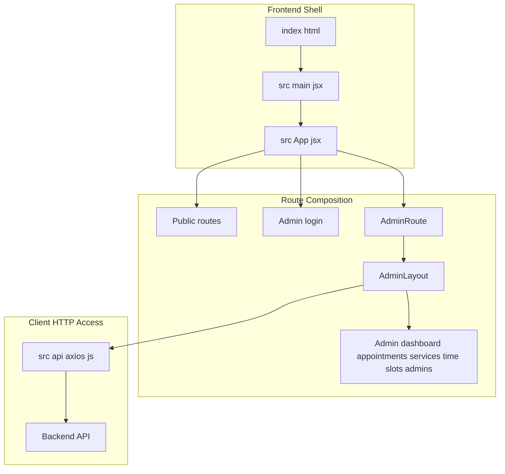
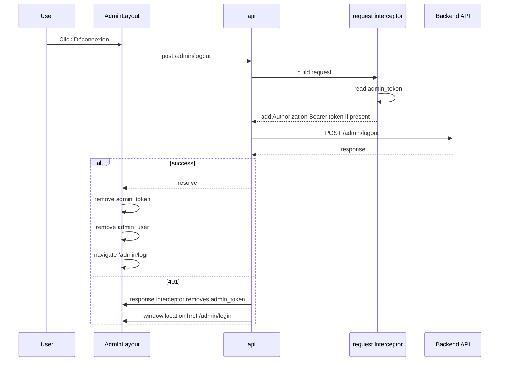
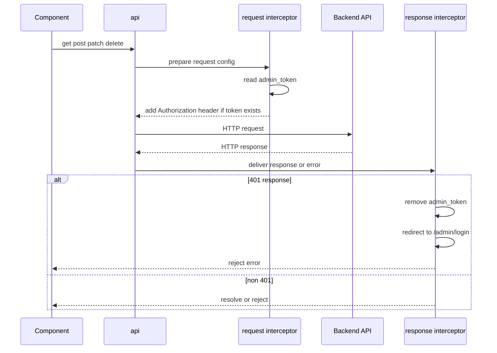
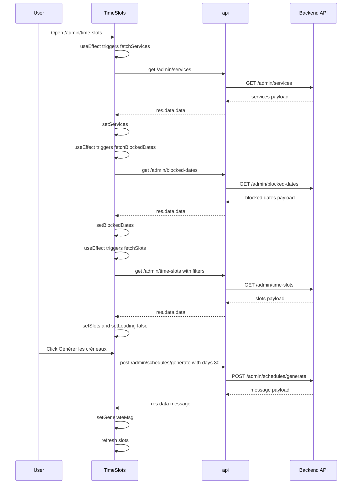

# System Architecture and Runtime Entry Points - Frontend shell, root rendering, and route composition

## Overview

The frontend in `cri-frontend` is a single-page application shell that starts in `cri-frontend/index.html`, mounts through `cri-frontend/src/main.jsx`, and routes inside `cri-frontend/src/App.jsx`. Public booking pages, confirmation pages, search, and the admin area are all selected client-side from the same React root.

The protected admin experience is split into two runtime layers: `AdminRoute.jsx` enforces the token gate, and `AdminLayout.jsx` renders the authenticated shell with sidebar navigation, user identity, and logout. Shared HTTP access runs through `cri-frontend/src/api/axios.js`, which injects the bearer token from `localStorage` and forces a redirect to `/admin/login` on 401 responses.

## Architecture Overview



## Runtime Shell and Root Rendering

### `cri-frontend/index.html`

*Path: `cri-frontend/index.html`*

This file is the browser entry shell for the SPA.

| Element | Role |
| --- | --- |
| `<div id="root"></div>` | Mount point for the React application |
| `<script type="module" src="/src/main.jsx"></script>` | Loads the React entry module |
| `<link rel="icon" type="image/svg+xml" href="/favicon.svg" />` | References the favicon asset |


### `cri-frontend/src/main.jsx`

*Path: `cri-frontend/src/main.jsx`*

`main.jsx` performs the root render. It imports `StrictMode`, `createRoot`, `./index.css`, and `App.jsx`, then renders `<App />` into `document.getElementById('root')`.

| Runtime step | Behavior |
| --- | --- |
| Module load | Imports the global stylesheet and the application component |
| Root creation | Calls `createRoot(document.getElementById('root'))` |
| Render | Wraps `<App />` in `<StrictMode>` and renders it |


### `cri-frontend/src/index.css`

*Path: `cri-frontend/src/index.css`*

This stylesheet is the global CSS entry surface.

| Declaration | Role |
| --- | --- |
| `@tailwind base` | Loads Tailwind base styles |
| `@tailwind components` | Loads Tailwind component styles |
| `@tailwind utilities` | Loads Tailwind utility classes |


### `cri-frontend/src/App.css`

*Path: `cri-frontend/src/App.css`*

This stylesheet defines the app-shell visual rules visible in the repository context.

| Selector | Role |
| --- | --- |
| `.counter` | Accent-styled control with hover and focus-visible states |
| `.hero` | Positions `.base`, `.framework`, and `.vite` layers |
| `#center` | Centers the main content area and adds responsive spacing |
| `#next-steps` | Builds a split panel with responsive stacking |
| `#docs` | Adds the left-side border divider in the split layout |
| `#spacer` | Inserts a vertical separator block |
| `.ticks` | Draws border-based triangular markers with pseudo-elements |


The stylesheet uses the custom properties `--accent`, `--accent-bg`, `--accent-border`, `--border`, `--text-h`, `--social-bg`, and `--shadow`.

## Route Composition

### `cri-frontend/src/App.jsx`

*Path: `cri-frontend/src/App.jsx`*

`App` builds the route tree with `BrowserRouter`, `Routes`, `Route`, and `Navigate`.

| Path | Element | Role |
| --- | --- | --- |
| `/` | `Home` | Public home page |
| `/booking` | `Booking` | Public booking page |
| `/confirmation/:reference` | `Confirmation` | Public confirmation page with a route parameter |
| `/search` | `Search` | Public search page |
| `/admin/login` | `Login` | Admin authentication page |
| `/admin` | `AdminRoute` | Protected admin parent route |
| `/admin/dashboard` | `Dashboard` | Admin dashboard child route |
| `/admin/appointments` | `Appointments` | Admin appointments child route |
| `/admin/services` | `Services` | Admin services child route |
| `/admin/time-slots` | `TimeSlots` | Admin slot management child route |
| `/admin/admins` | `Admins` | Admin user management child route |


The protected `/admin` subtree renders `AdminLayout` inside `AdminRoute`, and `AdminLayout` renders nested children through `<Outlet />`.

### `cri-frontend/src/components/AdminRoute.jsx`

> **Note:** `cri-frontend/src/App.jsx` defines two `index` routes under the `/admin` parent: one redirects to `/admin/dashboard`, and another redirects to `/admin/appointments`. That is a conflicting default-child definition for the same parent route.

*Path: `cri-frontend/src/components/AdminRoute.jsx`*

`AdminRoute` is the token gate for the protected admin subtree.

| Value | Source | Runtime role |
| --- | --- | --- |
| `token` | `localStorage.getItem('admin_token')` | Determines access to the admin routes |


Behavior:

- When `token` exists, the component renders `<Outlet />`.
- When `token` is missing, the component renders `<Navigate to="/admin/login" />`.

### `cri-frontend/src/components/AdminLayout.jsx`

*Path: `cri-frontend/src/components/AdminLayout.jsx`*

`AdminLayout` is the authenticated admin shell. It combines navigation, identity display, date display, logout, and child route rendering.

#### Runtime values and state

| Value | Type | Role |
| --- | --- | --- |
| `admin` | object | Parsed from `localStorage.getItem('admin_user')` at module scope and again inside the component |
| `navItems` | array | Sidebar navigation model |
| `navigate` | function | Redirects after logout |
| `sidebarOpen` | boolean | Controls sidebar width and label visibility |


#### Sidebar navigation

| Path | Label | Condition |
| --- | --- | --- |
| `/admin/dashboard` | `Tableau de bord` | Always shown |
| `/admin/appointments` | `Rendez-vous` | Always shown |
| `/admin/services` | `Services` | Always shown |
| `/admin/time-slots` | `Creneaux` | Always shown |
| `/admin/admins` | `Admins` | Added only when `admin.role === 'superadmin'` |


#### Layout behavior

- The sidebar width toggles between `w-64` and `w-20` from the `sidebarOpen` state.
- The component renders the `criLogo` asset in the sidebar header.
- The top bar shows a French-formatted current date through `new Date().toLocaleDateString('fr-FR', { weekday: 'long', year: 'numeric', month: 'long', day: 'numeric' })`.
- The bottom sidebar block shows `admin.name` and `admin.role`.
- The main content area renders child routes through `<Outlet />`.

#### Logout flow

`handleLogout` calls `api.post('/admin/logout')`, ignores request errors in an empty `catch`, removes `admin_token` and `admin_user` from `localStorage`, and navigates to `/admin/login`.



## Client-Side API Access

### `cri-frontend/src/api/axios.js`

*Path: `cri-frontend/src/api/axios.js`*

This file creates the shared HTTP client used by admin runtime flows.

| Setting | Value | Role |
| --- | --- | --- |
| `baseURL` | `http://localhost:8000/api` | Backend API root |
| `Content-Type` | `application/json` | Default request header |
| `Accept` | `application/json` | Default request header |


#### Request interceptor

- Reads `admin_token` from `localStorage`.
- When the token exists, sets `config.headers.Authorization = \`Bearer ${token}\``.
- Returns the mutated config to continue the request.

#### Response interceptor

- Passes successful responses through unchanged.
- On `error.response?.status === 401`, removes `admin_token` from `localStorage` and sets `window.location.href = '/admin/login'`.
- Rejects the original error with `Promise.reject(error)` after the redirect behavior.



## Admin Time Slots Runtime Flow

### `cri-frontend/src/pages/admin/TimeSlots.jsx`

*Path: `cri-frontend/src/pages/admin/TimeSlots.jsx`*

`TimeSlots` is the admin page that loads services, blocked dates, and slots, and then lets an admin generate, block, unblock, toggle, and delete slots.

#### State and derived values

| Value | Type | Role |
| --- | --- | --- |
| `slots` | array | Current slot list |
| `services` | array | Service options for filtering |
| `blockedDates` | array | Current blocked-date list |
| `loading` | boolean | Table loading state |
| `generating` | boolean | Generation button state |
| `generateMsg` | string | Success or error message after generation |
| `blockModal` | boolean | Controls blocked-date modal visibility |
| `blockForm` | object | Form model with `blocked_date` and `reason` |
| `filters` | object | Slot filters with `service_id` and `date` |
| `deleteConfirm` | null or object | Controls delete confirmation modal |
| `currentAdmin` | object | Parsed from `localStorage.getItem('admin_user')` |
| `isRestricted` | boolean | Hides mutating actions when the admin is not `superadmin` and has `service_id` |


#### Local functions and handlers

| Function | Role |
| --- | --- |
| `fetchServices` | Calls `api.get('/admin/services')` and updates `services` |
| `fetchSlots` | Builds `params` from `filters`, calls `api.get('/admin/time-slots', { params })`, and updates `slots` |
| `fetchBlockedDates` | Calls `api.get('/admin/blocked-dates')` and updates `blockedDates` |
| `handleGenerate` | Posts `{ days: 30 }` to `api.post('/admin/schedules/generate', { days: 30 })`, sets `generateMsg`, and refreshes slots |
| `handleToggleSlot` | Calls `api.patch(\`/admin/time-slots/${slot.id}/toggle\`)` and refreshes slots |
| `handleDeleteSlot` | Calls `api.delete(\`/admin/time-slots/${id}\`)`, refreshes slots, and clears `deleteConfirm` |
| `handleBlockDate` | Posts `blockForm` to `api.post('/admin/blocked-dates', blockForm)`, refreshes blocked dates, closes the modal, and resets the form |
| `handleUnblockDate` | Confirms with `confirm('Débloquer cette date ?')`, deletes the blocked date, and refreshes blocked dates |
| `formatDate` | Formats a date with `toLocaleDateString('fr-FR', { weekday: 'short', day: '2-digit', month: '2-digit', year: 'numeric' })` |
| `formatTime` | Returns the first five characters of a time string with `slice(0, 5)` |
| `getAvailability` | Derives the availability label and color from `capacity` and `booked_count` |


#### Data loading behavior

- On mount, `useEffect` calls `fetchServices()` and `fetchBlockedDates()`.
- On every `filters` change, `useEffect` calls `fetchSlots()`.
- `fetchSlots()` sets `loading` to `true` before the request and resets it in `finally`, so the spinner always closes even after errors.

#### Access control behavior

`isRestricted` is computed from `currentAdmin.role !== 'superadmin' && currentAdmin.service_id`. When true, the page hides the generate and block-date controls, hides the unblock action, and replaces slot deletion with `Lecture seule`.

#### UI state transitions

| State | Visible result |
| --- | --- |
| `loading === true` | Spinner in the slot table |
| `slots.length === 0` | Empty-state message `Aucun créneau trouvé` |
| `generateMsg` set | Green success or error banner area |
| `blockModal === true` | Block-date modal overlay |
| `deleteConfirm` set | Delete confirmation modal overlay |
| `isRestricted === true` | Read-only actions and hidden mutating buttons |




## API Integration

### Admin Logout

*Path: `cri-frontend/src/components/AdminLayout.jsx`*

```api
{
    "title": "Admin Logout",
    "description": "Ends the current admin session through the shared API client.",
    "method": "POST",
    "baseUrl": "http://localhost:8000/api",
    "endpoint": "/admin/logout",
    "headers": [
        {
            "key": "Content-Type",
            "value": "application/json",
            "required": true
        },
        {
            "key": "Accept",
            "value": "application/json",
            "required": true
        },
        {
            "key": "Authorization",
            "value": "Bearer <token>",
            "required": true
        }
    ],
    "queryParams": [],
    "pathParams": [],
    "bodyType": "json",
    "requestBody": "[]",
    "formData": [],
    "rawBody": "",
    "responses": {
        "200": {
            "description": "Session closed",
            "body": "[]"
        }
    }
}
```

### Get Admin Services

*Path: `cri-frontend/src/pages/admin/TimeSlots.jsx`*

```api
{
    "title": "Get Admin Services",
    "description": "Loads the service list used by the TimeSlots filter.",
    "method": "GET",
    "baseUrl": "http://localhost:8000/api",
    "endpoint": "/admin/services",
    "headers": [
        {
            "key": "Content-Type",
            "value": "application/json",
            "required": true
        },
        {
            "key": "Accept",
            "value": "application/json",
            "required": true
        },
        {
            "key": "Authorization",
            "value": "Bearer <token>",
            "required": true
        }
    ],
    "queryParams": [],
    "pathParams": [],
    "bodyType": "none",
    "requestBody": "",
    "formData": [],
    "rawBody": "",
    "responses": {
        "200": {
            "description": "Service collection",
            "body": "{\n    \"data\": [\n        {\n            \"id\": 1,\n            \"name\": \"General Consultation\"\n        }\n    ]\n}"
        }
    }
}
```

### Get Admin Time Slots

*Path: `cri-frontend/src/pages/admin/TimeSlots.jsx`*

```api
{
    "title": "Get Admin Time Slots",
    "description": "Loads slots for the selected service and date filters.",
    "method": "GET",
    "baseUrl": "http://localhost:8000/api",
    "endpoint": "/admin/time-slots",
    "headers": [
        {
            "key": "Content-Type",
            "value": "application/json",
            "required": true
        },
        {
            "key": "Accept",
            "value": "application/json",
            "required": true
        },
        {
            "key": "Authorization",
            "value": "Bearer <token>",
            "required": true
        }
    ],
    "queryParams": [
        {
            "key": "service_id",
            "value": "1",
            "required": false
        },
        {
            "key": "date",
            "value": "2026-05-14",
            "required": false
        }
    ],
    "pathParams": [],
    "bodyType": "none",
    "requestBody": "",
    "formData": [],
    "rawBody": "",
    "responses": {
        "200": {
            "description": "Slot collection",
            "body": "{\n    \"data\": [\n        {\n            \"id\": 101,\n            \"service\": {\n                \"name\": \"General Consultation\"\n            },\n            \"slot_date\": \"2026-05-14\",\n            \"start_time\": \"09:00:00\",\n            \"end_time\": \"09:30:00\",\n            \"booked_count\": 1,\n            \"capacity\": 2,\n            \"is_active\": true\n        }\n    ]\n}"
        }
    }
}
```

### Get Blocked Dates

*Path: `cri-frontend/src/pages/admin/TimeSlots.jsx`*

```api
{
    "title": "Get Blocked Dates",
    "description": "Loads blocked dates for the admin schedule view.",
    "method": "GET",
    "baseUrl": "http://localhost:8000/api",
    "endpoint": "/admin/blocked-dates",
    "headers": [
        {
            "key": "Content-Type",
            "value": "application/json",
            "required": true
        },
        {
            "key": "Accept",
            "value": "application/json",
            "required": true
        },
        {
            "key": "Authorization",
            "value": "Bearer <token>",
            "required": true
        }
    ],
    "queryParams": [],
    "pathParams": [],
    "bodyType": "none",
    "requestBody": "",
    "formData": [],
    "rawBody": "",
    "responses": {
        "200": {
            "description": "Blocked date collection",
            "body": "{\n    \"data\": [\n        {\n            \"id\": 7,\n            \"blocked_date\": \"2026-06-01\",\n            \"reason\": \"Maintenance\"\n        }\n    ]\n}"
        }
    }
}
```

### Generate Time Slots

*Path: `cri-frontend/src/pages/admin/TimeSlots.jsx`*

```api
{
    "title": "Generate Time Slots",
    "description": "Requests schedule generation for the next 30 days and refreshes the slot list on success.",
    "method": "POST",
    "baseUrl": "http://localhost:8000/api",
    "endpoint": "/admin/schedules/generate",
    "headers": [
        {
            "key": "Content-Type",
            "value": "application/json",
            "required": true
        },
        {
            "key": "Accept",
            "value": "application/json",
            "required": true
        },
        {
            "key": "Authorization",
            "value": "Bearer <token>",
            "required": true
        }
    ],
    "queryParams": [],
    "pathParams": [],
    "bodyType": "json",
    "requestBody": "{\n    \"days\": 30\n}",
    "formData": [],
    "rawBody": "",
    "responses": {
        "200": {
            "description": "Generation status message",
            "body": "{\n    \"message\": \"Cr\\u00e9neaux g\\u00e9n\\u00e9r\\u00e9s pour 30 jours.\"\n}"
        }
    }
}
```

### Toggle Time Slot

*Path: `cri-frontend/src/pages/admin/TimeSlots.jsx`*

```api
{
    "title": "Toggle Time Slot",
    "description": "Toggles a single slot and refreshes the slot list afterward.",
    "method": "PATCH",
    "baseUrl": "http://localhost:8000/api",
    "endpoint": "/admin/time-slots/{id}/toggle",
    "headers": [
        {
            "key": "Content-Type",
            "value": "application/json",
            "required": true
        },
        {
            "key": "Accept",
            "value": "application/json",
            "required": true
        },
        {
            "key": "Authorization",
            "value": "Bearer <token>",
            "required": true
        }
    ],
    "queryParams": [],
    "pathParams": [
        {
            "key": "id",
            "value": "101",
            "required": true
        }
    ],
    "bodyType": "json",
    "requestBody": "[]",
    "formData": [],
    "rawBody": "",
    "responses": {
        "200": {
            "description": "Updated slot state",
            "body": "[]"
        }
    }
}
```

### Delete Time Slot

*Path: `cri-frontend/src/pages/admin/TimeSlots.jsx`*

```api
{
    "title": "Delete Time Slot",
    "description": "Deletes a slot, refreshes the list, and clears the delete confirmation state.",
    "method": "DELETE",
    "baseUrl": "http://localhost:8000/api",
    "endpoint": "/admin/time-slots/{id}",
    "headers": [
        {
            "key": "Content-Type",
            "value": "application/json",
            "required": true
        },
        {
            "key": "Accept",
            "value": "application/json",
            "required": true
        },
        {
            "key": "Authorization",
            "value": "Bearer <token>",
            "required": true
        }
    ],
    "queryParams": [],
    "pathParams": [
        {
            "key": "id",
            "value": "101",
            "required": true
        }
    ],
    "bodyType": "none",
    "requestBody": "",
    "formData": [],
    "rawBody": "",
    "responses": {
        "200": {
            "description": "Deletion acknowledged",
            "body": "[]"
        }
    }
}
```

### Create Blocked Date

*Path: `cri-frontend/src/pages/admin/TimeSlots.jsx`*

```api
{
    "title": "Create Blocked Date",
    "description": "Stores a blocked date and reloads the blocked-date list.",
    "method": "POST",
    "baseUrl": "http://localhost:8000/api",
    "endpoint": "/admin/blocked-dates",
    "headers": [
        {
            "key": "Content-Type",
            "value": "application/json",
            "required": true
        },
        {
            "key": "Accept",
            "value": "application/json",
            "required": true
        },
        {
            "key": "Authorization",
            "value": "Bearer <token>",
            "required": true
        }
    ],
    "queryParams": [],
    "pathParams": [],
    "bodyType": "json",
    "requestBody": "{\n    \"blocked_date\": \"2026-06-01\",\n    \"reason\": \"Public holiday\"\n}",
    "formData": [],
    "rawBody": "",
    "responses": {
        "200": {
            "description": "Blocked date created",
            "body": "{\n    \"data\": {\n        \"id\": 7,\n        \"blocked_date\": \"2026-06-01\",\n        \"reason\": \"Public holiday\"\n    }\n}"
        }
    }
}
```

### Delete Blocked Date

*Path: `cri-frontend/src/pages/admin/TimeSlots.jsx`*

```api
{
    "title": "Delete Blocked Date",
    "description": "Removes a blocked date after confirmation and refreshes the list.",
    "method": "DELETE",
    "baseUrl": "http://localhost:8000/api",
    "endpoint": "/admin/blocked-dates/{id}",
    "headers": [
        {
            "key": "Content-Type",
            "value": "application/json",
            "required": true
        },
        {
            "key": "Accept",
            "value": "application/json",
            "required": true
        },
        {
            "key": "Authorization",
            "value": "Bearer <token>",
            "required": true
        }
    ],
    "queryParams": [],
    "pathParams": [
        {
            "key": "id",
            "value": "7",
            "required": true
        }
    ],
    "bodyType": "none",
    "requestBody": "",
    "formData": [],
    "rawBody": "",
    "responses": {
        "200": {
            "description": "Deletion acknowledged",
            "body": "[]"
        }
    }
}
```

## Error Handling

### `cri-frontend/src/api/axios.js`

*Path: `cri-frontend/src/api/axios.js`*

- 401 responses clear `admin_token` and redirect to `/admin/login`.
- Promise rejection continues after the redirect behavior.

### `cri-frontend/src/components/AdminLayout.jsx`

*Path: `cri-frontend/src/components/AdminLayout.jsx`*

- `handleLogout` wraps `api.post('/admin/logout')` in `try/catch`.
- The `catch` block is empty, so logout cleanup continues even when the request fails.
- Cleanup always removes `admin_token` and `admin_user`, then navigates to `/admin/login`.

### `cri-frontend/src/pages/admin/TimeSlots.jsx`

*Path: `cri-frontend/src/pages/admin/TimeSlots.jsx`*

- `handleGenerate` sets `generateMsg` to `Erreur lors de la génération.` on failure.
- `handleDeleteSlot` shows `err.response?.data?.message || 'Impossible de supprimer ce créneau.'`.
- `handleBlockDate` shows `err.response?.data?.message || 'Erreur.'`.
- `handleUnblockDate` requires `confirm('Débloquer cette date ?')` before deletion.
- `fetchSlots()` clears the loading spinner in `finally`, so the loading state ends after both success and failure.

## Integration Points

- `cri-frontend/src/App.jsx` connects public pages and admin pages into one client-side route tree.
- `cri-frontend/src/components/AdminRoute.jsx` enforces the admin token gate before protected admin routes render.
- `cri-frontend/src/components/AdminLayout.jsx` provides the shared admin shell, sidebar navigation, and logout behavior.
- `cri-frontend/src/api/axios.js` is shared by `AdminLayout.jsx` and `TimeSlots.jsx` for authenticated backend access.
- `cri-frontend/src/pages/admin/TimeSlots.jsx` drives the schedule generation, filtering, and blocking flows that depend on `/admin/services`, `/admin/time-slots`, `/admin/blocked-dates`, `/admin/schedules/generate`, `/admin/blocked-dates`, and `/admin/logout`.

## Dependencies

| File | Dependencies |
| --- | --- |
| `cri-frontend/src/main.jsx` | `StrictMode`, `createRoot`, `./index.css`, `./App.jsx` |
| `cri-frontend/src/App.jsx` | `BrowserRouter`, `Routes`, `Route`, `Navigate`, `Home`, `Booking`, `Confirmation`, `Search`, `Login`, `Dashboard`, `Appointments`, `Services`, `TimeSlots`, `Admins`, `AdminRoute`, `AdminLayout` |
| `cri-frontend/src/components/AdminRoute.jsx` | `Navigate`, `Outlet` |
| `cri-frontend/src/components/AdminLayout.jsx` | `useState`, `NavLink`, `useNavigate`, `Outlet`, `api`, `criLogo` |
| `cri-frontend/src/api/axios.js` | `axios` |
| `cri-frontend/src/pages/admin/TimeSlots.jsx` | `useState`, `useEffect`, `api` |
| `cri-frontend/index.html` | `/favicon.svg`, `/src/main.jsx` |
| `cri-frontend/src/index.css` | Tailwind CSS layers |
| `cri-frontend/src/App.css` | CSS custom properties such as `--accent`, `--accent-bg`, `--accent-border`, `--border`, `--text-h`, `--social-bg`, `--shadow` |


## Key Classes Reference

| Class | Responsibility |
| --- | --- |
| `index.html` | Browser host shell and React mount point |
| `main.jsx` | Root renderer for the SPA |
| `App.jsx` | Client-side route composition |
| `AdminRoute.jsx` | Token gate for protected admin routes |
| `AdminLayout.jsx` | Authenticated admin shell with sidebar, header, and logout |
| `axios.js` | Shared API client with bearer-token injection and 401 redirect handling |
| `TimeSlots.jsx` | Admin slot and blocked-date management page |
| `App.css` | Template-style SPA visual rules |
| `index.css` | Global Tailwind entry stylesheet |
