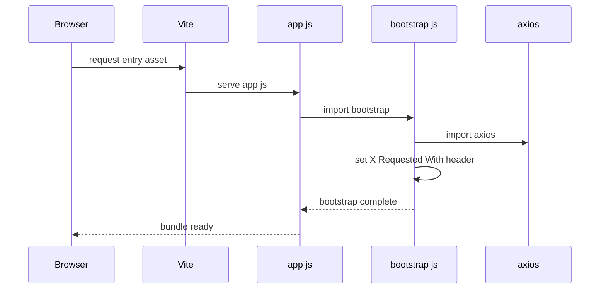

# System Architecture and Runtime Entry Points

## Overview

The runtime shape is split between Laravel config surfaces under `cri-back/config`, the frontend entry files under `cri-back/resources`, and build and test metadata in `cri-back/composer.json`, `cri-back/package.json`, `cri-back/phpunit.xml`, and `cri-back/tests/TestCase.php`. The environment template in `cri-back/.env.example` ties those pieces together by setting the default drivers and app identity values that the config files read at startup.

## Architecture Overview

```mermaid
flowchart TD
    env["Environment template"]
    shell["Laravel app shell"]
    frontend["Frontend delivery pipeline"]
    tooling["Build and test tooling"]
    runtime["Runtime services"]

    appcfg["config app php"]
    cachecfg["config cache php"]
    fscfg["config filesystems php"]
    logcfg["config logging php"]
    mailcfg["config mail php"]
    queuecfg["config queue php"]
    sessioncfg["config session php"]
    sanctumcfg["config sanctum php"]
    jwtcfg["config jwt php"]
    svccfg["config services php"]

    pkgjson["package json"]
    appjs["resources js app js"]
    bootjs["resources js bootstrap js"]
    css["resources css app css"]

    composer["composer json"]
    phpunit["phpunit xml"]
    testcase["tests TestCase php"]

    env --> appcfg
    env --> cachecfg
    env --> fscfg
    env --> logcfg
    env --> mailcfg
    env --> queuecfg
    env --> sessioncfg
    env --> sanctumcfg
    env --> jwtcfg
    env --> svccfg

    shell --> runtime
    appjs --> bootjs
    pkgjson --> appjs
    pkgjson --> css

    composer --> tooling
    phpunit --> testcase

    cachecfg --> runtime
    fscfg --> runtime
    logcfg --> runtime
    mailcfg --> runtime
    queuecfg --> runtime
    sessioncfg --> runtime
    sanctumcfg --> runtime
    jwtcfg --> runtime
    svccfg --> runtime

    frontend --> appjs
    frontend --> css
    tooling --> phpunit
    tooling --> testcase
```

## Shared Application Configuration

### Environment Template

*`cri-back/.env.example`*

`cri-back/.env.example` provides the defaults that the config layer reads through `env`. The file establishes the app identity, local runtime posture, and the storage, queue, session, cache, broadcast, and mail driver defaults used by the rest of the shell.

| Key | Value |
| --- | --- |
| `APP_NAME` | `Laravel` |
| `APP_ENV` | `local` |
| `APP_KEY` | empty |
| `APP_DEBUG` | `true` |
| `APP_URL` | `http://localhost` |
| `BROADCAST_CONNECTION` | `log` |
| `FILESYSTEM_DISK` | `local` |
| `QUEUE_CONNECTION` | `database` |
| `CACHE_STORE` | `database` |
| `SESSION_DRIVER` | `database` |
| `MAIL_MAILER` | `log` |
| `VITE_APP_NAME` | `${APP_NAME}` |

The template also defines the database, Redis, Memcached, AWS, and mail transport environment variables that the corresponding config files read directly.

### Core Application Settings

*`cri-back/config/app.php`*

`config/app.php` defines the core Laravel app identity and startup defaults. It reads its name, environment, debug mode, URL, locale, and key material from the environment, then hardcodes the timezone and cipher settings that the framework uses during bootstrap.

| Key | Value |
| --- | --- |
| `name` | `env('APP_NAME', 'Laravel')` |
| `env` | `env('APP_ENV', 'production')` |
| `debug` | `(bool) env('APP_DEBUG', false)` |
| `url` | `env('APP_URL', 'http://localhost')` |
| `timezone` | `UTC` |
| `locale` | `env('APP_LOCALE', 'en')` |
| `fallback_locale` | `env('APP_FALLBACK_LOCALE', 'en')` |
| `faker_locale` | `env('APP_FAKER_LOCALE', 'en_US')` |
| `cipher` | `AES-256-CBC` |
| `key` | `env('APP_KEY')` |
| `previous_keys` | `array_filter(explode(',', (string) env('APP_PREVIOUS_KEYS', ''))) ` |
| `maintenance.driver` | `env('APP_MAINTENANCE_DRIVER', 'file')` |
| `maintenance.store` | `env('APP_MAINTENANCE_STORE', 'database')` |

The `previous_keys` array is built from `APP_PREVIOUS_KEYS`, which allows Laravel to accept more than one key during rotation. The maintenance block is wired to either `file` or `cache` mode through the same config surface.

### Runtime Store and Transport Configuration

#### Cache

*`cri-back/config/cache.php`*

`config/cache.php` selects the default cache store, declares the available store drivers, and applies a shared key prefix. The default is `database`, which matches the environment template and keeps the cache path aligned with the project bootstrap defaults.

| Entry | Value |
| --- | --- |
| `default` | `env('CACHE_STORE', 'database')` |
| `stores.array.driver` | `array` |
| `stores.array.serialize` | `false` |
| `stores.database.driver` | `database` |
| `stores.database.connection` | `env('DB_CACHE_CONNECTION')` |
| `stores.database.table` | `env('DB_CACHE_TABLE', 'cache')` |
| `stores.file.driver` | `file` |
| `stores.file.path` | `storage_path('framework/cache/data')` |
| `stores.memcached.driver` | `memcached` |
| `stores.redis.driver` | `redis` |
| `stores.dynamodb.driver` | `dynamodb` |
| `stores.octane.driver` | `octane` |
| `stores.failover.driver` | `failover` |
| `stores.failover.stores` | `database`, `array` |
| `prefix` | `env('CACHE_PREFIX', Str::slug((string) env('APP_NAME', 'laravel')).'-cache-')` |

The cache prefix is derived from `APP_NAME`, which keeps shared cache keys separated by application name.

#### Filesystems

*`cri-back/config/filesystems.php`*

`config/filesystems.php` binds the local storage roots and cloud storage credentials. It also defines the public storage symlink target used by the `storage:link` command.

| Disk or Entry | Value |
| --- | --- |
| `default` | `env('FILESYSTEM_DISK', 'local')` |
| `disks.local.driver` | `local` |
| `disks.local.root` | `storage_path('app/private')` |
| `disks.local.serve` | `true` |
| `disks.public.driver` | `local` |
| `disks.public.root` | `storage_path('app/public')` |
| `disks.public.url` | `rtrim(env('APP_URL', 'http://localhost'), '/').'/storage'` |
| `disks.public.visibility` | `public` |
| `disks.s3.driver` | `s3` |
| `disks.s3.key` | `env('AWS_ACCESS_KEY_ID')` |
| `disks.s3.secret` | `env('AWS_SECRET_ACCESS_KEY')` |
| `disks.s3.region` | `env('AWS_DEFAULT_REGION')` |
| `disks.s3.bucket` | `env('AWS_BUCKET')` |
| `disks.s3.url` | `env('AWS_URL')` |
| `disks.s3.endpoint` | `env('AWS_ENDPOINT')` |
| `disks.s3.use_path_style_endpoint` | `env('AWS_USE_PATH_STYLE_ENDPOINT', false)` |
| `links.public_path('storage')` | `storage_path('app/public')` |

The `public` disk URL is derived from `APP_URL`, so the storage URL follows the same base used by the app shell.

#### Logging

*`cri-back/config/logging.php`*

`config/logging.php` wires Laravel to Monolog handlers and sets the default channel to the configured stack. The stack uses the comma-separated `LOG_STACK` value, while the named channels cover file logging, Slack, Papertrail, stderr, syslog, errorlog, and null output.

| Channel | Driver | Key bindings |
| --- | --- | --- |
| `default` | `env('LOG_CHANNEL', 'stack')` | default channel name |
| `deprecations` | array | `channel`, `trace` |
| `stack` | `stack` | `channels`, `ignore_exceptions` |
| `single` | `single` | `path`, `level`, `replace_placeholders` |
| `daily` | `daily` | `path`, `level`, `days`, `replace_placeholders` |
| `slack` | `slack` | `url`, `username`, `emoji`, `level`, `replace_placeholders` |
| `papertrail` | `monolog` | `handler`, `handler_with`, `processors` |
| `stderr` | `monolog` | `handler`, `handler_with`, `formatter`, `processors` |
| `syslog` | `syslog` | `facility`, `level`, `replace_placeholders` |
| `errorlog` | `errorlog` | `level`, `replace_placeholders` |
| `null` | `monolog` | `handler` |
| `emergency` | entry | `path` |

`papertrail` uses `SyslogUdpHandler::class`, `stderr` uses `StreamHandler::class`, and `null` uses `NullHandler::class`, with `PsrLogMessageProcessor::class` applied where defined.

#### Mail

*`cri-back/config/mail.php`*

`config/mail.php` binds the default mailer and the available transports that Laravel can use for outgoing messages. The default is `log`, which matches the environment template, while SMTP derives its local domain from `APP_URL`.

| Mailer | Transport | Key bindings |
| --- | --- | --- |
| `default` | `env('MAIL_MAILER', 'log')` | default mailer name |
| `smtp` | `smtp` | `scheme`, `url`, `host`, `port`, `username`, `password`, `timeout`, `local_domain` |
| `ses` | `ses` | transport only |
| `postmark` | `postmark` | transport only |
| `resend` | `resend` | transport only |
| `sendmail` | `sendmail` | `path` |
| `log` | `log` | `channel` |
| `array` | `array` | transport only |
| `failover` | `failover` | `mailers`, `retry_after` |
| `roundrobin` | `roundrobin` | `mailers`, `retry_after` |

#### Queue

*`cri-back/config/queue.php`*

`config/queue.php` sets the queue backend and the job batching and failed-job storage tables. The default connection is `database`, and the failover connection falls back from `database` to `deferred`.

| Entry | Value |
| --- | --- |
| `default` | `env('QUEUE_CONNECTION', 'database')` |
| `connections.sync.driver` | `sync` |
| `connections.database.driver` | `database` |
| `connections.database.connection` | `env('DB_QUEUE_CONNECTION')` |
| `connections.database.table` | `env('DB_QUEUE_TABLE', 'jobs')` |
| `connections.database.queue` | `env('DB_QUEUE', 'default')` |
| `connections.database.retry_after` | `(int) env('DB_QUEUE_RETRY_AFTER', 90)` |
| `connections.beanstalkd.driver` | `beanstalkd` |
| `connections.sqs.driver` | `sqs` |
| `connections.redis.driver` | `redis` |
| `connections.redis.connection` | `env('REDIS_QUEUE_CONNECTION', 'default')` |
| `connections.redis.queue` | `env('REDIS_QUEUE', 'default')` |
| `connections.failover.driver` | `failover` |
| `connections.failover.connections` | `database`, `deferred` |
| `batching.database` | `env('DB_CONNECTION', 'sqlite')` |
| `batching.table` | `job_batches` |
| `failed.driver` | `env('QUEUE_FAILED_DRIVER', 'database-uuids')` |
| `failed.database` | `env('DB_CONNECTION', 'sqlite')` |
| `failed.table` | `failed_jobs` |

#### Session

*`cri-back/config/session.php`*

`config/session.php` binds the request session store and cookie policy. The default driver is `database`, which matches the environment template, and the session cookie name is derived from `APP_NAME`.

| Entry | Value |
| --- | --- |
| `driver` | `env('SESSION_DRIVER', 'database')` |
| `lifetime` | `(int) env('SESSION_LIFETIME', 120)` |
| `expire_on_close` | `env('SESSION_EXPIRE_ON_CLOSE', false)` |
| `encrypt` | `env('SESSION_ENCRYPT', false)` |
| `files` | `storage_path('framework/sessions')` |
| `connection` | `env('SESSION_CONNECTION')` |
| `table` | `env('SESSION_TABLE', 'sessions')` |
| `store` | `env('SESSION_STORE')` |
| `lottery` | `[2, 100]` |
| `cookie` | `env('SESSION_COOKIE', Str::slug((string) env('APP_NAME', 'laravel')).'-session')` |
| `path` | `env('SESSION_PATH', '/')` |
| `domain` | `env('SESSION_DOMAIN')` |
| `secure` | `env('SESSION_SECURE_COOKIE')` |
| `http_only` | `env('SESSION_HTTP_ONLY', true)` |
| `same_site` | `env('SESSION_SAME_SITE', 'lax')` |
| `partitioned` | `env('SESSION_PARTITIONED_COOKIE', false)` |

#### Sanctum

*`cri-back/config/sanctum.php`*

`config/sanctum.php` defines the first-party stateful domain list, the guard list, and the middleware stack used during SPA authentication. The default stateful domain list includes local hosts and `Sanctum::currentApplicationUrlWithPort()`.

| Entry | Value |
| --- | --- |
| `stateful` | `explode(',', env('SANCTUM_STATEFUL_DOMAINS', sprintf(, Sanctum::currentApplicationUrlWithPort(), )))` |
| `guard` | `['web']` |
| `expiration` | `null` |
| `token_prefix` | `env('SANCTUM_TOKEN_PREFIX', '')` |
| `middleware.authenticate_session` | `Laravel\Sanctum\Http\Middleware\AuthenticateSession::class` |
| `middleware.encrypt_cookies` | `Illuminate\Cookie\Middleware\EncryptCookies::class` |
| `middleware.validate_csrf_token` | `Illuminate\Foundation\Http\Middleware\ValidateCsrfToken::class` |

#### JWT

*`cri-back/config/jwt.php`*

`config/jwt.php` wires token signing, refresh behavior, blacklist handling, cookie token naming, and provider classes for `php-open-source-saver/jwt-auth`. The active config uses `JWT_SECRET` for symmetric signing, `HS256` as the default algorithm, and blacklist support enabled.

| Entry | Value |
| --- | --- |
| `secret` | `env('JWT_SECRET')` |
| `keys.public` | `env('JWT_PUBLIC_KEY')` |
| `keys.private` | `env('JWT_PRIVATE_KEY')` |
| `keys.passphrase` | `env('JWT_PASSPHRASE')` |
| `ttl` | `(int) env('JWT_TTL', 60)` |
| `refresh_iat` | `env('JWT_REFRESH_IAT', false)` |
| `refresh_ttl` | `(int) env('JWT_REFRESH_TTL', 20160)` |
| `algo` | `env('JWT_ALGO', 'HS256')` |
| `required_claims` | `iss`, `iat`, `exp`, `nbf`, `sub`, `jti` |
| `persistent_claims` | empty array with commented placeholders |
| `lock_subject` | `true` |
| `leeway` | `(int) env('JWT_LEEWAY', 0)` |
| `blacklist_enabled` | `env('JWT_BLACKLIST_ENABLED', true)` |
| `blacklist_grace_period` | `(int) env('JWT_BLACKLIST_GRACE_PERIOD', 0)` |
| `show_black_list_exception` | `env('JWT_SHOW_BLACKLIST_EXCEPTION', true)` |
| `decrypt_cookies` | `false` |
| `cookie_key_name` | `token` |
| `providers.jwt` | `PHPOpenSourceSaver\JWTAuth\Providers\JWT\Lcobucci::class` |
| `providers.auth` | `PHPOpenSourceSaver\JWTAuth\Providers\Auth\Illuminate::class` |
| `providers.storage` | `PHPOpenSourceSaver\JWTAuth\Providers\Storage\Illuminate::class` |

#### Services

*`cri-back/config/services.php`*

`config/services.php` is the shared credential map for external services. It contains active credential slots for mail, notifications, messaging, calendar, and ERP integrations, plus a commented-out `twilio` block.

| Service | Fields |
| --- | --- |
| `postmark` | `key` |
| `resend` | `key` |
| `ses` | `key`, `secret`, `region` |
| `slack.notifications` | `bot_user_oauth_token`, `channel` |
| `infobip` | `api_key`, `base_url`, `from` |
| `google` | `calendar_id`, `credentials_path` |
| `odoo` | `url`, `db`, `email`, `password` |

The commented `twilio` block is present in the file but not returned in the active array.

## Frontend Asset Bootstrapping

### JavaScript Entry Point

*`cri-back/resources/js/app.js`*

`resources/js/app.js` is the frontend entry file. It imports `./bootstrap` and does not add any additional application logic in this layer, so all shared client bootstrap behavior flows through `resources/js/bootstrap.js`.

### Client Bootstrap

*`cri-back/resources/js/bootstrap.js`*

`resources/js/bootstrap.js` loads `axios`, assigns it to `window.axios`, and sets the default request header `X-Requested-With` to `XMLHttpRequest`. This file establishes the single shared HTTP client surface that the rest of the frontend bundle can reuse.

### Stylesheet Entry Point

*`cri-back/resources/css/app.css`*

`resources/css/app.css` is the stylesheet entry for the Vite pipeline. It imports `tailwindcss`, declares scan sources for Laravel blade views and JavaScript files, and defines the shared sans-serif font stack through `@theme`.

| Directive | Value |
| --- | --- |
| `@import` | `tailwindcss` |
| `@source` | `../../vendor/laravel/framework/src/Illuminate/Pagination/resources/views/*.blade.php` |
| `@source` | `../../storage/framework/views/*.php` |
| `@source` | `../**/*.blade.php` |
| `@source` | `../**/*.js` |
| `@theme --font-sans` | `Instrument Sans, ui-sans-serif, system-ui, sans-serif, Apple Color Emoji, Segoe UI Emoji, Segoe UI Symbol, Noto Color Emoji` |

The `@source` entries define the files that Tailwind scans when generating the final stylesheet bundle.

## Build and Test Tooling

### Composer Project Wiring

*`cri-back/composer.json`*

`composer.json` defines the backend project package, the PHP dependency set, autoload rules, and the Composer lifecycle scripts used by the application shell. The visible package requirements include Laravel, Sanctum, JWT auth, DomPDF, Google API client, Infobip, php-xmlrpc, and Twilio SDK.

| Area | Entries |
| --- | --- |
| Package identity | `name`, `type`, `description`, `keywords`, `license` |
| Runtime packages | `php`, `barryvdh/laravel-dompdf`, `google/apiclient`, `infobip/infobip-api-php-client`, `laravel/framework`, `laravel/sanctum`, `laravel/tinker`, `php-open-source-saver/jwt-auth`, `phpxmlrpc/phpxmlrpc`, `twilio/sdk` |
| Dev packages | `fakerphp/faker`, `laravel/pail`, `laravel/pint`, `laravel/sail`, `mockery/mockery`, `nunomaduro/collision`, `phpunit/phpunit` |
| Autoloading | `App\\` to `app/`, `Database\\Factories\\` to `database/factories/`, `Database\\Seeders\\` to `database/seeders/`, `Tests\\` to `tests/` |
| Scripts | `setup`, `dev`, `test`, `post-autoload-dump`, `post-update-cmd`, `post-root-package-install`, `post-create-project-cmd`, `pre-package-uninstall` |

The `dev` script runs `php artisan serve`, `php artisan queue:listen --tries=1 --timeout=0`, `php artisan pail --timeout=0`, and `npm run dev` together through `npx concurrently`.

### Frontend Package Wiring

*`cri-back/package.json`*

`package.json` defines the frontend build target and the Vite toolchain used to compile `resources/js/app.js` and `resources/css/app.css`. It is marked as an ES module package and keeps the frontend dependencies isolated from the backend Composer surface.

| Entry | Value |
| --- | --- |
| `private` | `true` |
| `type` | `module` |
| `scripts.build` | `vite build` |
| `scripts.dev` | `vite` |
| `devDependencies` | `@tailwindcss/vite`, `axios`, `concurrently`, `laravel-vite-plugin`, `tailwindcss`, `vite` |

The shared client HTTP bootstrap depends on `axios`, while the build pipeline depends on `laravel-vite-plugin` and the Tailwind Vite integration.

### Test Runtime Configuration

*`cri-back/phpunit.xml`*

`phpunit.xml` sets the test bootstrap and the runtime environment used by the suite. It splits tests into `Unit` and `Feature`, includes the `app` directory in source coverage, and forces in-memory or array-backed infrastructure for deterministic test execution.

| Entry | Value |
| --- | --- |
| `bootstrap` | `vendor/autoload.php` |
| `testsuites.Unit` | `tests/Unit` |
| `testsuites.Feature` | `tests/Feature` |
| `source.include.directory` | `app` |
| `APP_ENV` | `testing` |
| `APP_MAINTENANCE_DRIVER` | `file` |
| `BCRYPT_ROUNDS` | `4` |
| `BROADCAST_CONNECTION` | `null` |
| `CACHE_STORE` | `array` |
| `DB_CONNECTION` | `sqlite` |
| `DB_DATABASE` | `:memory:` |
| `DB_URL` | empty |
| `MAIL_MAILER` | `array` |
| `QUEUE_CONNECTION` | `sync` |
| `SESSION_DRIVER` | `array` |
| `PULSE_ENABLED` | `false` |
| `TELESCOPE_ENABLED` | `false` |
| `NIGHTWATCH_ENABLED` | `false` |

### Test Base Class

*`cri-back/tests/TestCase.php`*

`tests/TestCase.php` defines the abstract `TestCase` class and extends `Illuminate\Foundation\Testing\TestCase as BaseTestCase`. The class body is empty, so this file only provides the shared Laravel testing base used by the test suite.

## Key Classes Reference

| Class | Responsibility |
| --- | --- |
| `TestCase.php` | Abstract Laravel test base that extends `Illuminate\Foundation\Testing\TestCase as BaseTestCase` for the project test harness |
